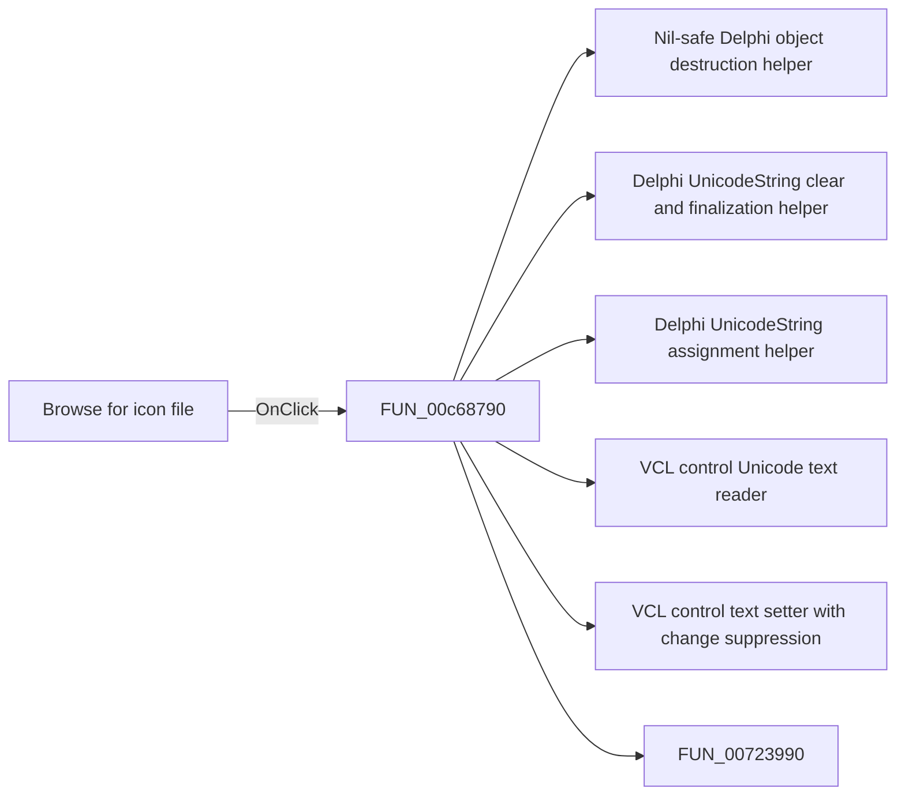

# Browse for icon file

> Analysis status: Pending individual source review.

## Control

| Property | Recovered value |
| --- | --- |
| Form | ApAddPlaceFrm |
| Component path | ApAddPlaceFrm.btnBrowseLib |
| Control class | TSpeedButton |
| Caption | Not present in the recovered resource. |
| Hint | Browse for icon file |
| Text | Not present in the recovered resource. |
| Handler name | btnBrowseLibClick |
| Handler address | 00c68790 |
| Graph node | `resource:dfm:ApAddPlaceFrm/ApAddPlaceFrm.btnBrowseLib` |
| Handler node | `function:00c68790` |
| Graph layer | UI |

## What happens when clicked

Pending individual analysis. An agent must read the recovered handler source and its relevant callees before it replaces this text.

## Click flow

## Handler evidence

- Source: [DecompiledSources/Tina16/functions/0000000000C68790__FUN_00c68790.c](../../../DecompiledSources/Tina16/functions/0000000000C68790__FUN_00c68790.c)
- Recovered role: Not present in the recovered resource.
- Current graph summary: Handles 1 Delphi UI event: ApAddPlaceFrm.btnBrowseLib.OnClick.
- Current graph behavior: Not present in the recovered resource.
- Current graph evidence: Not present in the recovered resource.
- Complexity: complex
- Distinct outgoing calls: 8

## Direct calls

- `function:00410f20` — Nil-safe Delphi object destruction helper
- `function:00414480` — Delphi UnicodeString clear and finalization helper
- `function:00414ad0` — Delphi UnicodeString assignment helper
- `function:0064dd90` — VCL control Unicode text reader
- `function:0064de00` — VCL control text setter with change suppression
- `function:00723990` — FUN_00723990
- `function:00724270` — FUN_00724270
- `function:00724380` — FUN_00724380

## Resource evidence

- Kind: Not present in the recovered resource.
- Modal result: Not present in the recovered resource.
- Checked state: Not present in the recovered resource.
- List items: Not present in the recovered resource.
- Image reference: Not present in the recovered resource.
- Extracted glyph: [`0015_ApAddPlaceFrm_ApAddPlaceFrm_btnBrowseLib_Glyph_Data.png`](../../../glyph/0015_ApAddPlaceFrm_ApAddPlaceFrm_btnBrowseLib_Glyph_Data.png)

## Nearby label candidates

Nearby labels are layout candidates only. They are not proof of behavior.

- Rank 1: S&elected: at distance 135.
- Rank 2: &Icons from library: at distance 239.
- Rank 3: &Hint: at distance 271.

## Analysis limits

- Do not infer behavior from the control class, caption, hint, glyph, or nearby label alone.
- Do not replace the pending status until the handler source and relevant call path provide enough evidence.
