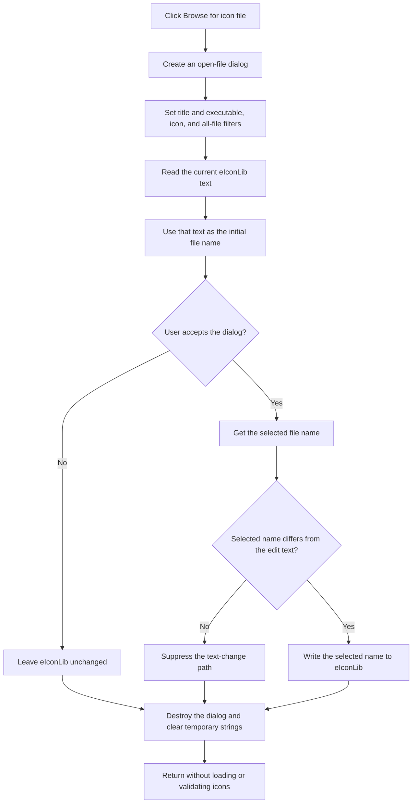

# Browse for an icon-library file

> Analysis status: Source reviewed and behavior traced.

## Control

| Property | Recovered value |
| --- | --- |
| Form | ApAddPlaceFrm |
| Component path | ApAddPlaceFrm.btnBrowseLib |
| Control class | TSpeedButton |
| Caption | Not present in the recovered resource. |
| Hint | Browse for icon file |
| Text | Not present in the recovered resource. |
| Handler name | btnBrowseLibClick |
| Handler address | 00c68790 |
| Graph node | `resource:dfm:ApAddPlaceFrm/ApAddPlaceFrm.btnBrowseLib` |
| Handler node | `function:00c68790` |
| Graph layer | UI |

## What happens when clicked

The button opens a file-selection dialog for an icon source. The handler reads the current text from `eIconLib` at form field offset `+0x6f0`. The recovered resource initializes this edit with `shell32.dll` and describes it as the library from which icons are extracted. The handler uses that text as the initial file name in the dialog.

The dialog has the title **Browse for icon library** and these filters:

- Executables: `*.exe;*.dll;*.ocx;*.bpl;*.cpl;`
- Icons: `*.ico`
- All files: `*.*`

The handler then executes the dialog. If the user accepts it, the handler gets the selected file name and assigns it to `eIconLib`. The VCL text setter first compares the selected name with the existing text. It sends the text-change path only when they differ.

If the user cancels the dialog, the handler does not change `eIconLib`. There is no application error branch in this handler. The filter includes **All files**, and the handler does not validate the selected file or check that it contains icons.

This click does not extract or display icons. The separate `btnShowIcons` handler reads the same `eIconLib` field, extracts icons, and updates the two icon grids. Therefore, selecting a file only stages the path in the edit. The user must use **Load images from selected library** to load it.

## Click flow

## Handler evidence

- [FUN_00c68790](../../../DecompiledSources/Tina16/functions/0000000000C68790__FUN_00c68790.c) constructs the dialog, assigns the filter and title strings, reads form field `+0x6f0`, executes the dialog, and writes a returned file name to that same field only on acceptance.
- [FUN_00724380](../../../DecompiledSources/Tina16/functions/0000000000724380__FUN_00724380.c) compares and assigns the dialog's initial file-name string.
- [FUN_00724270](../../../DecompiledSources/Tina16/functions/0000000000724270__FUN_00724270.c) returns the dialog's selected file name.
- [FUN_0064dd90](../../../DecompiledSources/Tina16/functions/000000000064DD90__FUN_0064dd90.c) reads the current text from a VCL control.
- [FUN_0064de00](../../../DecompiledSources/Tina16/functions/000000000064DE00__FUN_0064de00.c) compares a requested text value with the current control text and sends the text-change path only when the values differ.
- [FUN_00c67db0](../../../DecompiledSources/Tina16/functions/0000000000C67DB0__FUN_00c67db0.c), the separate `btnShowIcons` handler, reads form field `+0x6f0`, extracts icons, and updates the icon grids. This identifies `+0x6f0` as `eIconLib` and separates file selection from icon loading.
- Recovered role: Select an icon-library file and put its path in the icon-library edit.
- Complexity: complex
- Distinct outgoing calls: 8

## Resource evidence

- `btnBrowseLib` has the hint **Browse for icon file**.
- `eIconLib` has the hint **Extract icons from this library** and the initial text `shell32.dll`.
- The nearby label **Icons from library:** identifies the edit's purpose.
- The extracted [folder glyph](../../../glyph/0015_ApAddPlaceFrm_ApAddPlaceFrm_btnBrowseLib_Glyph_Data.png) supports the browse affordance. The handler source, not the glyph, proves the file-selection behavior.
- The adjacent `btnShowIcons` control has the hint **Load images from selected library**.

## Analysis limits

- The recovered handler does not expose the native dialog's internal error reporting.
- The handler does not prove that an accepted path exists, is readable, or contains an icon resource.
- The handler does not persist the selected path or update the pending PlacesBar item. The dialog's OK handler performs the later transfer.
