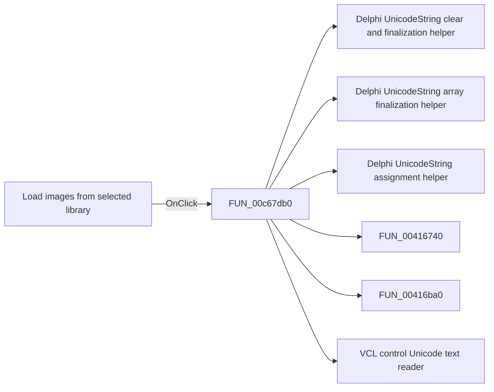

# Load images from selected library

> Analysis status: Pending individual source review.

## Control

| Property | Recovered value |
| --- | --- |
| Form | ApAddPlaceFrm |
| Component path | ApAddPlaceFrm.btnShowIcons |
| Control class | TSpeedButton |
| Caption | Not present in the recovered resource. |
| Hint | Load images from selected library |
| Text | Not present in the recovered resource. |
| Handler name | btnShowIconsClick |
| Handler address | 00c67db0 |
| Graph node | `resource:dfm:ApAddPlaceFrm/ApAddPlaceFrm.btnShowIcons` |
| Handler node | `function:00c67db0` |
| Graph layer | UI |

## What happens when clicked

Pending individual analysis. An agent must read the recovered handler source and its relevant callees before it replaces this text.

## Click flow

## Handler evidence

- Source: [DecompiledSources/Tina16/functions/0000000000C67DB0__FUN_00c67db0.c](../../../DecompiledSources/Tina16/functions/0000000000C67DB0__FUN_00c67db0.c)
- Recovered role: Not present in the recovered resource.
- Current graph summary: Handles 1 Delphi UI event: ApAddPlaceFrm.btnShowIcons.OnClick.
- Current graph behavior: Not present in the recovered resource.
- Current graph evidence: Not present in the recovered resource.
- Complexity: complex
- Distinct outgoing calls: 8

## Direct calls

- `function:00414480` — Delphi UnicodeString clear and finalization helper
- `function:00414560` — Delphi UnicodeString array finalization helper
- `function:00414ad0` — Delphi UnicodeString assignment helper
- `function:00416740` — FUN_00416740
- `function:00416ba0` — FUN_00416ba0
- `function:0064dd90` — VCL control Unicode text reader
- `function:0080d2f0` — FUN_0080d2f0
- `function:008483e0` — FUN_008483e0

## Resource evidence

- Kind: Not present in the recovered resource.
- Modal result: Not present in the recovered resource.
- Checked state: Not present in the recovered resource.
- List items: Not present in the recovered resource.
- Image reference: Not present in the recovered resource.
- Extracted glyph: [`0014_ApAddPlaceFrm_ApAddPlaceFrm_btnShowIcons_Glyph_Data.png`](../../../glyph/0014_ApAddPlaceFrm_ApAddPlaceFrm_btnShowIcons_Glyph_Data.png)

## Nearby label candidates

Nearby labels are layout candidates only. They are not proof of behavior.

- Rank 1: S&elected: at distance 112.
- Rank 2: &Icons from library: at distance 216.
- Rank 3: &Hint: at distance 248.

## Analysis limits

- Do not infer behavior from the control class, caption, hint, glyph, or nearby label alone.
- Do not replace the pending status until the handler source and relevant call path provide enough evidence.
