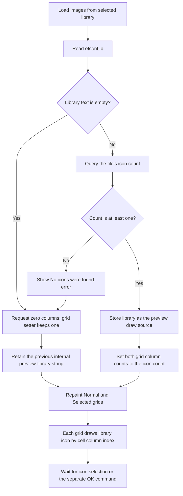

# Load images from selected library

> Analysis status: Source reviewed. The icon-library preview load and reset paths are documented.

## Control

| Property | Recovered value |
| --- | --- |
| Form | ApAddPlaceFrm |
| Component path | ApAddPlaceFrm.btnShowIcons |
| Control class | TSpeedButton |
| Caption | Not present in the recovered resource. |
| Hint | Load images from selected library |
| Text | Not present in the recovered resource. |
| Handler name | btnShowIconsClick |
| Handler address | 00c67db0 |
| Graph node | `resource:dfm:ApAddPlaceFrm/ApAddPlaceFrm.btnShowIcons` |
| Handler node | `function:00c67db0` |
| Graph layer | UI |

## What happens when clicked

`btnShowIcons` reloads the Normal and Selected icon-preview grids from the file
named in `eIconLib`. The edit is labeled **Icons from library**, has the hint
**Extract icons from this library**, and initially contains `shell32.dll`.

The handler reads `eIconLib` and follows these steps:

1. If the text is empty, it requests a column count of zero for both preview
   grids and repaints them. The common grid setter enforces a minimum count of
   one, so each grid ends with one column. This path is silent.
2. If the text is not empty, an unresolved imported icon routine is called
   with the file name, icon index `-1`, and requested icon count zero. The
   handler uses the returned integer as the number of icons in the file.
3. If the returned count is below one, it displays
   `No icons were found in file <file>` with the title
   `PlacesBar Item Icon` and an error icon. It then applies the same one-column
   reset and repaint to both grids.
4. If the count is one or greater, it copies the edit text to the form's
   internal preview-library string at offset `+0x768`, sets both grid column
   counts to that icon count, and repaints both grids.

The grid draw handlers confirm the preview meaning. `dg1DrawCell` and
`dg2DrawCell` use the internal library string and the cell's column index to
extract one icon. They center the result in the cell and draw a selection
background when the cell is selected. The `dg1` resource says that it selects
the icon shown when the place is not selected. The `dg2` resource says that it
selects the icon shown when the place is selected.

The empty and no-icons paths do not clear the internal preview-library string.
When that string has not been populated, the one remaining cell is blank.
After an earlier successful load, an invalid or empty edit can leave the
earlier library as the draw source while both grids are reduced to one column.
This is not a successful library replacement.

The click does not commit the PlacesBar item, change the target, or close the
dialog. The separate OK handler later reads the icon-library edit and the
current column in each grid and stores those three values in the item. When an
existing item is opened, `FUN_00c68390` fills the edit, calls this loader, and
then restores the saved Normal and Selected column indexes when they are within
the new grid counts. The adjacent Browse button only selects a file into
`eIconLib`; it does not call the preview loader.

The handler has no local exception handler. Its only recovered failure test is
an icon count below one.

## Click flow

## Handler evidence

- Handler source: [FUN_00c67db0](../../../DecompiledSources/Tina16/functions/0000000000C67DB0__FUN_00c67db0.c)
- Icon-count import thunk: [thunk_FUN_0415b283](../../../DecompiledSources/Tina16/functions/0000000000636930__thunk_FUN_0415b283.c)
- Grid column-count helper: [FUN_008483e0](../../../DecompiledSources/Tina16/functions/00000000008483E0__FUN_008483e0.c)
- Normal-grid draw source: [FUN_00c679f0](../../../DecompiledSources/Tina16/functions/0000000000C679F0__FUN_00c679f0.c)
- Selected-grid draw source: [FUN_00c67bd0](../../../DecompiledSources/Tina16/functions/0000000000C67BD0__FUN_00c67bd0.c)
- Existing-item initialization: [FUN_00c68390](../../../DecompiledSources/Tina16/functions/0000000000C68390__FUN_00c68390.c)
- Item commit source: [FUN_00c680a0](../../../DecompiledSources/Tina16/functions/0000000000C680A0__FUN_00c680a0.c)
- Browse-only source: [FUN_00c68790](../../../DecompiledSources/Tina16/functions/0000000000C68790__FUN_00c68790.c)
- Recovered role: Load an icon-library path into the two PlacesBar preview grids.
- Complexity: complex
- Distinct outgoing calls: 8

The handler reads form field `+0x6F0`. The Browse and OK handlers use the same
field as the icon-library edit, which confirms that it is `eIconLib`. The two
grid fields are `+0x700` and `+0x710`. The OK handler reads their current column
indexes, while existing-item initialization restores two saved icon indexes to
those same grids. Successful loading assigns the file name to `+0x768`; both
draw handlers require that string and pass it with the cell column index to the
icon extraction thunk.

## Direct calls

- `function:00414480` — clear and finalize temporary UnicodeStrings.
- `function:00414560` — finalize the remaining UnicodeString array.
- `function:00414ad0` — assign the successful library path to the preview
  source string.
- `function:00416740` — expose a UnicodeString pointer for the icon-count query
  and message helper.
- `function:00416ba0` — build the no-icons message.
- `function:0064dd90` — read `eIconLib` text.
- `function:0080d2f0` — show the no-icons error dialog.
- `function:008483e0` — change a preview grid's column count.

The unresolved import thunk used for the icon-count query is present in the
recovered handler source but is not represented by a named direct-call graph
edge.

## Resource evidence

- The form caption is `PlacesBar item`.
- The control hint is `Load images from selected library`.
- The extracted 17 by 20 glyph is a green curved arrow. It is consistent with
  a load or refresh action, but the handler source establishes the exact icon
  reload behavior.
- `eIconLib` has the default text `shell32.dll` and the hint
  `Extract icons from this library`.
- `dg1` is labeled **Normal** and has the hint
  `Select icon wich will be displayed when this place is not selected`.
- `dg2` is labeled **Selected** and has the hint
  `Select icon to represent this place when it is selected on the places bar`.
- The adjacent Browse button has the separate hint `Browse for icon file`.
- Extracted glyph: [`0014_ApAddPlaceFrm_ApAddPlaceFrm_btnShowIcons_Glyph_Data.png`](../../../glyph/0014_ApAddPlaceFrm_ApAddPlaceFrm_btnShowIcons_Glyph_Data.png)

## Analysis limits

- The imported icon-count thunk's symbol is not recovered. Its arguments and
  return-value use match an icon-count query, but this article does not assign
  a specific Win32 API name.
- The loader does not distinguish a missing file, an unreadable file, and a
  valid file with no icons. All return counts below one use the same error path.
- The grid setter can normalize grid state when the count changes. The click
  handler itself does not explicitly select a Normal or Selected icon.
