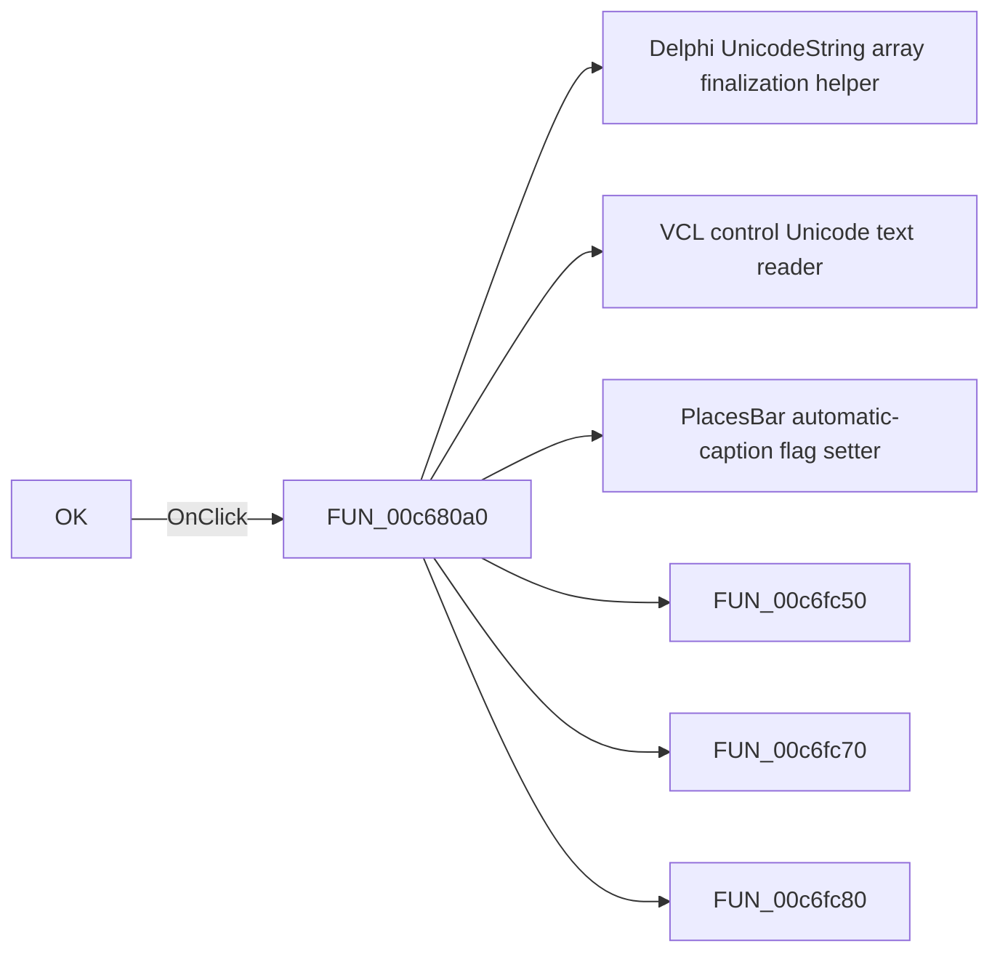

# OK

> Analysis status: Pending individual source review.

## Control

| Property | Recovered value |
| --- | --- |
| Form | ApAddPlaceFrm |
| Component path | ApAddPlaceFrm.Button1 |
| Control class | TButton |
| Caption | OK |
| Hint | Not present in the recovered resource. |
| Text | Not present in the recovered resource. |
| Handler name | Button1Click |
| Handler address | 00c680a0 |
| Graph node | `resource:dfm:ApAddPlaceFrm/ApAddPlaceFrm.Button1` |
| Handler node | `function:00c680a0` |
| Graph layer | UI |

## What happens when clicked

Pending individual analysis. An agent must read the recovered handler source and its relevant callees before it replaces this text.

## Click flow

## Handler evidence

- Source: [DecompiledSources/Tina16/functions/0000000000C680A0__FUN_00c680a0.c](../../../DecompiledSources/Tina16/functions/0000000000C680A0__FUN_00c680a0.c)
- Recovered role: Not present in the recovered resource.
- Current graph summary: Handles 1 Delphi UI event: ApAddPlaceFrm.Button1.OnClick.
- Current graph behavior: Not present in the recovered resource.
- Current graph evidence: Not present in the recovered resource.
- Complexity: complex
- Distinct outgoing calls: 12

## Direct calls

- `function:00414560` — Delphi UnicodeString array finalization helper
- `function:0064dd90` — VCL control Unicode text reader
- `function:00c6fc40` — PlacesBar automatic-caption flag setter
- `function:00c6fc50` — FUN_00c6fc50
- `function:00c6fc70` — FUN_00c6fc70
- `function:00c6fc80` — FUN_00c6fc80
- `function:00c6fc90` — FUN_00c6fc90
- `function:00c6fcb0` — PlacesBar manual-caption setter
- `function:00c6fcd0` — FUN_00c6fcd0
- `function:00c6fcf0` — FUN_00c6fcf0
- `function:00c6fd10` — FUN_00c6fd10
- `function:00c6fda0` — FUN_00c6fda0

## Resource evidence

- Kind: Not present in the recovered resource.
- Modal result: 1
- Checked state: Not present in the recovered resource.
- List items: Not present in the recovered resource.
- Image reference: Not present in the recovered resource.
- Extracted glyph: None.

## Nearby label candidates

Nearby labels are layout candidates only. They are not proof of behavior.

- Rank 1: S&elected: at distance 112.
- Rank 2: &Normal: at distance 200.
- Rank 3: &Icons from library: at distance 232.

## Analysis limits

- Do not infer behavior from the control class, caption, hint, glyph, or nearby label alone.
- Do not replace the pending status until the handler source and relevant call path provide enough evidence.
