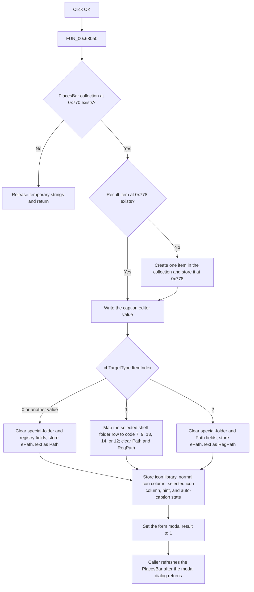

# OK

> Analysis status: Complete. The recovered handler and its item setters establish the result-object update and modal result.

## Control

| Property | Recovered value |
| --- | --- |
| Form | ApAddPlaceFrm |
| Component path | ApAddPlaceFrm.Button1 |
| Control class | TButton |
| Caption | OK |
| Hint | Not present in the recovered resource. |
| Handler name | Button1Click |
| Handler address | 00c680a0 |
| Graph node | `resource:dfm:ApAddPlaceFrm/ApAddPlaceFrm.Button1` |
| Handler node | `function:00c680a0` |
| Graph layer | UI |
| Default button | Yes |
| Modal result | 1 (`mrOk`) |

## What happens when clicked

`FUN_00c680a0` accepts the PlacesBar item that the dialog edits. The form field at offset `0x770` is the PlacesBar item collection. The field at `0x778` is the current result item. If the collection field is null, the handler does not create or update an item and does not write its own modal result.

When the collection exists, the handler creates an item in that collection if `0x778` is null. It reuses the item at `0x778` when the dialog edits an existing entry. The edit caller, `FUN_00c69cb0`, assigns the selected item to this field before it shows the dialog. Thus, repeated execution does not add another item after the first result item exists.

The handler then writes these dialog values to the item:

| Dialog input | Item value |
| --- | --- |
| `eShort.Text` | Manual caption, before the target-kind setter applies its default caption. |
| `eHint.Text` | Hint text. |
| `eIconLib.Text` | Icon-library path. |
| `dg1.Col` | Normal icon index. The grid hint identifies this as the icon used when the place is not selected. |
| `dg2.Col` | Hot or selected icon index. The grid hint identifies this as the selected-state icon. |
| `chkAutoCap.Checked` | Automatic-caption flag. |

The target type comes from `cbTargetType.ItemIndex`:

| Index and resource item | Stored target state |
| --- | --- |
| `0`, Folder/file path | Clears the special-folder code and registry path, then stores `ePath.Text` as the file-system path. |
| `1`, Special shell folder | Maps `ePath.ItemIndex` to Desktop (`7`), My Computer (`9`), My Documents (`13`), Favorites (`14`), or Network (`12`). It clears the path and registry-path fields. |
| `2`, Registry value | Clears the special-folder code and file-system path, then stores `ePath.Text` as the registry path. |

The special-folder setter also derives a default name and hint from the selected shell-folder code. It clears those defaults when the code is zero. The handler calls this setter after it writes `eShort.Text`, so this setter can replace the earlier manual-caption value. The handler writes `eHint.Text` after target processing, which makes the editor text the final hint value.

After all item fields are set, the handler writes `1` to the form modal-result field. This accepts the dialog. The edit caller refreshes the displayed place caption, hint, normal icon, and selected icon only after `ShowModal` returns `1`. The batch-add caller rebuilds the PlacesBar after its dialog loop. These refresh operations are outside this click handler.

## Click flow

## State, validation, and persistence

- The item is changed in memory before the handler sets `mrOk`.
- The handler has no empty-string checks, path checks, registry checks, icon-index checks, message box, or local exception handler.
- The special-folder branch directly indexes a five-byte mapping with `ePath.ItemIndex`. The handler contains no bounds check. The target-type change handler supplies the five matching choices in the normal UI path.
- The handler does not save the collection to the configuration store. `FUN_00c6ee60` is the separate routine that serializes the collection fields as `Name`, `Path`, `RegPath`, `IconDll`, `Icon`, `IconHot`, `Hint`, `SpecFolder`, and `AutoCaption`.
- The DFM also gives the button `ModalResult = 1`. Independently of that VCL property, the recovered event handler writes `1` only on the non-null collection path.

## Handler evidence

- Handler source: [FUN_00c680a0](../../../DecompiledSources/Tina16/functions/0000000000C680A0__FUN_00c680a0.c)
- Existing-item population: [FUN_00c68390](../../../DecompiledSources/Tina16/functions/0000000000C68390__FUN_00c68390.c)
- New-item caller and post-dialog rebuild: [FUN_00c69760](../../../DecompiledSources/Tina16/functions/0000000000C69760__FUN_00c69760.c)
- Edit caller and accepted-result refresh: [FUN_00c69cb0](../../../DecompiledSources/Tina16/functions/0000000000C69CB0__FUN_00c69cb0.c)
- Special-folder choice builder: [FUN_00c65ce0](../../../DecompiledSources/Tina16/functions/0000000000C65CE0__FUN_00c65ce0.c)
- Item configuration writer: [FUN_00c6ee60](../../../DecompiledSources/Tina16/functions/0000000000C6EE60__FUN_00c6ee60.c)
- Recovered role: Accepts a PlacesBar-item dialog and writes the control values to a new or existing collection item.
- Complexity: complex
- Distinct outgoing calls: 12

## Direct calls

- `function:00414560` - Finalizes the five temporary Unicode strings.
- `function:0064dd90` - Reads Unicode text from the caption, target, hint, and icon-library controls.
- `function:00c6fc40` - Stores the automatic-caption Boolean.
- `function:00c6fc50` - Stores the item hint.
- `function:00c6fc70` - Stores the selected or hot icon index.
- `function:00c6fc80` - Stores the normal icon index.
- `function:00c6fc90` - Stores the icon-library path.
- `function:00c6fcb0` - Stores the manual caption.
- `function:00c6fcd0` - Stores the file-system path.
- `function:00c6fcf0` - Stores the registry path.
- `function:00c6fd10` - Stores the special-folder code and derives its default name and hint.
- `function:00c6fda0` - Creates a PlacesBar item in the supplied collection.

## Resource evidence

- The form caption is `PlacesBar item`.
- `cbTargetType` contains `Folder/file path`, `Special shell folder`, and `Registry value`.
- `eShort` has the hint `Caption`.
- `eHint` has the hint `Hint for this place`.
- `eIconLib` starts with `shell32.dll` and has the hint `Extract icons from this library`.
- `dg1` says that it selects the icon used when the place is not selected.
- `dg2` says that it selects the icon used when the place is selected.
- The button is the default control and has modal result `1`.

## Evidence limits

- The recovered code establishes in-memory collection changes and caller-side UI refresh. It does not establish when the application later invokes the separate configuration writer.
- The recovered handler does not define user-facing behavior for an invalid special-folder index. It only shows that no bounds check exists in this function.
