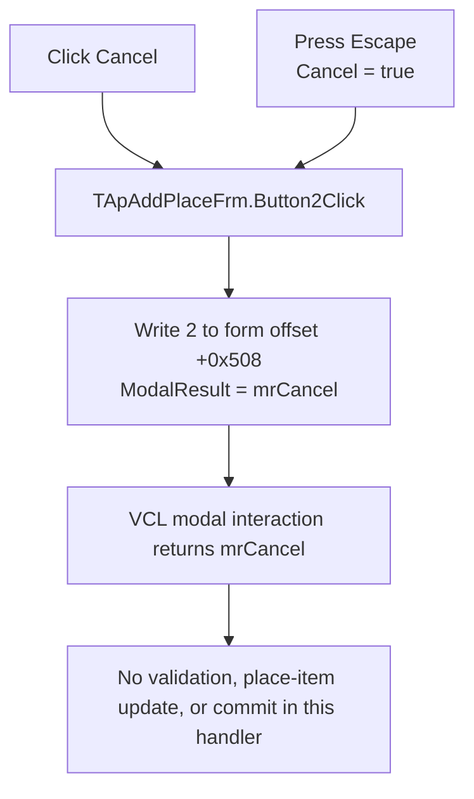

# Cancel

> Analysis status: Recovered handler and Delphi form resource reviewed.

## Control

| Property | Recovered value |
| --- | --- |
| Form | ApAddPlaceFrm |
| Form caption | PlacesBar item |
| Component path | ApAddPlaceFrm.Button2 |
| Control class | TButton |
| Caption | Cancel |
| Cancel button | Yes; `Cancel = true` |
| Modal result | `2` (`mrCancel`) |
| Handler name | Button2Click |
| Handler address | 00c68370 |
| Graph node | `resource:dfm:ApAddPlaceFrm/ApAddPlaceFrm.Button2` |
| Handler node | `function:00c68370` |
| Graph layer | UI |

## What happens when clicked

`TApAddPlaceFrm.Button2Click` receives the form instance and ignores the event
sender. It performs one operation: it writes `2` to the 32-bit field at form
offset `+0x508`. Recovered VCL form code uses this offset as the modal-result
field, and Delphi value `2` is `mrCancel`.

The DFM resource confirms the same intent independently. `Button2` has caption
`Cancel`, `Cancel = true`, and `ModalResult = 2`. The `Cancel` property makes
this the dialog's Escape-key button under normal VCL dialog-key handling. A
mouse click and that keyboard route therefore request the same cancel result.

The nonzero modal result ends the modal interaction and returns `mrCancel` to
the code that showed the form. The click handler does not call a close or hide
routine itself.

## State, commit, and error behavior

- The only explicit state change is `ApAddPlaceFrm.ModalResult := mrCancel`.
- The handler does not read any edit, combo-box, check-box, or icon-grid value.
- It does not validate the target, caption, hint, icon library, or selected
  icons.
- It does not allocate or update the pending place-item object at form offset
  `+0x778`. In contrast, the recovered OK handler builds or updates that object
  and sets modal result `1` only on its accepted path.
- It has no function calls, conditional branches, error message, retry path,
  cleanup operation, or exception-specific recovery.
- Repeating the handler before the modal loop exits writes the same value, so
  the write is idempotent. There is no separate no-op branch.
- The handler allocates and destroys no object. Dialog and pending-object
  ownership stay outside this handler.

## Click flow

## Handler evidence

- Handler source: [FUN_00c68370](../../../DecompiledSources/Tina16/functions/0000000000C68370__FUN_00c68370.c)
- Accepted-path comparison: [FUN_00c680a0](../../../DecompiledSources/Tina16/functions/0000000000C680A0__FUN_00c680a0.c)
- Recovered VCL close path: [FUN_00805200](../../../DecompiledSources/Tina16/functions/0000000000805200__FUN_00805200.c)
- Recovered form evidence: [ui-evidence.json](../../../DecompiledSources/Tina16/resources/dfm/ui-evidence.json)
- Recovered role: Returns `mrCancel` from the PlacesBar-item dialog without
  building or changing its pending result object.
- Complexity: simple
- Distinct outgoing calls: 0

## Direct calls

- No direct call edge is present. The handler consists only of the modal-result
  field write and return.

## Resource evidence

- The form caption is `PlacesBar item`.
- `Button2` has caption `Cancel`, `Cancel = true`, `ModalResult = 2`, and
  `TabOrder = 9`.
- No hint, text, image reference, or embedded glyph is present on this button.
- The nearby labels describe place-item fields. The handler does not read any
  of those controls, so label proximity is not used to infer extra behavior.

## Analysis limits

- The handler proves the cancel result and absence of local commit work. The
  recovered call graph does not identify the modal caller for this form, so
  this article does not claim how a specific caller stores or discards its own
  pre-dialog state.
- The VCL can perform its normal modal-loop and dialog-key work after the
  handler returns. Those framework operations are not direct calls from
  `FUN_00c68370`.
