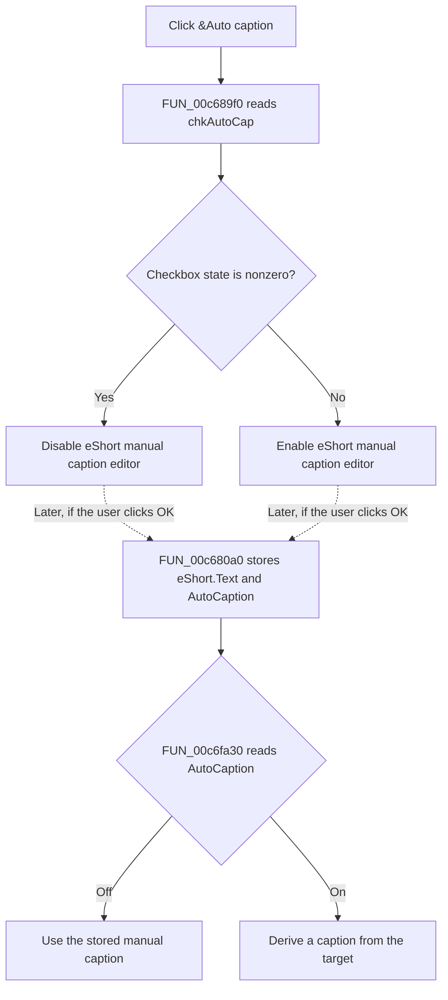

# &Auto caption

> Analysis status: Complete. The recovered handler, the OK handler, and the PlacesBar caption resolver establish the control effect and the later use of its state.

## Control

| Property | Recovered value |
| --- | --- |
| Form | ApAddPlaceFrm |
| Component path | ApAddPlaceFrm.chkAutoCap |
| Control class | TCheckBox |
| Caption | &Auto caption |
| Hint | Not present in the recovered resource. |
| Text | Not present in the recovered resource. |
| Handler name | chkAutoCapClick |
| Handler address | 00c689f0 |
| Graph node | `resource:dfm:ApAddPlaceFrm/ApAddPlaceFrm.chkAutoCap` |
| Handler node | `function:00c689f0` |
| Graph layer | UI |
| Initial checked state | Not stored in the DFM. The normal VCL default is unchecked. |

## What happens when clicked

`FUN_00c689f0` reads the current state of `chkAutoCap` from the form field at offset `0x750`. It then changes the enabled state of the control at form offset `0x6d0`:

| `chkAutoCap` state | Effect on `eShort` |
| --- | --- |
| Cleared (`0`) | Enables the manual caption editor. |
| Checked or another nonzero state | Disables the manual caption editor. |

The field at `0x6d0` is `eShort`. The DFM places this `TEdit` next to the `&Caption:` label and gives it the hint `Caption`. The OK handler also reads text from `0x6d0` and stores it as the item's manual caption. These independent uses establish the field identity.

The click does not clear or replace the editor text. It does not change a PlacesBar item. It also does not close the dialog. It changes only whether the user can edit the caption.

## Later use of the checkbox state

The value becomes item state only if the user accepts the dialog. `FUN_00c680a0`, the OK handler, reads `eShort.Text`, stores it as the item's manual-caption field, reads `chkAutoCap`, and passes that Boolean to `FUN_00c6fc40`. The setter writes the value to item byte `0x50`.

`FUN_00c6fa30` is the later caption resolver. It reads the same item byte:

- If automatic caption is off, it returns the stored manual caption at item offset `0x38`.
- If automatic caption is on, it derives the caption from the path, registry target, or known Shell folder instead of using the stored manual caption.

When the dialog loads an existing item, `FUN_00c68390` first resolves its displayed caption through `FUN_00c6fa30` and writes that text to `eShort`. It then restores the item's automatic-caption flag to `chkAutoCap`. Thus, if a user clears the checkbox for an existing automatic item, the newly enabled editor already contains the resolved displayed caption. The user can keep or edit that text before accepting the dialog.

The separate configuration writer `FUN_00c6ee60` later writes the resolved caption as `Name` and item byte `0x50` as `AutoCaption`. The click handler does not call that writer and does not itself persist any value.

## Click flow

## State, boundary, and error behavior

- Every normal handler invocation calls the enabled-state setter exactly once. There is no normal no-op branch.
- The handler treats every nonzero checkbox result as automatic-caption mode.
- The handler has no collection check, validation, message box, error return, or local exception handler.
- The handler does not check the two form control pointers before it uses them. The DFM-created form supplies these controls in the normal path.
- Disabling `eShort` does not remove its text. The OK handler still reads that text before it stores the automatic-caption flag.

## Handler and consumer evidence

- Click handler: [FUN_00c689f0](../../../DecompiledSources/Tina16/functions/0000000000C689F0__FUN_00c689f0.c)
- Existing-item form population: [FUN_00c68390](../../../DecompiledSources/Tina16/functions/0000000000C68390__FUN_00c68390.c)
- Dialog OK handler: [FUN_00c680a0](../../../DecompiledSources/Tina16/functions/0000000000C680A0__FUN_00c680a0.c)
- Automatic-caption flag setter: [FUN_00c6fc40](../../../DecompiledSources/Tina16/functions/0000000000C6FC40__FUN_00c6fc40.c)
- Displayed-caption resolver: [FUN_00c6fa30](../../../DecompiledSources/Tina16/functions/0000000000C6FA30__FUN_00c6fa30.c)
- Configuration writer: [FUN_00c6ee60](../../../DecompiledSources/Tina16/functions/0000000000C6EE60__FUN_00c6ee60.c)
- Recovered role: PlacesBar automatic-caption mode checkbox handler.
- Complexity: simple.
- Distinct outgoing graph calls: 0. The two VCL method calls are indirect virtual calls.

## Resource and image evidence

- The checkbox caption is `&Auto caption`.
- `eShort` is on the same DFM row as the checkbox. It has the hint `Caption`, and the adjacent label is `&Caption:`.
- The checkbox has no recovered hint, checked-state property, image reference, picture data, or embedded glyph. There is no image evidence for this control.

## Evidence limits

- The recovered code does not give Delphi names for the indirect virtual methods. Their getter and enabled-state effects are established by the branch values, the sibling form routines, and the identified controls.
- The click handler proves the editor-state change. Persistence depends on later dialog acceptance and the separate configuration-write path.
