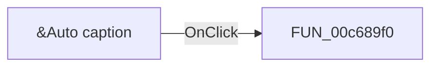

# &Auto caption

> Analysis status: Pending individual source review.

## Control

| Property | Recovered value |
| --- | --- |
| Form | ApAddPlaceFrm |
| Component path | ApAddPlaceFrm.chkAutoCap |
| Control class | TCheckBox |
| Caption | &Auto caption |
| Hint | Not present in the recovered resource. |
| Text | Not present in the recovered resource. |
| Handler name | chkAutoCapClick |
| Handler address | 00c689f0 |
| Graph node | `resource:dfm:ApAddPlaceFrm/ApAddPlaceFrm.chkAutoCap` |
| Handler node | `function:00c689f0` |
| Graph layer | UI |

## What happens when clicked

Pending individual analysis. An agent must read the recovered handler source and its relevant callees before it replaces this text.

## Click flow

## Handler evidence

- Source: [DecompiledSources/Tina16/functions/0000000000C689F0__FUN_00c689f0.c](../../../DecompiledSources/Tina16/functions/0000000000C689F0__FUN_00c689f0.c)
- Recovered role: PlacesBar auto-caption checkbox handler
- Current graph summary: Reads the Auto caption checkbox. It disables the manual caption edit when checked and enables it when cleared. Handles 1 Delphi UI event: ApAddPlaceFrm.chkAutoCap.OnClick.
- Current graph behavior: Reads the Auto caption checkbox. It disables the manual caption edit when checked and enables it when cleared.
- Current graph evidence: ApAddPlaceFrm.chkAutoCap.OnClick resolves here. The handler reads form field 0x750 and changes the enabled state of edit field 0x6d0.
- Complexity: simple
- Distinct outgoing calls: 0

## Direct calls

- No direct call edge is present in the recovered graph.

## Resource evidence

- Kind: Not present in the recovered resource.
- Modal result: Not present in the recovered resource.
- Checked state: Not present in the recovered resource.
- List items: Not present in the recovered resource.
- Image reference: Not present in the recovered resource.
- Extracted glyph: None.

## Nearby label candidates

Nearby labels are layout candidates only. They are not proof of behavior.

- Rank 1: S&elected: at distance 136.
- Rank 2: &Caption: at distance 176.
- Rank 3: Target: at distance 208.

## Analysis limits

- Do not infer behavior from the control class, caption, hint, glyph, or nearby label alone.
- Do not replace the pending status until the handler source and relevant call path provide enough evidence.
