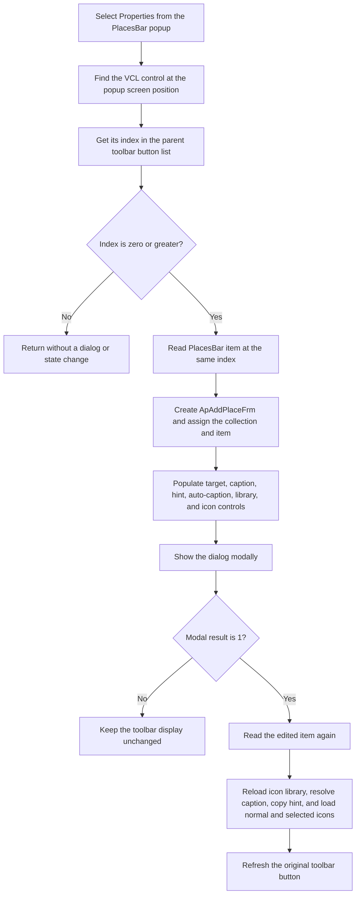

# Properties...

> Analysis status: Complete. The recovered handler establishes how the popup location selects a PlacesBar button, how the dialog edits its item, and which visible button fields are refreshed after acceptance.

## Control

| Property | Recovered value |
| --- | --- |
| Form | ApPlacesBarFrm |
| Component path | ApPlacesBarFrm.pop1.Changeplace1 |
| Control class | TMenuItem |
| Parent | `pop1`, a `TPopupMenu` |
| Caption | Properties... |
| Hint | Not present in the recovered resource. |
| Handler name | Changeplace1Click |
| Handler address | 00c69cb0 |
| Graph node | `resource:dfm:ApPlacesBarFrm/ApPlacesBarFrm.pop1.Changeplace1` |
| Handler node | `function:00c69cb0` |
| Graph layer | UI |

The DFM supplies `Properties...` as the fallback caption. During form creation, `FUN_00c69e40` loads Shell32 string resource `0x8313`, appends an ellipsis, and assigns it to the second popup item when that resource exists. This gives the command a localized caption without changing its handler.

## What happens when selected

`FUN_00c69cb0` first uses the popup menu's stored screen position to find the VCL control under the menu. It asks that control for its index in the parent toolbar's button list. The handler uses this button index as the index of the corresponding PlacesBar item in the form's item collection.

If the index is negative, the handler returns after cleaning its temporary caption string. It does not open a dialog or change the collection or toolbar.

For a valid index, the handler:

1. Creates an `ApAddPlaceFrm` dialog owned by the application.
2. Assigns the current PlacesBar collection to dialog field `0x770`.
3. Reads the indexed item and assigns it to dialog field `0x778`.
4. Calls `FUN_00c68390` to populate the target type, target value, caption, hint, automatic-caption state, icon-library path, and both icon selections from that item.
5. Shows the dialog modally.

The dialog's OK handler edits the item at `0x778` in place. It stores the dialog controls into the item and returns modal result `1`. The Cancel handler returns modal result `2` without changing the item.

When the modal result is `1`, `FUN_00c69cb0` reads the same indexed item again and updates only the toolbar button that was under the popup:

- It assigns the item's icon-library path and reloads the button's normal and selected icon objects.
- It resolves the displayed caption. The resolver uses the stored manual caption when automatic captions are disabled. Otherwise, it derives the caption from the file path, registry path, or known Shell target.
- It assigns the resolved caption and the stored hint.
- It assigns the normal icon index and selected-state icon index, reloading each icon from the library.
- It invokes the button's virtual refresh operation.

The handler does not rebuild the full toolbar and does not change the selected index or collection order.

## Command flow

## Selection and state evidence

- Form field `0x6b0` is the popup menu. The handler passes the point at popup offset `0xc8` to `FUN_0064acf0`. The recovered helper resolves the window and VCL control at that screen point.
- `FUN_006fa830` returns `-1` when the candidate has no parent toolbar. Otherwise, it returns the candidate's position in the parent's button list.
- Form field `0x6e8` is the PlacesBar item collection. Both this handler and the toolbar builder use `FUN_00c6fe60` to read an item by index.
- `FUN_00c6ffe0`, the complete toolbar builder, copies the same item fields to every PlacesBar tool button. This matches the narrower refresh performed by this command.

## Cancel, no-op, error, and persistence paths

- No toolbar-button index: no dialog, item update, caption change, icon change, or repaint.
- The handler assumes that the popup-position lookup returns a control. It does not test the returned pointer for null before it asks for the toolbar index.
- Dialog result other than `1`: no post-dialog toolbar refresh. In the normal Cancel path, the dialog's Cancel handler does not update the item.
- Accepted dialog: the item changes in memory before this handler refreshes the matching toolbar button.
- This handler contains no message box, input validation, bounds correction, or local exception handler. Input handling belongs to the item dialog, whose OK handler also has no user-facing validation.
- This handler does not write the PlacesBar configuration. `FUN_00c6ee60` is the separate collection serializer. The recovered call path does not establish when the application later invokes it.

## Handler evidence

- Handler source: [FUN_00c69cb0](../../../DecompiledSources/Tina16/functions/0000000000C69CB0__FUN_00c69cb0.c)
- Popup-position control lookup: [FUN_0064acf0](../../../DecompiledSources/Tina16/functions/000000000064ACF0__FUN_0064acf0.c)
- Toolbar-button index getter: [FUN_006fa830](../../../DecompiledSources/Tina16/functions/00000000006FA830__FUN_006fa830.c)
- Dialog population: [FUN_00c68390](../../../DecompiledSources/Tina16/functions/0000000000C68390__FUN_00c68390.c)
- Dialog OK handler: [FUN_00c680a0](../../../DecompiledSources/Tina16/functions/0000000000C680A0__FUN_00c680a0.c)
- Dialog Cancel handler: [FUN_00c68370](../../../DecompiledSources/Tina16/functions/0000000000C68370__FUN_00c68370.c)
- Full toolbar builder: [FUN_00c6ffe0](../../../DecompiledSources/Tina16/functions/0000000000C6FFE0__FUN_00c6ffe0.c)
- Configuration writer: [FUN_00c6ee60](../../../DecompiledSources/Tina16/functions/0000000000C6EE60__FUN_00c6ee60.c)
- Recovered role: Opens the properties dialog for the PlacesBar button under the popup and refreshes that button after acceptance.
- Complexity: complex
- Distinct outgoing calls: 12

## Direct calls

- `function:00414480` - Finalizes the temporary displayed-caption string.
- `function:00414ad0` - Copies the edited item's hint to the toolbar button.
- `function:0064acf0` - Finds the VCL control at the popup screen position.
- `function:0064de00` - Assigns the resolved displayed caption to the toolbar button.
- `function:006fa830` - Gets the toolbar button's index in its parent toolbar.
- `function:007fc180` - Creates the `ApAddPlaceFrm` dialog.
- `function:00c68390` - Populates the dialog from the selected PlacesBar item.
- `function:00c6bbe0` - Assigns the icon-library path and initializes both button icon objects.
- `function:00c6bd30` - Loads the normal icon at the item's saved index.
- `function:00c6bda0` - Loads the selected-state icon at the item's saved index.
- `function:00c6fa30` - Resolves the item's displayed caption.
- `function:00c6fe60` - Reads one PlacesBar item by collection index.

## Resource evidence

- The control is the `Properties...` item in the form's only recovered popup menu.
- Its sibling menu item is `Delete place...`, which uses the same popup-position and toolbar-index selection method before it asks for deletion confirmation.
- The menu item has no recovered hint, action, shortcut, checked state, image reference, or glyph.

## Evidence limits

- The handler assumes that the toolbar-button index maps to the corresponding PlacesBar collection index. It does not verify item identity by pointer or name.
- The virtual call at toolbar-button slot `0x188` is used as a refresh operation throughout the recovered UI code. The decompilation does not preserve its Delphi method name.
