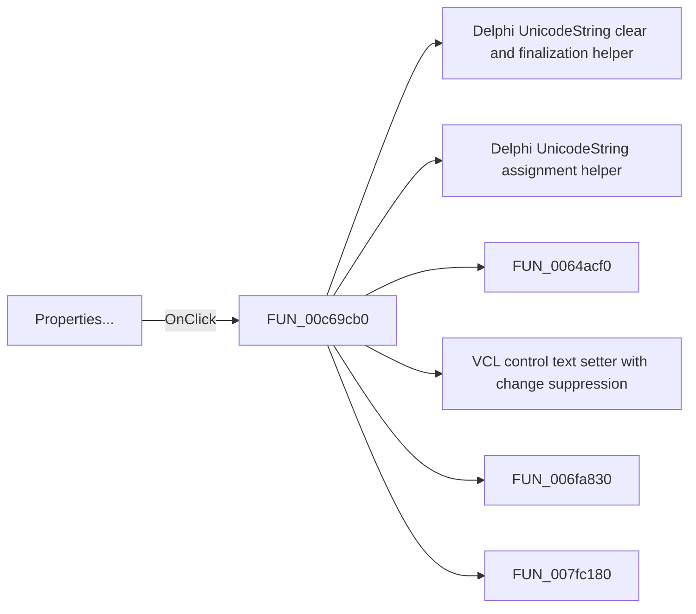

# Properties...

> Analysis status: Pending individual source review.

## Control

| Property | Recovered value |
| --- | --- |
| Form | ApPlacesBarFrm |
| Component path | ApPlacesBarFrm.pop1.Changeplace1 |
| Control class | TMenuItem |
| Caption | Properties... |
| Hint | Not present in the recovered resource. |
| Text | Not present in the recovered resource. |
| Handler name | Changeplace1Click |
| Handler address | 00c69cb0 |
| Graph node | `resource:dfm:ApPlacesBarFrm/ApPlacesBarFrm.pop1.Changeplace1` |
| Handler node | `function:00c69cb0` |
| Graph layer | UI |

## What happens when clicked

Pending individual analysis. An agent must read the recovered handler source and its relevant callees before it replaces this text.

## Click flow

## Handler evidence

- Source: [DecompiledSources/Tina16/functions/0000000000C69CB0__FUN_00c69cb0.c](../../../DecompiledSources/Tina16/functions/0000000000C69CB0__FUN_00c69cb0.c)
- Recovered role: Not present in the recovered resource.
- Current graph summary: Handles 1 Delphi UI event: ApPlacesBarFrm.pop1.Changeplace1.OnClick.
- Current graph behavior: Not present in the recovered resource.
- Current graph evidence: Not present in the recovered resource.
- Complexity: complex
- Distinct outgoing calls: 12

## Direct calls

- `function:00414480` — Delphi UnicodeString clear and finalization helper
- `function:00414ad0` — Delphi UnicodeString assignment helper
- `function:0064acf0` — FUN_0064acf0
- `function:0064de00` — VCL control text setter with change suppression
- `function:006fa830` — FUN_006fa830
- `function:007fc180` — FUN_007fc180
- `function:00c68390` — FUN_00c68390
- `function:00c6bbe0` — FUN_00c6bbe0
- `function:00c6bd30` — FUN_00c6bd30
- `function:00c6bda0` — FUN_00c6bda0
- `function:00c6fa30` — PlacesBar displayed-caption resolver
- `function:00c6fe60` — FUN_00c6fe60

## Resource evidence

- Kind: Not present in the recovered resource.
- Modal result: Not present in the recovered resource.
- Checked state: Not present in the recovered resource.
- List items: Not present in the recovered resource.
- Image reference: Not present in the recovered resource.
- Extracted glyph: None.

## Nearby label candidates

Nearby labels are layout candidates only. They are not proof of behavior.

- No same-parent label candidate is available.

## Analysis limits

- Do not infer behavior from the control class, caption, hint, glyph, or nearby label alone.
- Do not replace the pending status until the handler source and relevant call path provide enough evidence.
