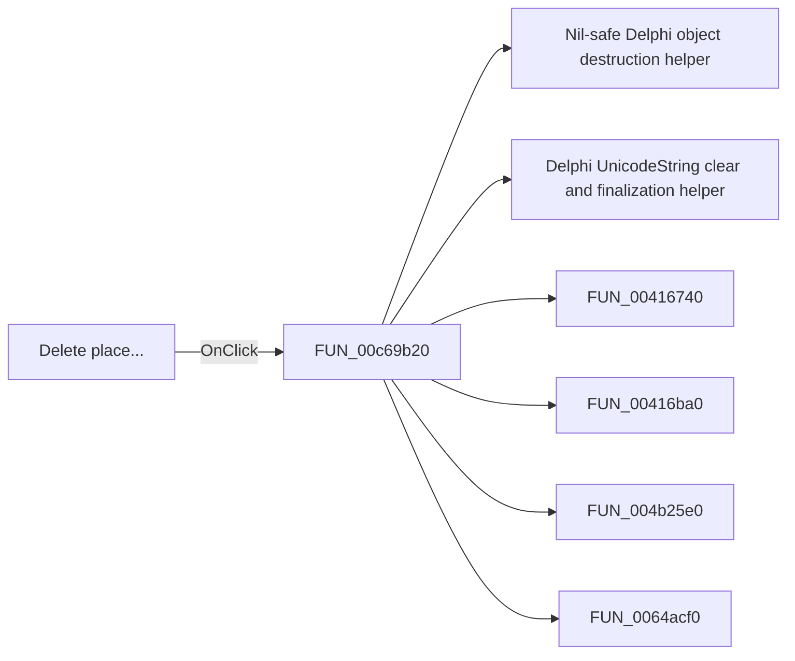

# Delete place...

> Analysis status: Pending individual source review.

## Control

| Property | Recovered value |
| --- | --- |
| Form | ApPlacesBarFrm |
| Component path | ApPlacesBarFrm.pop1.Deleteplace1 |
| Control class | TMenuItem |
| Caption | Delete place... |
| Hint | Not present in the recovered resource. |
| Text | Not present in the recovered resource. |
| Handler name | Deleteplace1Click |
| Handler address | 00c69b20 |
| Graph node | `resource:dfm:ApPlacesBarFrm/ApPlacesBarFrm.pop1.Deleteplace1` |
| Handler node | `function:00c69b20` |
| Graph layer | UI |

## What happens when clicked

Pending individual analysis. An agent must read the recovered handler source and its relevant callees before it replaces this text.

## Click flow

## Handler evidence

- Source: [DecompiledSources/Tina16/functions/0000000000C69B20__FUN_00c69b20.c](../../../DecompiledSources/Tina16/functions/0000000000C69B20__FUN_00c69b20.c)
- Recovered role: Not present in the recovered resource.
- Current graph summary: Handles 1 Delphi UI event: ApPlacesBarFrm.pop1.Deleteplace1.OnClick.
- Current graph behavior: Not present in the recovered resource.
- Current graph evidence: Not present in the recovered resource.
- Complexity: complex
- Distinct outgoing calls: 10

## Direct calls

- `function:00410f20` — Nil-safe Delphi object destruction helper
- `function:00414480` — Delphi UnicodeString clear and finalization helper
- `function:00416740` — FUN_00416740
- `function:00416ba0` — FUN_00416ba0
- `function:004b25e0` — FUN_004b25e0
- `function:0064acf0` — FUN_0064acf0
- `function:0064dd90` — VCL control Unicode text reader
- `function:00654af0` — FUN_00654af0
- `function:006fa830` — FUN_006fa830
- `function:0080d2f0` — FUN_0080d2f0

## Resource evidence

- Kind: Not present in the recovered resource.
- Modal result: Not present in the recovered resource.
- Checked state: Not present in the recovered resource.
- List items: Not present in the recovered resource.
- Image reference: Not present in the recovered resource.
- Extracted glyph: None.

## Nearby label candidates

Nearby labels are layout candidates only. They are not proof of behavior.

- No same-parent label candidate is available.

## Analysis limits

- Do not infer behavior from the control class, caption, hint, glyph, or nearby label alone.
- Do not replace the pending status until the handler source and relevant call path provide enough evidence.
