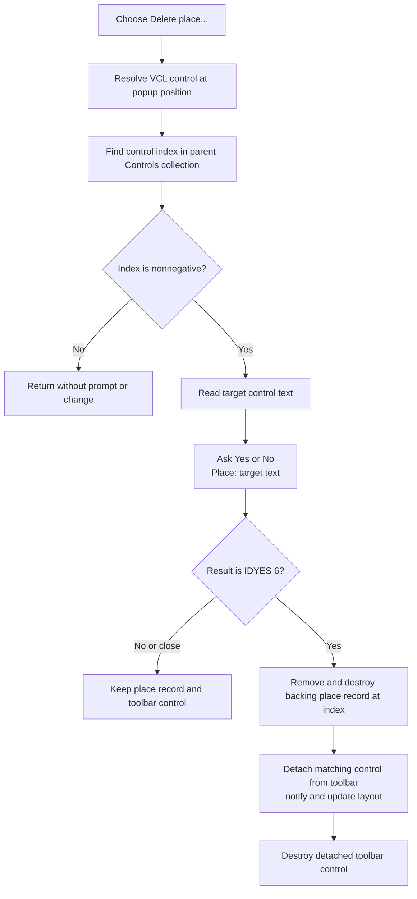

# Delete place...

> Analysis status: Complete. The handler confirms and removes the Places Bar entry under the popup position from both the backing owned list and the toolbar.

## Control

| Property | Recovered value |
| --- | --- |
| Form | ApPlacesBarFrm |
| Form caption | ApPlacesBarFrm |
| Component path | ApPlacesBarFrm.pop1.Deleteplace1 |
| Control class | TMenuItem |
| DFM caption | Delete place... |
| Runtime caption | Shell32 string resource `0x8311` plus `...` when that resource loads successfully. |
| Hint | Not present in the recovered resource. |
| Handler name | Deleteplace1Click |
| Handler address | 00c69b20 |
| Graph node | `resource:dfm:ApPlacesBarFrm/ApPlacesBarFrm.pop1.Deleteplace1` |
| Handler node | `function:00c69b20` |
| Graph layer | UI |

## What happens when clicked

`FUN_00c69b20` resolves the VCL control under the popup menu's stored screen
position. It does not read a selected row or a menu-item tag. `FUN_0064acf0`
maps the popup point to a VCL control, and `FUN_006fa830` returns that control's
index in its visual parent's `Controls` collection. The adjacent
**Properties...** handler uses the same control and index to edit the backing
place record and then update that control. This establishes that the toolbar
control order and the backing place-list order are paired.

If the returned control has no parent or is not present in its parent's control
list, the index is `-1`. The handler then returns without a prompt or any state
change.

For a nonnegative index, the handler reads the target control's Unicode text
and builds this confirmation message:

```text
Are you sure you want to delete this place?
Place: <target control text>
```

It displays the message with title **Place bar** and style `0x24`, which is a
question-icon Yes/No message box. Only return value `6` (`IDYES`) reaches the
delete path. No and a dialog close leave the backing record and toolbar control
unchanged.

On Yes, the handler performs these operations in order:

1. `FUN_004b25e0` removes the item at the resolved index from the owned backing
   list at form offset `+0x6E8` and destroys that place-record object.
2. `FUN_00654af0` detaches the target control from the toolbar at form offset
   `+0x6D8`. The VCL removal path sends control-list change notifications and
   requests a parent layout update.
3. `FUN_00410f20` destroys the detached toolbar control.

The successful path therefore updates both in-memory representations. The
remaining backing items and toolbar controls move to their new collection
indexes. The handler does not assign a new selected control, transfer focus, or
rebuild the complete Places Bar. Its visual refresh is the VCL child-removal
and parent-layout path. It also does not write a file, registry value, or other
persistent store directly.

## Click flow



## Selection, cancellation, and error behavior

- The command targets the child control under the popup position. There is no
  separate selected-item field in the recovered handler.
- An index of `-1` is the handled no-op path. It suppresses both the question
  and deletion.
- No and message-box close are cancellation paths. They do not mutate either
  collection.
- The handler checks only that the toolbar control index is nonnegative. The
  owned-list deletion performs its own upper-bound check and raises through the
  recovered list error helper if the toolbar and model counts are inconsistent.
  That failure occurs before the toolbar control is removed.
- There is no explicit null check between the hit-test result and the parent
  index lookup. The popup is expected to identify a control. A null hit-test
  result does not have a recovered handled no-op branch.
- The handler has no local exception recovery or rollback. If a later VCL
  detach or destruction operation fails after the model deletion, the recovered
  code does not restore the deleted model object.
- Temporary Unicode strings are finalized after each normal return path.

## Evidence

- [Delete handler `FUN_00c69b20`](../../../DecompiledSources/Tina16/functions/0000000000C69B20__FUN_00c69b20.c) contains the popup-position hit test, parent-control index test, target text read, exact confirmation strings, `0x24` dialog style, `IDYES` comparison, and ordered model/control deletion.
- [Popup-point control resolver `FUN_0064acf0`](../../../DecompiledSources/Tina16/functions/000000000064ACF0__FUN_0064acf0.c) resolves the window at a supplied screen point, converts that point to the control's client coordinates, and returns the matching VCL child when available.
- [Parent control-index lookup `FUN_006fa830`](../../../DecompiledSources/Tina16/functions/00000000006FA830__FUN_006fa830.c) returns `-1` without a parent and otherwise searches the parent's control list for the target control.
- [Owned-list delete `FUN_004b25e0`](../../../DecompiledSources/Tina16/functions/00000000004B25E0__FUN_004b25e0.c) range-checks the requested item, sends its delete notification, and destroys the removed object.
- [VCL child removal `FUN_00654af0`](../../../DecompiledSources/Tina16/functions/0000000000654AF0__FUN_00654af0.c) sends before-and-after control-list notifications, detaches the child, and requests parent layout processing.
- [Properties handler `FUN_00c69cb0`](../../../DecompiledSources/Tina16/functions/0000000000C69CB0__FUN_00c69cb0.c) uses the same hit-tested control index to fetch the backing place record and copy accepted record properties back to that control.
- [Toolbar rebuild `FUN_00c6ffe0`](../../../DecompiledSources/Tina16/functions/0000000000C6FFE0__FUN_00c6ffe0.c) destroys the existing toolbar children and recreates one control for each backing-list item, in matching index order.
- [Form initializer `FUN_00c69e40`](../../../DecompiledSources/Tina16/functions/0000000000C69E40__FUN_00c69e40.c) loads Shell32 string resources `0x8311` and `0x8313`, appends an ellipsis, assigns the two popup captions when loading succeeds, and installs the toolbar event callback.
- The DFM binds `Deleteplace1.OnClick` to `Deleteplace1Click` and supplies the fallback caption **Delete place...**. It supplies no hint, action, image, glyph, checked state, or modal-result property.

## Direct calls

- `function:0064acf0` - resolves the target VCL control at the popup position.
- `function:006fa830` - finds the target control's index in its parent.
- `function:0064dd90` - reads the target control's Unicode text.
- `function:00416ba0` - joins the confirmation prefix and target text.
- `function:00416740` - supplies a non-null Unicode-string data pointer to the
  dialog call.
- `function:0080d2f0` - displays the application-owned Yes/No message box.
- `function:004b25e0` - removes and destroys the indexed backing object.
- `function:00654af0` - removes the target child from the toolbar.
- `function:00410f20` - destroys the detached toolbar control.
- `function:00414480` - finalizes both temporary Unicode strings.

## Analysis limits

- Original Delphi field and collection type names at form offsets `+0x6D8` and
  `+0x6E8` are not recovered. Their toolbar and paired place-list roles follow
  from the delete path, the Properties path, and the complete toolbar rebuild
  path.
- The runtime text for Shell32 resource `0x8311` depends on the installed
  localized Shell32 resource. The source proves the resource ID, conditional
  replacement, and appended ellipsis, but this analysis does not assign one
  language-specific string to every installation.
- This handler proves immediate in-memory model deletion and toolbar removal.
  It does not establish when the remaining Places Bar model is persisted.
