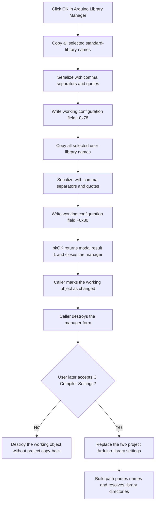

# Accept the Arduino library selections

> Analysis status: Source reviewed and behavior traced.

## Control

| Property | Recovered value |
| --- | --- |
| Form | ArduinoLibrary |
| Form caption | Arduino Library Manager |
| Component path | ArduinoLibrary.bOk |
| Control class | TBitBtn |
| Kind | bkOK |
| Handler name | bOkClick |
| Handler address | 010707b0 |
| Graph node | `resource:dfm:ArduinoLibrary/ArduinoLibrary.bOk` |
| Handler node | `function:010707b0` |
| Graph layer | UI |

## What happens when clicked

The handler accepts the names in the two **Selected** list boxes. It does not use the two **Available** list boxes.

First, it reads every item from `lbSelectedStandardLibs`. It appends each name to a private string list at form field `+0x730`. It serializes that list with a comma separator and double-quote delimiter. It then assigns the result to field `+0x78` of the borrowed Arduino configuration object at form field `+0x728`.

Next, it does the same operation for `lbSelectedUserLibs`. It uses the private string list at `+0x738` and assigns the serialized result to configuration field `+0x80`. An empty selected list produces an empty serialized value. The handler does not reject an empty list.

The stored values are library names, not resolved full paths. A later build path parses the standard and user values. It resolves each name against the discovered Arduino standard-library roots or the user-library root. It uses only paths that pass its path test.

## Validation and errors

The handler does not validate a library name, directory, or file. It has no error-message branch. Toolchain validation occurs before the Arduino Library Manager opens. The caller gets the configured Arduino root and runs Arduino toolchain discovery. If discovery fails, it shows an error and does not create this dialog. If the configured root cannot be obtained, it also does not create the dialog.

The Add handlers prevent duplicate selected names. The OK handler does not repeat that duplicate check. It serializes the list-box state as it exists when the user clicks OK.

## Modal close and copy-back

`bOk` has the built-in kind `bkOK`. After the handler returns, the standard VCL button action supplies modal result 1 and closes the manager. The form has no recovered `OnCloseQuery` event, so there is no application close veto in this dialog.

The caller tests the modal result. For result 1, it sets the changed flag at `+0x08` in the working Arduino configuration object. For Cancel or any other result, it does not set that flag. The caller destroys the manager form after either result.

The library values are not copied to the project settings immediately. The user must also accept the outer **C Compiler Settings** dialog. Its caller reads the working object and, when the changed flag is set, replaces the two entries in the project's Arduino-library settings list with fields `+0x78` and `+0x80`. If the user cancels the outer dialog, this copy-back does not occur. The traced path does not prove a direct registry or file write for these two values.

## Ownership

- The C Compiler Settings handler creates the Arduino Library Manager with the application as owner. It destroys the form after `ShowModal` returns.
- The Arduino configuration object at form field `+0x728` is borrowed from C Compiler Settings. The manager writes to it but does not free it.
- The two private string lists at `+0x730` and `+0x738` are created in `FormCreate` and freed in `FormDestroy`.
- The initial two-value selection list at `+0x740` is borrowed. `FormShow` reads it when its item count is exactly two. The manager does not free it.

## Click flow

## Handler and call-path evidence

- [FUN_010707b0](../../../DecompiledSources/Tina16/functions/00000000010707B0__FUN_010707b0.c) enumerates the two selected list-box item collections, serializes two private string lists, and writes the results to borrowed-object fields `+0x78` and `+0x80`.
- [FUN_004b37d0](../../../DecompiledSources/Tina16/functions/00000000004B37D0__FUN_004b37d0.c) temporarily selects comma and double-quote characters, then calls the string-list serialization path.
- [FUN_01070220](../../../DecompiledSources/Tina16/functions/0000000001070220__FUN_01070220.c) creates the two private string lists. [FUN_01070270](../../../DecompiledSources/Tina16/functions/0000000001070270__FUN_01070270.c) frees them.
- [FUN_01070030](../../../DecompiledSources/Tina16/functions/0000000001070030__FUN_01070030.c) stores the borrowed configuration and initial-selection references. It also fills the available standard and user list boxes from discovered library names.
- [FUN_010702a0](../../../DecompiledSources/Tina16/functions/00000000010702A0__FUN_010702a0.c) parses the two initial selection strings and fills the two selected list boxes when the initial list has exactly two items.
- [FUN_01071a70](../../../DecompiledSources/Tina16/functions/0000000001071A70__FUN_01071a70.c) gets the configured Arduino root through [FUN_0105fed0](../../../DecompiledSources/Tina16/functions/000000000105FED0__FUN_0105fed0.c) and runs toolchain discovery through [FUN_0105f390](../../../DecompiledSources/Tina16/functions/000000000105F390__FUN_0105f390.c) before it creates the manager. It checks `ShowModal` for result 1, sets the working-object changed flag on acceptance, and always destroys the manager.
- [FUN_0108c580](../../../DecompiledSources/Tina16/functions/000000000108C580__FUN_0108c580.c) owns the outer C Compiler Settings transaction. It copies the changed Arduino selections to project settings only after that outer dialog returns result 1.
- [FUN_0160e060](../../../DecompiledSources/Tina16/functions/000000000160E060__FUN_0160e060.c) clears the project's two-value Arduino-library settings list and appends the standard and user serialized values.
- [FUN_010629c0](../../../DecompiledSources/Tina16/functions/00000000010629C0__FUN_010629c0.c) is a downstream build consumer. It parses configuration fields `+0x78` and `+0x80`, resolves selected names against standard and user roots, tests the resulting paths, and prepares build inputs.
- Recovered role: Accept selected Arduino library names into the compiler-settings working object.
- Complexity: complex
- Distinct outgoing calls: 3

## Resource evidence

- The form caption is **Arduino Library Manager**.
- `bOk` has built-in kind `bkOK`.
- The source list captions are **Available standard libraries:** and **Available user libraries:**.
- The destination list captions are **Selected standard libraries** and **Selected user libraries**.
- `bCancel` has built-in kind `bkCancel` and no application click handler.
- This control has no separate extracted glyph. Its image and caption come from the standard `bkOK` kind.

## Analysis limits

- The handler serializes the visible selected names. It does not prove that each name still has a valid directory when OK is clicked.
- The built-in `bkOK` behavior supplies modal result 1. The resource does not store an explicit `ModalResult` property.
- The project-settings copy is proven. A durable file, registry, or database write for these two library values is not proven in this call path.
- The downstream build function has more responsibilities than library-path resolution. This article documents only its proven use of the two selection values.
