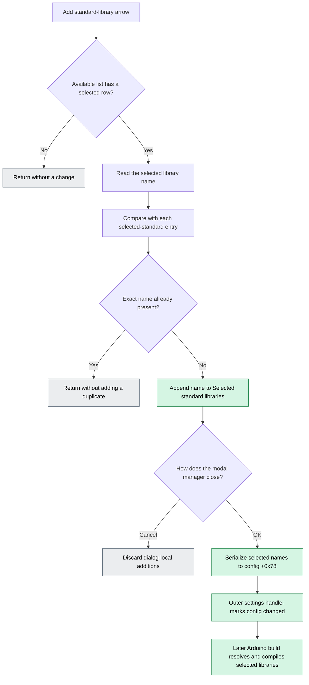

# Add a standard Arduino library

## Control

| Property | Recovered value |
| --- | --- |
| Form | ArduinoLibrary |
| Component path | ArduinoLibrary.sbAddStandard |
| Control class | TSpeedButton |
| Caption | Not present |
| Hint | Add |
| Handler name | sbAddStandardClick |
| Handler address | 01070470 |
| Source list | `lbStandardLibs` at form offset `+0x6B0` |
| Destination list | `lbSelectedStandardLibs` at form offset `+0x6B8` |
| Graph node | `resource:dfm:ArduinoLibrary/ArduinoLibrary.sbAddStandard` |
| Handler node | `function:01070470` |
| Graph layer | UI |

## What happens when clicked

The button adds the currently selected **Available standard libraries** entry to **Selected standard libraries**. `FUN_01070470` reads the source list's selected index. If the index is valid, it reads that library name, compares it with every destination entry, and appends it only when no exact match exists.

The duplicate test compares the full Delphi UnicodeString values. It is case-sensitive and does not normalize a file path. A matching name makes the click a no-op. A selection such as `Wire` can therefore appear only once with the same spelling.

This button does not open a file or folder dialog and does not choose a path. The library manager receives its available catalogs before this click can occur. The outer **Arduino Libraries** command discovers directory names under the Arduino core library root and the board-package library root, serializes those names, and opens the manager as a modal dialog. The manager constructor then loads both standard catalogs into `lbStandardLibs`. The right-arrow glyph, the `Add` hint, and the left-to-right list layout corroborate this source-to-destination operation.

The new destination entry is dialog-local. A later click on the manager's built-in **OK** button serializes the selected standard list as comma-delimited text and writes it to the Arduino configuration field at `+0x78`. The outer caller then sees modal result `1` and marks that configuration object as changed. The Add click itself does not write a settings file. Canceling the manager discards additions because the `bkCancel` path does not run the list-commit handler.

## Click flow

## Selection and duplicate handling

- `lbStandardLibs.ItemIndex` supplies the source selection. An index below zero causes an immediate no-op.
- The handler retrieves the source item by the selected index. It does not accept typed text or an external path.
- It scans all items in `lbSelectedStandardLibs` from index zero to count minus one.
- `FUN_00416db0` returns zero only for an exact ordinal UnicodeString match. The first match stops the scan.
- Only the no-match branch calls the destination list's append method.
- The handler does not remove the item from the available list. The same catalog entry remains available after it is selected.

## Library discovery and path selection

- [Library manager opener `FUN_01071a70`](../../../DecompiledSources/Tina16/functions/0000000001071A70__FUN_01071a70.c) validates the Arduino toolchain and refreshes library discovery before it constructs and shows this modal form.
- [Library discovery `FUN_0105ee90`](../../../DecompiledSources/Tina16/functions/000000000105EE90__FUN_0105ee90.c) scans two standard roots: the Arduino core `libraries` directory and the selected board package's `libraries` directory. It also scans the user's `Documents\Arduino\libraries` directory for the separate user-library list.
- [Manager initialization `FUN_01070030`](../../../DecompiledSources/Tina16/functions/0000000001070030__FUN_01070030.c) expands the two comma-delimited standard catalogs into `lbStandardLibs`. It expands the user catalog into the separate `lbUserLibs` control.
- [Form show `FUN_010702a0`](../../../DecompiledSources/Tina16/functions/00000000010702A0__FUN_010702a0.c) expands the two current selection strings into the selected-standard and selected-user lists.
- No browse dialog, path edit, or path validation is present in `FUN_01070470`.

## Persistence timing

- The click mutates only the `lbSelectedStandardLibs.Items` collection.
- [Manager OK handler `FUN_010707b0`](../../../DecompiledSources/Tina16/functions/00000000010707B0__FUN_010707b0.c) copies all selected-standard entries into a temporary string list, converts it to comma-delimited text, and assigns it to configuration offset `+0x78`. It performs the same operation for selected user libraries at `+0x80`.
- The modal caller in `FUN_01071a70` marks the Arduino configuration object changed only when the manager returns modal result `1`.
- The recovered Add and manager-OK paths contain no direct file or registry write. Durable saving occurs outside these traced functions.

## Downstream use

- [Arduino build preparation `FUN_010629c0`](../../../DecompiledSources/Tina16/functions/00000000010629C0__FUN_010629c0.c) splits the selected-standard string at configuration offset `+0x78` back into names.
- [Standard-library root resolver `FUN_0105a1e0`](../../../DecompiledSources/Tina16/functions/000000000105A1E0__FUN_0105a1e0.c) selects the Arduino core or board-package root according to the catalog that contains the name.
- Build preparation combines each resolved root with the selected name and tests whether that library directory exists before it derives compiler inputs.
- [Library build stage `FUN_01062160`](../../../DecompiledSources/Tina16/functions/0000000001062160__FUN_01062160.c) iterates the selected-standard list and adds the selected libraries to the Arduino compilation path. It handles `LiquidCrystal` separately from the general selected-library pass.

## Failure and no-op behavior

- No selected source row: no destination mutation.
- Exact duplicate name: no destination mutation and no message.
- Manager Cancel or ordinary close without OK: additions remain dialog-local and are discarded.
- The handler has no confirmation, error message, retry, or exception branch.
- Toolchain or library discovery failure occurs before this form opens. `FUN_01071a70` reports that upstream failure and does not construct the manager.
- A selected name whose directory is absent is not checked by this button. The later build-preparation path checks directory existence before it processes that library.

## Resource and glyph evidence

- The speed button has the hint `Add` and no text caption.
- Its extracted [32-by-16 two-frame glyph](../../../glyph/0017_ArduinoLibrary_ArduinoLibrary_sbAddStandard_Glyph_Data.png) contains a right-pointing arrow.
- `lbStandardLibs` and the label **Available standard libraries:** are to the left of the button. `lbSelectedStandardLibs` and **Selected standard libraries** are to its right.
- The same form has separate Add and Delete controls for standard and user libraries. The handler's offsets prove that this button uses only the two standard-library lists.

## Handler evidence

- [Click handler `FUN_01070470`](../../../DecompiledSources/Tina16/functions/0000000001070470__FUN_01070470.c) contains the selected-index gate, exact duplicate scan, and destination append.
- [UnicodeString comparator `FUN_00416d10`](../../../DecompiledSources/Tina16/functions/0000000000416D10__FUN_00416d10.c) compares UTF-16 code units without case folding. `FUN_00416db0` forwards to this comparator.
- The knowledge graph records only the string comparator and Delphi temporary-string cleanup as direct calls because the list operations are recovered as virtual VCL calls.

## Direct calls

- `FUN_00416db0` — compare a destination entry with the selected source name.
- `FUN_00414560` — release the temporary Delphi UnicodeString values before return.

## Analysis limits

- The recovered code does not expose Delphi field names at each raw offset. The form resource order, published field evidence, and consistent list operations establish the `+0x6B0` and `+0x6B8` identities.
- The final durable-storage routine for the changed Arduino configuration is outside the traced Library Manager call path. The proven commit point here is the in-memory configuration update on manager OK.
