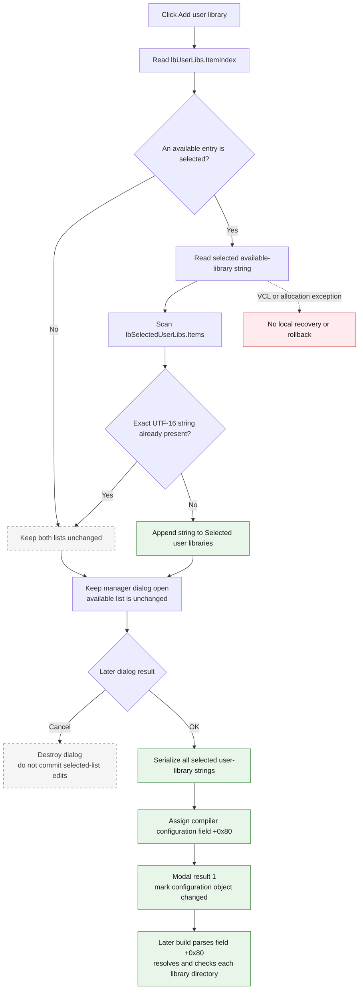

# Add user library

> Analysis status: Complete. The recovered handler, form initialization, OK handler, caller, downstream build paths, resource labels, hint, and glyph agree on this behavior.

## Control

| Property | Recovered value |
| --- | --- |
| Form | ArduinoLibrary |
| Form caption | Arduino Library Manager |
| Component path | ArduinoLibrary.sbAddUser |
| Control class | TSpeedButton |
| Caption | Not present in the recovered resource. |
| Hint | Add |
| Handler name | sbAddUserClick |
| Handler address | 010705c0 |
| Graph node | `resource:dfm:ArduinoLibrary/ArduinoLibrary.sbAddUser` |
| Handler node | `function:010705c0` |
| Graph layer | UI |

## What happens when clicked

The speed button adds the currently selected entry from **Available user libraries:** to **Selected user libraries**. It does not remove the entry from the available list. It also does not open a folder browser, file dialog, or another library-selection dialog.

`FUN_010705c0` performs these operations:

1. It reads `lbUserLibs.ItemIndex` from form field `+0x710`.
2. If the index is negative, it returns without a change.
3. It reads the string at that index from `lbUserLibs.Items`.
4. It scans every string in `lbSelectedUserLibs.Items` at form field `+0x718`.
5. It compares each string with the selected source string by UTF-16 code unit. A zero result means that the strings are identical.
6. If an identical string is present, it returns without a change or message.
7. Otherwise, it appends the source string to the end of `lbSelectedUserLibs.Items`.

The duplicate check is ordinal and case-sensitive. Thus, two strings that differ only by case are not duplicates in this handler. The handler does not sort the destination list or change its selected row.

## Inputs, state changes, and outputs

| Stage | Proven behavior |
| --- | --- |
| Available entries | The dialog constructor parses compiler-configuration field `+0x70` and adds its strings to `lbUserLibs`. The Add handler does not discover directories. |
| Input | The selected index and string from `lbUserLibs`. |
| Selection guard | A negative `ItemIndex` is a silent no-op. |
| Duplicate guard | An identical UTF-16 string already in `lbSelectedUserLibs` is a silent no-op. |
| UI mutation | A unique string is appended to `lbSelectedUserLibs.Items`. `lbUserLibs.Items` is unchanged. |
| Immediate persistence | None. The click changes only the dialog's selected-user-libraries list. |
| OK-time commit | `FUN_010707b0` serializes all strings in `lbSelectedUserLibs` and assigns the result to compiler-configuration field `+0x80`. |
| Parent result | After the modal dialog returns result `1`, `FUN_01071a70` marks the compiler-configuration object as changed at byte field `+0x08`. |
| Downstream use | Build preparation parses field `+0x80`, resolves each selected user-library entry below the configured user-library root, checks the resulting directory, and passes valid entries through the Arduino library build path. |

## Click and commit flow

## Handler and data-flow evidence

- Add click handler: [FUN_010705c0](../../../DecompiledSources/Tina16/functions/00000000010705C0__FUN_010705c0.c)
- Dialog constructor and available-list population: [FUN_01070030](../../../DecompiledSources/Tina16/functions/0000000001070030__FUN_01070030.c)
- Selected-list restoration on show: [FUN_010702a0](../../../DecompiledSources/Tina16/functions/00000000010702A0__FUN_010702a0.c)
- OK-time selected-list serialization: [FUN_010707b0](../../../DecompiledSources/Tina16/functions/00000000010707B0__FUN_010707b0.c)
- Modal caller and changed flag: [FUN_01071a70](../../../DecompiledSources/Tina16/functions/0000000001071A70__FUN_01071a70.c)
- User-library build consumer: [FUN_01062160](../../../DecompiledSources/Tina16/functions/0000000001062160__FUN_01062160.c)
- Selected-library path preparation: [FUN_010629c0](../../../DecompiledSources/Tina16/functions/00000000010629C0__FUN_010629c0.c)
- User-library root resolver: [FUN_0105a3c0](../../../DecompiledSources/Tina16/functions/000000000105A3C0__FUN_0105a3c0.c)
- UTF-16 comparison implementation: [FUN_00416d10](../../../DecompiledSources/Tina16/functions/0000000000416D10__FUN_00416d10.c)
- Recovered handler role: Add one unique available user-library entry to the dialog's selected list.
- Likely Delphi method: `TArduinoLibrary.sbAddUserClick`.
- Complexity: moderate
- Distinct outgoing calls: 2

The graph records two direct calls from the handler:

- `FUN_00416db0` is the comparison wrapper. Its target `FUN_00416d10` compares the two UnicodeStrings by UTF-16 code unit and returns zero for equality.
- `FUN_00414560` finalizes the handler's temporary UnicodeStrings.

The list access, selected-index read, and append are Delphi virtual calls, so the graph does not record them as direct function-call edges.

## Resource and glyph evidence

- The control has the direct hint **Add**.
- The extracted [`0019_ArduinoLibrary_ArduinoLibrary_sbAddUser_Glyph_Data.png`](../../../glyph/0019_ArduinoLibrary_ArduinoLibrary_sbAddUser_Glyph_Data.png) is a 32 by 16 raster with two button-state frames. Each frame shows a right-pointing red and yellow arrow.
- The speed button is between the left `lbUserLibs` list and the right `lbSelectedUserLibs` list. The labels identify these lists as **Available user libraries:** and **Selected user libraries**.
- The arrow supports the left-to-right transfer meaning. The handler's field accesses and list mutation establish the meaning; the glyph alone does not.
- The nearest recovered label is **Selected user libraries** at distance 91. **Available user libraries:** is the second candidate at distance 219. These distances agree with the recovered component layout but are not used alone to map the fields.

## Cancel, duplicate, error, and persistence behavior

- No selection: the click is a complete no-op.
- Duplicate selection: the click is a complete no-op and shows no message.
- Unique selection: the dialog list changes immediately, but the compiler-configuration object does not change yet.
- Cancel: `bCancel` has `bkCancel` and no application OnClick handler. The OK serialization does not run, so this Add click's list-only change is discarded when the modal dialog is destroyed.
- OK: `bOkClick` serializes the complete selected standard and user lists. It assigns the selected user-library string to configuration field `+0x80`. The parent then marks the object changed when `ShowModal` returns `1`.
- File-system checks: the Add handler performs none. The later path-preparation code resolves each selected user-library entry and checks the resulting directory before it adds it to downstream build state.
- Durable storage: no recovered function in this click, dialog, or immediate modal-return path writes a file, registry value, or database row. The changed flag proves a later-save requirement, but the durable save call and its timing are outside this traced path.
- Exceptions: the handler has no local exception block. An unexpected list-access, append, comparison, or allocation exception leaves the handler. There is no local error message or rollback.

## Analysis limits

- The source establishes that the available user-library strings come from compiler-configuration field `+0x70`. It does not establish where that field was first populated.
- The downstream code treats field `+0x80` as selected user-library entries and resolves each entry under a user-library root. This article does not claim that the strings themselves are absolute paths.
- The source proves the in-memory commit and changed flag. It does not prove when another subsystem writes the compiler configuration to durable storage.
