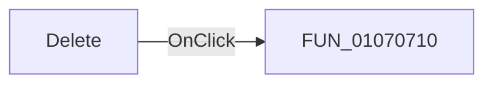

# Delete

> Analysis status: Pending individual source review.

## Control

| Property | Recovered value |
| --- | --- |
| Form | ArduinoLibrary |
| Component path | ArduinoLibrary.sbDeleteStandard |
| Control class | TSpeedButton |
| Caption | Not present in the recovered resource. |
| Hint | Delete |
| Text | Not present in the recovered resource. |
| Handler name | sbDeleteStandardClick |
| Handler address | 01070710 |
| Graph node | `resource:dfm:ArduinoLibrary/ArduinoLibrary.sbDeleteStandard` |
| Handler node | `function:01070710` |
| Graph layer | UI |

## What happens when clicked

Pending individual analysis. An agent must read the recovered handler source and its relevant callees before it replaces this text.

## Click flow

## Handler evidence

- Source: [DecompiledSources/Tina16/functions/0000000001070710__FUN_01070710.c](../../../DecompiledSources/Tina16/functions/0000000001070710__FUN_01070710.c)
- Recovered role: Not present in the recovered resource.
- Current graph summary: Handles 1 Delphi UI event: ArduinoLibrary.sbDeleteStandard.OnClick.
- Current graph behavior: Not present in the recovered resource.
- Current graph evidence: Not present in the recovered resource.
- Complexity: simple
- Distinct outgoing calls: 0

## Direct calls

- No direct call edge is present in the recovered graph.

## Resource evidence

- Kind: Not present in the recovered resource.
- Modal result: Not present in the recovered resource.
- Checked state: Not present in the recovered resource.
- List items: Not present in the recovered resource.
- Image reference: Not present in the recovered resource.
- Extracted glyph: [`0018_ArduinoLibrary_ArduinoLibrary_sbDeleteStandard_Glyph_Data.png`](../../../glyph/0018_ArduinoLibrary_ArduinoLibrary_sbDeleteStandard_Glyph_Data.png)

## Nearby label candidates

Nearby labels are layout candidates only. They are not proof of behavior.

- Rank 1: Selected standard libraries at distance 217.
- Rank 2: Selected user libraries at distance 347.
- Rank 3: Available standard libraries: at distance 489.

## Analysis limits

- Do not infer behavior from the control class, caption, hint, glyph, or nearby label alone.
- Do not replace the pending status until the handler source and relevant call path provide enough evidence.
