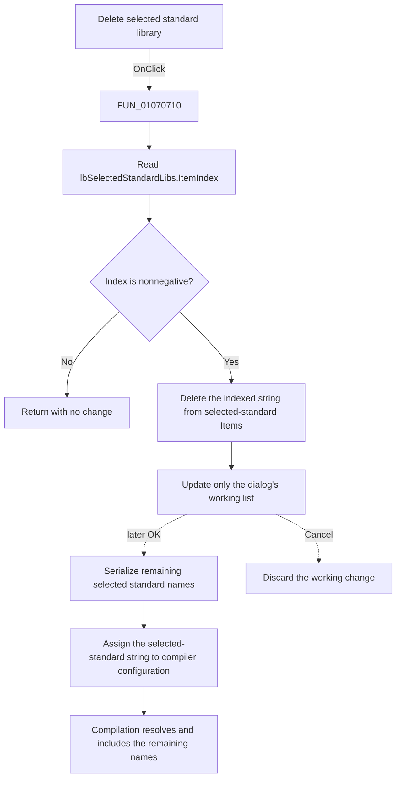

# Delete

This speed button removes the current entry from the working **Selected standard libraries** list.

## Control

| Property | Recovered value |
| --- | --- |
| Form | ArduinoLibrary |
| Component path | ArduinoLibrary.sbDeleteStandard |
| Control class | TSpeedButton |
| Caption | Not present in the recovered resource. |
| Hint | Delete |
| Text | Not present in the recovered resource. |
| Handler name | sbDeleteStandardClick |
| Handler address | 01070710 |
| Graph node | `resource:dfm:ArduinoLibrary/ArduinoLibrary.sbDeleteStandard` |
| Handler node | `function:01070710` |
| Graph layer | UI |

## What happens when clicked

`FUN_01070710` reads `lbSelectedStandardLibs.ItemIndex`. If the index is negative, which is the VCL value for no selection, the handler returns without changing anything. If the index is nonnegative, it reads the index again and calls `lbSelectedStandardLibs.Items.Delete(index)`.

The deletion affects only the selected-standard list on this dialog. It does not remove the same library from **Available standard libraries**, delete a library directory, or destroy a library object. The add handler copied only the library-name string into the selected list, and this delete handler retrieves no item object. The VCL list manages the removed string entry.

The click does not persist the edited list. The OK handler later enumerates the remaining selected-standard entries, serializes them, and assigns the result to the Arduino compiler-configuration object. The calling compiler-settings dialog marks that configuration as changed only after the library manager returns the OK modal result. Cancel does not run the OK handler, so the working deletion is discarded.

The accepted standard-library string is used downstream by the Arduino compilation paths. They parse the selected names, resolve each name against the standard Arduino library directories, and add the resolved library inputs. Thus, after OK, the removed name is no longer included by those enumeration paths.

There is no confirmation dialog, error message, or local exception handler. The nonnegative check is the only explicit guard. Normal VCL state keeps a nonnegative `ItemIndex` within the item range; the handler relies on that control contract before it calls `Delete`.

## Click flow

## Handler evidence

- Source: [DecompiledSources/Tina16/functions/0000000001070710__FUN_01070710.c](../../../DecompiledSources/Tina16/functions/0000000001070710__FUN_01070710.c)
- Recovered role: Removes the selected standard-library name from the dialog's working selection.
- Current graph summary: Handles `ArduinoLibrary.sbDeleteStandard.OnClick` through indirect VCL list access.
- Input: `lbSelectedStandardLibs.ItemIndex` from form field `+0x6b8`.
- Guard: Only indexes greater than or equal to zero reach the deletion.
- State change: `lbSelectedStandardLibs.Items.Delete(ItemIndex)` removes one string entry.
- Immediate output: The selected-standard list is redrawn without that entry. No configuration field or file is changed by this handler.
- Complexity: simple
- Distinct outgoing calls: 0

## Direct calls

- No direct call edge is present in the recovered graph because both `ItemIndex` and `Items.Delete` use VCL virtual dispatch.
- [FUN_01070470](../../../DecompiledSources/Tina16/functions/0000000001070470__FUN_01070470.c), the paired Add handler, copies a name string from `lbStandardLibs` to `lbSelectedStandardLibs` only when it is not already selected. It does not attach an application object to the entry.
- [FUN_010707b0](../../../DecompiledSources/Tina16/functions/00000000010707B0__FUN_010707b0.c), the OK handler, serializes the remaining selected-standard and selected-user strings and assigns them to the supplied compiler-configuration object.
- [FUN_010629c0](../../../DecompiledSources/Tina16/functions/00000000010629C0__FUN_010629c0.c) and [FUN_01062160](../../../DecompiledSources/Tina16/functions/0000000001062160__FUN_01062160.c) parse and enumerate the accepted standard-library names when they resolve Arduino library paths and build compiler inputs.

## Resource evidence

- Kind: Not present in the recovered resource.
- Modal result: Not present in the recovered resource.
- Checked state: Not present in the recovered resource.
- List items: Not present in the recovered resource.
- Image reference: Not present in the recovered resource.
- Extracted glyph: [`0018_ArduinoLibrary_ArduinoLibrary_sbDeleteStandard_Glyph_Data.png`](../../../glyph/0018_ArduinoLibrary_ArduinoLibrary_sbDeleteStandard_Glyph_Data.png)

The resource sets `NumGlyphs` to `2`, so the 32 by 16 bitmap contains two 16 by 16 button-state frames. The image depicts the reverse transfer/removal direction of the paired Add arrow and is identical to the **Delete** glyph for selected user libraries. The hint and handler source confirm that this image means removal from a selected list; the bitmap alone does not prove which list changes.

## Nearby label candidates

Nearby labels are layout candidates only. They are not proof of behavior.

- Rank 1: Selected standard libraries at distance 217.
- Rank 2: Selected user libraries at distance 347.
- Rank 3: Available standard libraries: at distance 489.

## Analysis limits

- The handler does not choose a replacement selection after deletion. Any resulting selection is VCL list-box behavior.
- No recovered statement deletes a library file or directory.
- The OK handler updates the in-memory compiler-configuration object. The later disk-save point for the parent compiler settings is outside this click path.
