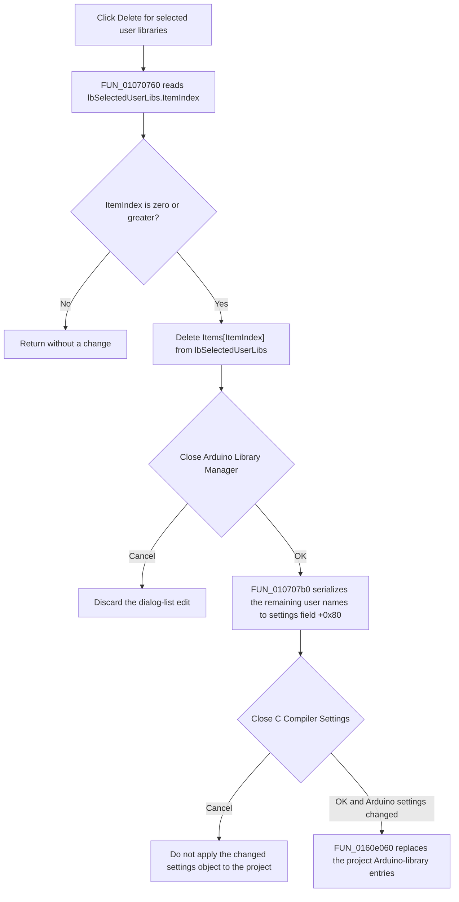

# Delete a selected user library

> Analysis status: Complete. The recovered handler, sibling list operations, dialog commit path, caller, and resource glyph support this behavior.

## Control

| Property | Recovered value |
| --- | --- |
| Form | ArduinoLibrary |
| Component path | ArduinoLibrary.sbDeleteUser |
| Control class | TSpeedButton |
| Caption | Not present in the recovered resource. |
| Hint | Delete |
| Handler name | sbDeleteUserClick |
| Handler address | 01070760 |
| Graph node | `resource:dfm:ArduinoLibrary/ArduinoLibrary.sbDeleteUser` |
| Handler node | `function:01070760` |
| Graph layer | UI |

## What happens when clicked

The handler reads `ItemIndex` from `lbSelectedUserLibs`. If the index is negative, it returns without a state change. If the index is zero or greater, it calls `Delete(ItemIndex)` on that list box's `Items` object. This removes only the selected user-library name from the dialog's selected-user list. It does not remove the same name from `lbUserLibs`, which is the available-user list.

This click does not save the change by itself. If the user accepts the Arduino Library Manager, [`FUN_010707b0`](../../../DecompiledSources/Tina16/functions/00000000010707B0__FUN_010707b0.c) collects the remaining selected-user names, creates comma-delimited quoted text, and writes that text to field `+0x80` of the compiler-settings object. The dialog caller then marks that object as changed. If the user cancels the Arduino dialog, its built-in Cancel button closes the dialog without running this OK handler, so the deleted row is not copied to the settings object.

The parent C Compiler Settings dialog is a second commit boundary. Its caller applies the changed Arduino-library fields to the project only after that parent dialog returns OK. [`FUN_0160e060`](../../../DecompiledSources/Tina16/functions/000000000160E060__FUN_0160e060.c) clears the project's Arduino-library target list and adds the serialized standard- and user-library strings from settings fields `+0x78` and `+0x80`. A parent-dialog cancel bypasses this application step. The traced path contains no file, registry, or network write.

## Click and commit flow

## Selection, list, and ownership evidence

- [`FUN_01070760`](../../../DecompiledSources/Tina16/functions/0000000001070760__FUN_01070760.c) uses form field `+0x718`. The DFM component order and the parallel user-add handler identify this field as `lbSelectedUserLibs`.
- The first virtual call at slot `+0x260` reads the list box selection index. The signed test `-1 < iVar2` is the only guard.
- On the accepted branch, the handler reads the index again and calls slot `+0x98` on the list box's `Items` object at control field `+0x4a0`. The parallel standard-library handler performs the same operation on `lbSelectedStandardLibs`, which establishes this as indexed item deletion.
- The user-add handler copies only the selected name from `lbUserLibs.Items` to `lbSelectedUserLibs.Items`. It does not attach an application object. The delete handler likewise does not read an `Objects` entry, move an object pointer, or call an object destructor.
- The list box continues to own its `Items` container. The handler removes one string entry from that container; it does not destroy the list box, the form, the compiler-settings object, or a user-library object.

## Persistence and downstream evidence

- Form creation allocates two temporary Delphi string lists at form fields `+0x730` and `+0x738`. Form destruction frees those containers.
- Arduino Library Manager OK iterates `lbSelectedUserLibs.Items`, adds each remaining string to the temporary list at `+0x738`, and calls [`FUN_004b37d0`](../../../DecompiledSources/Tina16/functions/00000000004B37D0__FUN_004b37d0.c). That function temporarily selects comma as the delimiter and double quote as the quote character before producing the delimited text.
- The OK handler copies the user-library result to compiler-settings field `+0x80`. It handles standard libraries in the same way and writes them to `+0x78`.
- [`FUN_01071a70`](../../../DecompiledSources/Tina16/functions/0000000001071A70__FUN_01071a70.c), the `Arduino Libraries...` button handler in C Compiler Settings, marks the compiler-settings object at field `+8` only when the Arduino dialog returns modal result 1.
- [`FUN_0108c580`](../../../DecompiledSources/Tina16/functions/000000000108C580__FUN_0108c580.c) applies those changed settings to the project only after the parent C Compiler Settings dialog also returns modal result 1.

## Resource and glyph evidence

- The control has the hint `Delete`, is next to the list labeled `Selected user libraries`, and is at the right edge of that list.
- Its embedded 32-by-16 bitmap contains two 16-by-16 button-state glyphs. The extracted image is [`0020_ArduinoLibrary_ArduinoLibrary_sbDeleteUser_Glyph_Data.png`](../../../glyph/0020_ArduinoLibrary_ArduinoLibrary_sbDeleteUser_Glyph_Data.png). The bitmap supports a remove/delete action, while the handler establishes the exact target and effect.
- The handler has no direct static call edge in the graph because both `ItemIndex` and `Items.Delete` are Delphi virtual calls.

## No-op and error paths

- No selection (`ItemIndex < 0`): return without changing either list.
- Valid selection: delete one selected-user string immediately from the dialog list.
- The handler does not ask for confirmation, validate the library name, add the name back to the available list, or report an error.
- No explicit exception handler or recovery branch is present. The recovered code does not establish how a VCL exception would be presented.
- Arduino dialog Cancel prevents the list edit from reaching the compiler-settings object. Parent C Compiler Settings Cancel prevents an accepted Arduino-dialog edit from reaching the project list.

## Analysis limits

- The recovered code proves runtime model propagation, but it does not prove when or where the project later writes these settings to durable storage.
- The glyph confirms general delete intent only. The selected-user list field and indexed virtual calls establish the specific behavior.
