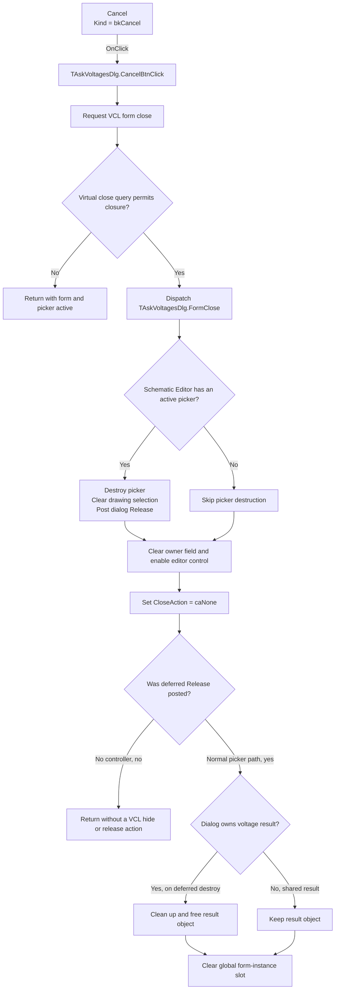

# Cancel

> Analysis status: Recovered control, handler, VCL close path, form lifecycle, caller ownership, and interaction-controller cleanup reviewed.

## Control

| Property | Recovered value |
| --- | --- |
| Form | AskVoltagesDlg |
| Form caption | Nodal Voltages/Meters |
| Component path | AskVoltagesDlg.BtnPanel.CancelBtn |
| Control class | TBitBtn |
| Button kind | bkCancel |
| Explicit DFM caption | Not present |
| Explicit DFM `ModalResult` | Not present |
| Explicit DFM `Cancel` | Not present |
| Handler name | CancelBtnClick |
| Handler address | 00f51340 |
| Form close handler | FormClose at `00f51320` |
| Form destroy handler | FormDestroy at `00f51290` |
| Graph node | `resource:dfm:AskVoltagesDlg/AskVoltagesDlg.BtnPanel.CancelBtn` |
| Handler node | `function:00f51340` |
| Graph layer | UI |

## What happens when clicked

`TAskVoltagesDlg.CancelBtnClick` contains one direct call. It requests closure
through the common VCL form-close routine. The decompiler omits the implicit
form argument at this call site. The event binding and the callee signature
show that the receiver is `AskVoltagesDlg`.

The recovered callers use the VCL `Show` wrapper, not `ShowModal`. The button
therefore follows the modeless branch of the close routine. This branch first
calls the form's virtual close query. If the query permits closure, the VCL
selects a default close action and dispatches `TAskVoltagesDlg.FormClose`.
The DFM has no `OnCloseQuery` binding. The recovered graph does not resolve a
class-specific close-query override, so the reason for a possible veto is
unknown.

`FormClose` calls `FUN_01c6cf20` on the global Schematic Editor. That function
owns the current interactive command at editor offset `+0x1b58` (`7000`
decimal). When the command exists, it calls the command's virtual destructor
and clears the owner field. It then enables the editor control at offset
`+0xbd0`.

The controller created with this dialog tracks the editor's voltage-selection
interaction. Its recovered destructor refreshes the current drawing list,
clears the selected object, and posts the VCL release message for the global
`AskVoltagesDlg` instance. Its base destructor also removes the controller from
the Schematic Editor. This is the operation that ends the interactive picker
and schedules the modeless form for destruction.

After it cancels the editor command, `FormClose` writes `0` to its
`TCloseAction` output. This is Delphi `caNone`. The common close routine does
not apply a second hide, minimize, or release action. The release was already
requested by the interaction-controller destructor.

## Kind, modal result, and keyboard behavior

The DFM stores only `Kind = bkCancel`. It does not store separate `Caption`,
`ModalResult`, or `Cancel` values for this control. The built-in VCL kind
supplies the standard Cancel presentation and cancel-button semantics. This
resource evidence supports the control's purpose.

The observed close behavior does not depend on a modal result. The recovered
openers show this form modelessly, and the click handler explicitly calls the
form-close routine. No code in this handler reads or writes the form's modal
result.

## Ownership and retained state

The openers pass a voltage-result object to the form at offset `+0x700` and
install the picking controller in the Schematic Editor. Ownership of the
result object depends on form byte `+0x6e0`:

- `FormCreate` sets the byte to `1`. The two calculation-result openers keep
  this default. When the form is destroyed, `FormDestroy` performs result
  cleanup and frees the object.
- The opener that displays an existing editor-owned result sets the byte to
  `0`. `FormDestroy` then leaves that shared result object allocated.

The Cancel handler itself does not edit or free the result. Destruction follows
the ownership flag, so a shared result is not freed as if it belonged to the
dialog. `FormDestroy` always clears the global form-instance slot after its
conditional result cleanup.

The voltage viewer has a view grid and no recovered edit or commit event. The
controller can change the live drawing selection while the picker is active.
Its destructor clears that selection. No recovered cancel path calls an undo
routine, restores a schematic snapshot, writes a file, or reverses the voltage
calculation that occurred before the viewer opened. Cancel ends the interactive
viewer and releases only the objects that this interaction owns.

## No-op and error boundaries

- If the virtual close query rejects closure, the VCL returns before
  `FormClose`. The active controller and form stay unchanged.
- If `FormClose` runs when the Schematic Editor has no active controller,
  `FUN_01c6cf20` has no controller to destroy. It still enables the editor
  control. Because `FormClose` returns `caNone`, this exceptional path does not
  issue a hide or release request from the common close routine.
- In the normal opening path, the opener installs the controller immediately
  after it shows the form. The normal Cancel path therefore reaches the
  controller cleanup and deferred form release.
- The click handler has no condition, retry, error message, allocation, or
  exception-specific recovery.

## Click flow

## Handler and lifecycle evidence

- Cancel handler: [FUN_00f51340](../../../DecompiledSources/Tina16/functions/0000000000F51340__FUN_00f51340.c)
- VCL form-close routine: [FUN_00805200](../../../DecompiledSources/Tina16/functions/0000000000805200__FUN_00805200.c)
- Form `OnClose`: [FUN_00f51320](../../../DecompiledSources/Tina16/functions/0000000000F51320__FUN_00f51320.c)
- Form `OnDestroy`: [FUN_00f51290](../../../DecompiledSources/Tina16/functions/0000000000F51290__FUN_00f51290.c)
- Form `OnCreate`: [FUN_00f51350](../../../DecompiledSources/Tina16/functions/0000000000F51350__FUN_00f51350.c)
- Modeless opening and owned-result path: [FUN_0131f8d0](../../../DecompiledSources/Tina16/functions/000000000131F8D0__FUN_0131f8d0.c)
- Shared-result opening path: [FUN_01c9c130](../../../DecompiledSources/Tina16/functions/0000000001C9C130__FUN_01c9c130.c)
- Schematic Editor command cleanup: [FUN_01c6cf20](../../../DecompiledSources/Tina16/functions/0000000001C6CF20__FUN_01c6cf20.c)
- Dialog interaction-controller destructor: [FUN_0136ad30](../../../DecompiledSources/Tina16/functions/000000000136AD30__FUN_0136ad30.c)
- VCL deferred form release: [FUN_00805ad0](../../../DecompiledSources/Tina16/functions/0000000000805AD0__FUN_00805ad0.c)
- Recovered form evidence: [ui-evidence.json](../../../DecompiledSources/Tina16/resources/dfm/ui-evidence.json)

## Direct calls

- `FUN_00805200` — Runs the VCL close-query and close-action pipeline.

## Resource evidence

- `AskVoltagesDlg` has caption `Nodal Voltages/Meters` and binds `OnClose`,
  `OnCreate`, `OnDestroy`, and `OnShow` handlers.
- `CancelBtn` is a `TBitBtn` with `Kind = bkCancel` and `TabOrder = 0`.
- The button has no explicit DFM caption, hint, text, action, `ModalResult`,
  `Cancel`, image reference, or embedded glyph.
- No same-parent label candidate is available. No label evidence is needed for
  the recovered close path.

## Analysis limits

- The recovered DFM does not record the properties that `bkCancel` supplies at
  run time. This article keeps those built-in properties separate from fields
  that are explicit in the DFM stream.
- The close-query virtual call is unresolved. This article does not invent a
  validation rule or close veto.
- `FUN_01c6cf20` ends an editor-owned interactive command. It is not evidence
  of a database transaction or a general schematic undo.
