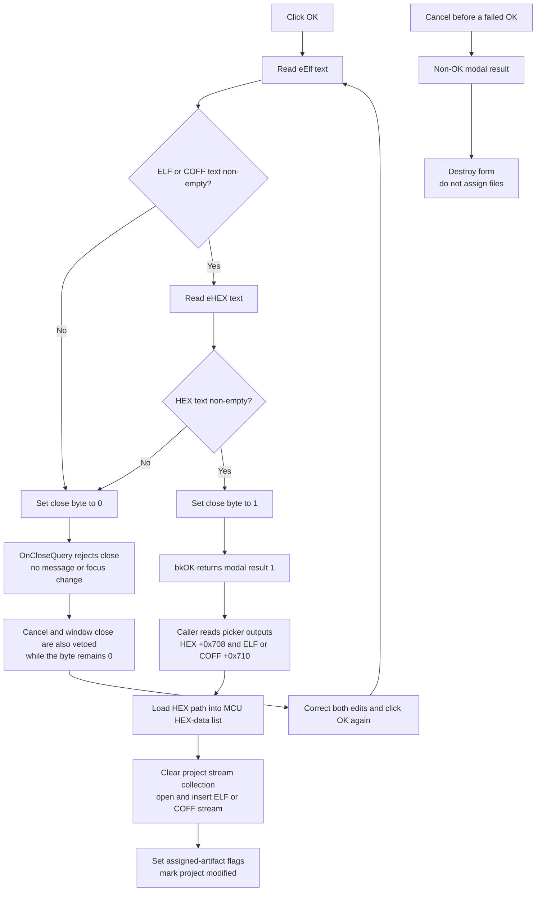

# Accept assigned ELF/COFF and HEX files

## Control

| Property | Recovered value |
| --- | --- |
| Form | AssignElfHex |
| Form caption | Assign Elf/Hex... |
| Component path | AssignElfHex.OK |
| Control class | TBitBtn |
| Kind | bkOK |
| Handler name | OKClick |
| Handler address | 0106ca50 |
| ELF/COFF edit | AssignElfHex.eElf |
| HEX edit | AssignElfHex.eHEX |
| Graph node | `resource:dfm:AssignElfHex/AssignElfHex.OK` |
| Handler node | `function:0106ca50` |
| Graph layer | UI |

## What OK validates

`FUN_0106ca50` reads the complete Unicode text from `eElf` at form offset `+0x6b0`. If that string is non-empty, it reads `eHEX` at `+0x6c8`. It sets the form close-permission byte at `+0x700` to one only when both strings are non-empty; every other case sets it to zero.

This is a presence check, not file validation. The handler does not trim spaces, test file existence, open either file, check `.elf`, `.cof`, or `.hex` extensions, compare base names, or verify that both files describe the same firmware. A string that contains only spaces is non-empty and passes this handler.

The caller selects the upper-file picker mode before it shows the dialog. `FUN_010b3ad0` returns COFF mode only for device type code 8 when project flag bit 0 is clear. The `eElf` hint describes this mode as **Coff: on PIC18 when C18 enabled, Elf: any other case**. The ELF picker then filters for `*.cof` in that mode and `*.elf` otherwise. OK does not repeat or enforce that format choice.

## Visible edits and accepted output paths

The form keeps two separate output strings:

- `+0x710` holds the ELF or COFF path.
- `+0x708` holds the HEX path.

`FormCreate` clears both output strings. The ELF/COFF and HEX picker handlers write these fields only after their `TOpenDialog` returns a selected file; they also copy the same path to the corresponding edit.

OK does not copy either edit to these output fields. It uses the edits only as the non-empty close gate. This creates two important cases:

- Text entered directly in both edits can pass OK while both accepted output paths remain empty.
- If the user selects a file and then changes its edit text manually, OK tests the changed text, but the caller still receives the previously selected path.

Clearing either edit after using its picker blocks OK even though the related output field still contains the selected path.

## Modal close and Cancel behavior

The button has `Kind = bkOK`, so the VCL supplies the standard modal OK result. The handler itself does not write a modal result. `FormCloseQuery` at `FUN_0106ca00` returns the byte at `+0x700` as `CanClose`.

When either edit is empty, OK sets the byte to zero. The close request is then rejected. The handler shows no message, does not focus an edit, and does not explain which value is missing. When both edits are non-empty, it sets the byte to one, the close request succeeds, and `ShowModal` returns result 1.

`FormCreate` initially sets the close byte to one. Therefore, Cancel or the window close command can close a newly opened dialog without committing anything. However, a failed OK attempt leaves the byte at zero, and `FormCloseQuery` does not reset it. A later Cancel or window close request is also rejected until another OK click recomputes the byte as true from two non-empty edits.

The Cancel button has `Kind = bkCancel` and no click handler. The caller processes only modal result 1. Any other result skips every HEX/ELF assignment and destroys the temporary form.

## Commit and downstream file access

`FUN_0108d670`, the **Assign ELF/HEX manually...** menu handler, creates this form and sets its ELF-versus-COFF mode. After modal result 1, it consumes the separate picker-output fields, not the edit controls:

1. It passes HEX output `+0x708` to the virtual file loader of the MCU Project form's HEX-data list at `+0x4d40`.
2. It clears the MCU project collection at project offset `+0x30`.
3. It calls `FUN_004b9f40` with ELF/COFF output `+0x710`. That helper opens the path as a read-mode Delphi file stream and inserts the stream into the project collection.
4. It sets two assigned-artifact state bytes at MCU Project form offsets `+0x4d48` and `+0x4d49`.
5. It calls `FUN_010b2840` with zero. The paired getter is later used by MCU Project close logic to identify a modified project and request a save.

This caller performs the first proven file-access checks. An empty, missing, or inaccessible HEX path can fail while the HEX list loads. An invalid ELF/COFF path can fail when the read-mode stream is created. Neither `FUN_0106ca50` nor `FUN_0108d670` has a local exception handler or rollback branch. The HEX load runs before the old ELF/COFF stream collection is cleared and replaced, so a later ELF/COFF open error can leave partially changed runtime state.

The caller does not prove that the two files belong together or validate their firmware content. It only loads the HEX text and opens the ELF/COFF stream for the MCU project. Later compile and debugger paths use the same HEX-data and project-stream containers.

## Click flow

## Evidence

- [OK handler `FUN_0106ca50`](../../../DecompiledSources/Tina16/functions/000000000106CA50__FUN_0106ca50.c) reads edit controls `+0x6b0` and `+0x6c8` and stores their combined non-empty result in byte `+0x700`.
- [Form close query `FUN_0106ca00`](../../../DecompiledSources/Tina16/functions/000000000106CA00__FUN_0106ca00.c) copies byte `+0x700` directly to `CanClose` and does not reset it.
- [Form creation `FUN_0106ca10`](../../../DecompiledSources/Tina16/functions/000000000106CA10__FUN_0106ca10.c) clears output strings `+0x708` and `+0x710`, initializes the close byte to one, and initializes the ELF/COFF mode byte to zero.
- [ELF/COFF picker `FUN_0106caf0`](../../../DecompiledSources/Tina16/functions/000000000106CAF0__FUN_0106caf0.c) selects the `*.elf` or `*.cof` filter from mode byte `+0x718` and writes a selected path to both `eElf` and output `+0x710`.
- [HEX picker `FUN_0106cd00`](../../../DecompiledSources/Tina16/functions/000000000106CD00__FUN_0106cd00.c) uses the `*.hex` filter and writes a selected path to both `eHEX` and output `+0x708`.
- [Modal caller `FUN_0108d670`](../../../DecompiledSources/Tina16/functions/000000000108D670__FUN_0108d670.c) sets mode `+0x718`, accepts only modal result 1, loads HEX output `+0x708`, clears and replaces the project stream collection from ELF/COFF output `+0x710`, updates two state flags, and marks the project modified.
- [ELF/COFF mode predicate `FUN_010b3ad0`](../../../DecompiledSources/Tina16/functions/00000000010B3AD0__FUN_010b3ad0.c) returns true only for device type 8 with project flag bit 0 clear.
- [File-stream insertion helper `FUN_004b9f40`](../../../DecompiledSources/Tina16/functions/00000000004B9F40__FUN_004b9f40.c) constructs a read-mode file stream for the supplied path and inserts it into the target collection.
- [Project-state setter `FUN_010b2840`](../../../DecompiledSources/Tina16/functions/00000000010B2840__FUN_010b2840.c) stores zero in the project state byte. [MCU Project close query `FUN_010870c0`](../../../DecompiledSources/Tina16/functions/00000000010870C0__FUN_010870c0.c) reads the paired getter and uses zero to enter the localized **Project changed** save-confirmation path.
- The DFM identifies `eElf`, `eHEX`, the ELF and HEX labels, `OK.Kind = bkOK`, `Cancel.Kind = bkCancel`, and the `eElf` COFF/ELF hint. No glyph is stored for OK.

## Direct calls

- `function:0064dd90` reads the Unicode text from each edit control.
- `function:00414560` finalizes the two temporary UnicodeString values.

## Analysis limits

- The recovered OK handler provides no file-content parser, signature check, or ELF-to-HEX correlation test.
- The immediate caller proves that it loads and opens the selected paths. The exact later debugger interpretation of all HEX records and ELF/COFF sections is outside this handler's call path.
