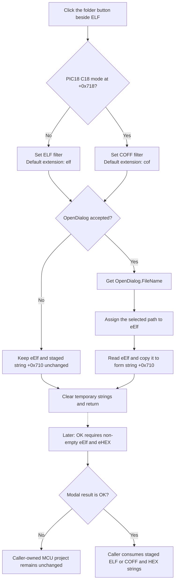

# Browse for an ELF or COFF file

> Analysis status: Source reviewed and behavior traced.

## Control

| Property | Recovered value |
| --- | --- |
| Form | AssignElfHex |
| Component path | AssignElfHex.sbElf |
| Control class | TSpeedButton |
| Caption | Not present in the recovered resource. |
| Hint | Not present on the button. The adjacent `eElf` edit has the hint `Coff: on PIC18 when C18 enabled, Elf: any other case`. |
| Text | Not present in the recovered resource. |
| Handler name | sbElfClick |
| Handler address | 0106caf0 |
| Graph node | `resource:dfm:AssignElfHex/AssignElfHex.sbElf` |
| Handler node | `function:0106caf0` |
| Graph layer | UI |

## What happens when clicked

`sbElfClick` configures the form's shared `OpenDialog` for one of two file types. The mode byte at form offset `+0x718` selects the configuration:

- When the byte is zero, the filter is `ELF file (*.elf)|*.elf` and the default extension is `elf`.
- When the byte is nonzero, the filter is `Coff file (cof)|*.cof` and the default extension is `cof`.

The caller sets this byte before it shows the form. Its result comes from the current MCU project and target. The recovered `eElf` hint identifies the nonzero case as PIC18 with C18 enabled. The filter limits the file-dialog view, but the click handler does not test the selected file's extension, existence, or contents.

The handler does not copy the current `eElf` text to `OpenDialog.FileName`. It also does not assign an initial directory. The DFM has no recovered file-name or initial-directory value for `OpenDialog`. Therefore, the edit text is not an input to the browse operation. Any initial file or directory comes from the shared dialog's existing VCL state.

The handler then executes `OpenDialog`. If the user cancels it, the handler clears its temporary strings and leaves both `eElf` and the form's staged ELF/COFF string unchanged. If the user accepts it, the handler gets `OpenDialog.FileName`, assigns it to `eElf`, reads the resulting edit text, and copies that text to the form-local UnicodeString at `+0x710`. The extra read means the staged value is the text held by the edit after the VCL setter returns.

The paired `sbHEXClick` handler uses the same dialog. It always selects the `Hex file (*.hex)|*.hex` filter and the `hex` default extension. On acceptance, it writes `eHEX` and the form-local string at `+0x708`. The two browse handlers do not update the MCU project directly.

Validation occurs only when the user selects the form's built-in OK button. `OKClick` reads both `eElf` and `eHEX` and permits the form to close only when both texts are non-empty. `FormCloseQuery` returns this Boolean flag. The check does not verify that either file exists or is readable, and it does not display an error. A failed OK attempt can be retried after both edits have text.

The caller creates a new `AssignElfHex` form, sets the mode, and shows it modally. Only modal result `1` transfers the staged values: it passes the HEX string at `+0x708` to a caller-owned virtual setter, adds an object built from the ELF/COFF string at `+0x710` to the MCU project's collection, sets two caller flags, and clears a project-state byte. Canceling the modal form skips all of these caller-owned updates. Because the caller reads the staged strings, while `OKClick` only validates the edit texts, the recovered code only proves synchronization of a typed path when a browse handler has accepted it.

## Click flow

## Handler evidence

- [FUN_0106caf0](../../../DecompiledSources/Tina16/functions/000000000106CAF0__FUN_0106caf0.c) selects the ELF or COFF filter from `+0x718`, executes the dialog at `+0x6f8`, and updates `eElf` at `+0x6b0` and the form string at `+0x710` only after acceptance.
- [FUN_00724270](../../../DecompiledSources/Tina16/functions/0000000000724270__FUN_00724270.c) gets the dialog's selected `FileName`.
- [FUN_0064de00](../../../DecompiledSources/Tina16/functions/000000000064DE00__FUN_0064de00.c) compares and assigns VCL control text. [FUN_0064dd90](../../../DecompiledSources/Tina16/functions/000000000064DD90__FUN_0064dd90.c) reads it back.
- [FUN_0106cd00](../../../DecompiledSources/Tina16/functions/000000000106CD00__FUN_0106cd00.c) is the paired HEX browse handler. It uses the same dialog and stages the accepted path at `+0x708`.
- [FUN_0106ca50](../../../DecompiledSources/Tina16/functions/000000000106CA50__FUN_0106ca50.c) sets the form's close-permission flag from the non-empty state of both edits. [FUN_0106ca00](../../../DecompiledSources/Tina16/functions/000000000106CA00__FUN_0106ca00.c) returns this flag from `FormCloseQuery`.
- [FUN_0106ca10](../../../DecompiledSources/Tina16/functions/000000000106CA10__FUN_0106ca10.c) clears both staged strings when the form is created and initializes the mode and close-permission bytes.
- [FUN_0108d670](../../../DecompiledSources/Tina16/functions/000000000108D670__FUN_0108d670.c) creates and shows the form. It sets the mode before `ShowModal` and consumes `+0x708` and `+0x710` only for modal result `1`.
- Recovered role: Select an ELF or COFF file and stage its path for manual MCU project assignment.
- Complexity: complex
- Distinct outgoing calls: 5

## Resource evidence

- The form caption is **Assign Elf/Hex...**. The labels **ELF** and **HEX** identify the two path rows.
- `eElf` has the hint **Coff: on PIC18 when C18 enabled, Elf: any other case**. This agrees with the mode branch in the handler.
- The extracted [two-frame folder glyph](../../../glyph/0021_AssignElfHex_AssignElfHex_sbElf_Glyph_Data.png) is a 32 by 16 pixel bitmap with `NumGlyphs = 2`. It supports the browse meaning. The handler source proves the file-selection behavior.
- `sbHEX` uses the same two-frame folder image. Its source provides the paired HEX behavior.
- `OpenDialog` is a form-owned `TOpenDialog`. Its DFM properties do not include a file name, initial directory, filter, or default extension. The click handler supplies only the mode-specific filter and default extension.

## No-op and error paths

- Canceling the file dialog is a no-op for `eElf` and `+0x710`.
- Selecting a file does not load, parse, or validate it. It only stages its path in the modal form.
- Empty-text validation occurs at OK, not during browsing. The recovered validation path has no message or field-focus action.
- The handler has no explicit exception handler or file-dialog error branch. Failures from the VCL dialog or string operations are not converted into a form-specific recovery result here.
- The recovered source does not prove that manual text changes are copied to `+0x710`. Only accepted browse selections perform that copy.
