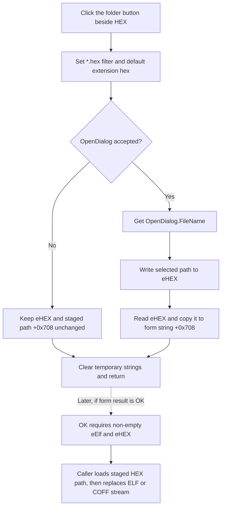

# Browse for a HEX file

> Analysis status: Complete. The recovered handler, shared dialog path, modal caller, and downstream loaders establish the control behavior.

## Control

| Property | Recovered value |
| --- | --- |
| Form | AssignElfHex |
| Form caption | Assign Elf/Hex... |
| Component path | AssignElfHex.sbHEX |
| Control class | TSpeedButton |
| Caption | Not present in the recovered resource. |
| Hint | Not present on the button. |
| Adjacent row label | HEX |
| Handler name | sbHEXClick |
| Handler address | 0106cd00 |
| Graph node | `resource:dfm:AssignElfHex/AssignElfHex.sbHEX` |
| Handler node | `function:0106cd00` |
| Graph layer | UI |

## What happens when clicked

`FUN_0106cd00` configures the form-owned `TOpenDialog` at offset `+0x6f8` with these values:

- Filter: `Hex file (*.hex)|*.hex`
- Default extension: `hex`

The second value is the Delphi UnicodeString at runtime address `0106ce68`. Its recovered UTF-16 bytes decode as `hex`. The handler then calls the dialog's virtual `Execute` method.

The handler does not copy `eHEX.Text` to `OpenDialog.FileName`. It does not assign an initial directory. The DFM stores no file name, initial directory, filter, or default extension for the dialog. Therefore, the current HEX edit text is not an input to this browse click.

If the user accepts the file dialog, the handler gets `OpenDialog.FileName` through `FUN_00724270`. It writes that path to the `eHEX` edit at form offset `+0x6c8`, reads the resulting edit text, and copies it to the form-local UnicodeString at `+0x708`. The read after the write makes the staged value match the text that the VCL edit holds after its setter returns.

If the user cancels the file dialog, the handler does not change `eHEX` or `+0x708`. The filter and default extension were assigned before `Execute`, so those two properties remain changed on the shared dialog. The function clears its temporary UnicodeStrings and returns in both cases.

## Coupling to the ELF or COFF picker

`sbHEXClick` and `sbElfClick` use the same `TOpenDialog` instance. The ELF button changes the shared filter and default extension to `elf` or `cof`; the HEX button changes them back to `hex` values.

There is no recovered code that derives a HEX base name or path from the ELF or COFF edit. However, an accepted ELF or COFF selection remains in the shared dialog's `FileName` property. `FUN_00723190`, the VCL dialog execution path, supplies the dialog's current `FileName` to its backend before it shows the next dialog. Because `sbHEXClick` does not replace that value, an ELF or COFF selection can become the existing file-name state for the next HEX browse. The recovered code does not establish how the Windows dialog presents or edits that value.

The caller sets form byte `+0x718` from the MCU target before it shows the form. This byte selects ELF versus COFF in `sbElfClick`. It does not change the HEX handler: `sbHEXClick` always uses the `.hex` filter and default extension.

## Form-local state and validation

`FUN_0106ca10`, the form creation handler, clears staged HEX string `+0x708` and staged ELF or COFF string `+0x710`. The two picker handlers are the only proven paths that write these staged strings.

The OK handler validates the visible edits, not the staged strings. It permits close only when both `eElf` and `eHEX` are non-empty. It does not trim text, check extensions, test file existence, open either file, or verify that the files belong together. This creates two boundary cases:

- Manually entered HEX text can pass the OK check while `+0x708` is still empty.
- Text changed after a browse can pass the OK check while `+0x708` still contains the earlier selected path.

The built-in Cancel button has no click handler. The modal caller applies state only for result `1`, so a normal form cancellation discards the form-local values. `FormCreate` initially permits close. A failed OK attempt changes the close-permission byte to false; `FormCloseQuery` then also blocks Cancel and the window close command until a later successful OK click restores that byte.

## Downstream use and errors

`FUN_0108d670`, the **Assign ELF/HEX manually...** menu handler, creates a new form and shows it modally. Only modal result `1` causes caller-owned changes. It then:

1. Passes staged HEX path `+0x708` to the MCU Project form's HEX-data loader.
2. Clears the MCU project's existing ELF or COFF stream collection.
3. Opens and inserts the staged ELF or COFF path from `+0x710`.
4. Sets two assigned-artifact flags and marks the project as changed.

This caller performs the first proven file access. The browse handler has no file-open call, parser, message, or local exception handler. An empty, missing, or unreadable staged HEX path can fail in the later HEX loader. An ELF or COFF open can fail after the HEX load and after the old stream collection is cleared. The caller has no recovered local rollback path, so a later failure can leave partially changed runtime state.

## Click flow

## Handler and caller evidence

- [HEX browse handler `FUN_0106cd00`](../../../DecompiledSources/Tina16/functions/000000000106CD00__FUN_0106cd00.c) sets the exact filter and default-extension fields, executes the dialog, and guards every edit and staged-string update with the accepted result.
- [Dialog FileName getter `FUN_00724270`](../../../DecompiledSources/Tina16/functions/0000000000724270__FUN_00724270.c) returns the dialog's selected file name.
- [Dialog execution path `FUN_00723190`](../../../DecompiledSources/Tina16/functions/0000000000723190__FUN_00723190.c) supplies the dialog's existing default extension and file name to the backend before it runs the dialog.
- [ELF or COFF browse handler `FUN_0106caf0`](../../../DecompiledSources/Tina16/functions/000000000106CAF0__FUN_0106caf0.c) uses the same dialog and stages its accepted path at `+0x710`.
- [Form creation `FUN_0106ca10`](../../../DecompiledSources/Tina16/functions/000000000106CA10__FUN_0106ca10.c) clears both staged strings and initializes close permission and ELF-versus-COFF mode.
- [OK handler `FUN_0106ca50`](../../../DecompiledSources/Tina16/functions/000000000106CA50__FUN_0106ca50.c) tests only whether the two edit strings are non-empty. [Form close query `FUN_0106ca00`](../../../DecompiledSources/Tina16/functions/000000000106CA00__FUN_0106ca00.c) returns the resulting close-permission byte.
- [Modal caller `FUN_0108d670`](../../../DecompiledSources/Tina16/functions/000000000108D670__FUN_0108d670.c) consumes `+0x708` and `+0x710` only after modal result `1` and then changes the MCU project.
- [ELF or COFF stream insertion helper `FUN_004b9f40`](../../../DecompiledSources/Tina16/functions/00000000004B9F40__FUN_004b9f40.c) constructs a read-mode file stream for the supplied path and inserts it into the project collection.
- Recovered role: Select and stage a HEX file for manual MCU project assignment.
- Complexity: complex.
- Distinct outgoing calls: 5.

## Resource and image evidence

- The `HEX` label and `eHEX` edit are on the same row as `sbHEX`.
- The button has no caption or hint. Its 32 by 16 pixel bitmap contains two 16 by 16 button-state frames, and the DFM sets `NumGlyphs = 2`.
- The extracted [folder/file browse glyph](../../../glyph/0022_AssignElfHex_AssignElfHex_sbHEX_Glyph_Data.png) supports a file-selection meaning. The `.hex` dialog setup and accepted-path data flow in the handler source prove that meaning.

## Evidence limits

- The handler does not prove that the selected file is Intel HEX or that it matches the ELF or COFF file.
- The shared dialog proves existing-file-name coupling. It does not prove a specific initial folder or exact Windows dialog presentation.
- The recovered handler has no explicit error branch. VCL or downstream loader failures are not converted to a control-specific result here.
