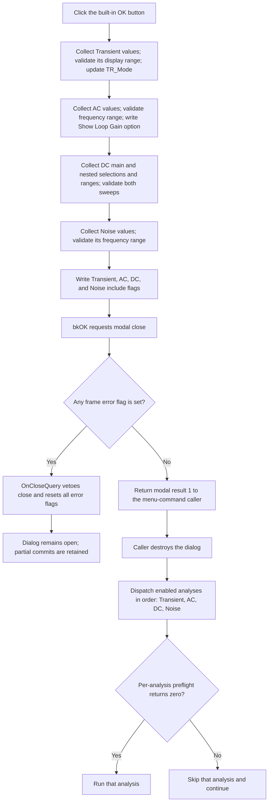

# OK

> Analysis status: Complete. The recovered handler, four frame validators, close-query handler, caller, and batch dispatcher establish the validation, commit, veto, and execution boundaries.

## Control

| Property | Recovered value |
| --- | --- |
| Form | BatchSimulationDlg |
| Component path | BatchSimulationDlg.btnOK |
| Control class | TBitBtn |
| Built-in kind | `bkOK` |
| Caption | Supplied by the built-in button kind. No explicit caption is stored in the DFM. |
| Handler name | btnOKClick |
| Handler address | 01c49890 |
| Graph node | `resource:dfm:BatchSimulationDlg/BatchSimulationDlg.btnOK` |
| Handler node | `function:01c49890` |
| Graph layer | UI |

## What happens when clicked

`FUN_01c49890` collects and validates all four analysis frames in this fixed order: Transient, AC Transfer, DC Transfer, and Noise. The four `Add ... to batch` checkboxes do not control validation. An analysis frame is still read and validated when its include checkbox is clear.

The handler starts the AC collection from the current global AC values. The other three frame routines copy the current global simulation record to local working storage. Each routine reads its controls into that working state. A frame writes its working record back only when that frame has no cross-field validation error.

After all four routines return, the handler writes the four include-checkbox states to global flags. It does this even when one of the frame routines set a cross-field error flag. It does not start a simulation and does not set the form modal result itself.

## Inputs and validation

| Analysis frame | Values read | Cross-field checks | Commit and side effects |
| --- | --- | --- | --- |
| Transient | Start display, end display, Draw excitation, one of `Calculate operating point`, `Use initial conditions`, or `Zero initial values`, and Use switching model. | End must be greater than start. Start can be zero but cannot be negative. | If valid, copies the transient working record to the global simulation record. The Use switching model value is also propagated to recovered `TR_Mode` properties in the active circuit before the frame commit test, so this model-side change can occur even when the range is invalid. |
| AC Transfer | Start frequency, end frequency, number of points, Linear or Logarithmic sweep, Amplitude, Phase, Bode, Nyquist, Group Delay, and Show Loop Gain output only. | End must be greater than start, start must be greater than zero, and end must not exceed `1e50`. This check is applied for both sweep types. | The handler commits start, end, points, sweep type, and diagram flags only when the AC frame error flag is clear. The Show Loop Gain option is written to `TINA.INI` during collection, even when the AC range is invalid. |
| DC Transfer | Main and nested input selections, both start and end values, both point counts, both sweep types, main hysteresis, and nested-sweep enable state. | For a Linear sweep, start and end must differ. For a Logarithmic sweep, end must be greater than start, start must be greater than zero, and end must not exceed `1e50`. The routine checks both ranges even when nested sweep is disabled. | If no DC error is set, copies the complete DC working record to the global simulation record. |
| Noise | Start frequency, end frequency, number of points, S/N signal amplitude, and Output Noise, Input Noise, Total Noise, and Signal to Noise diagram flags. | End must be greater than start, start must be greater than zero, and end must not exceed `1e50`. | If valid, copies the Noise working record to the global simulation record. |

The numeric controls also validate while their text is parsed:

- `TFloatEdit` parsing rejects values outside `-1e50` through `1e50` and applies any control-specific validation callback.
- `TIntEdit` parsing checks the control's configured minimum and maximum.
- These parser failures raise an exception. `FUN_01c49890` has no local exception handler, so the current validator stops and later validators and include-flag writes do not run.

The recovered cross-field routines do not add another explicit point-count check. Noise also has no additional cross-field check for S/N signal amplitude.

## DC input-list construction

The OK handler consumes the selected main and nested input names. The lists are prepared when the form is created:

- `FUN_010be2d0` scans supported circuit objects and circuit variables to build the main input list. It uses recovered labels when present and generates fallback names for unlabeled objects.
- It restores the main selection from the working DC record when possible. Otherwise, it selects an available default.
- It copies the main list to the nested selector, removes entries with the two recovered object-type codes `0x24` and `0x6c`, then restores the nested selection or uses index zero.
- Selection-change helpers update the displayed units. The DC collector reads the selected item text for both sweeps and copies the nested unit text to its working record.

The OK handler does not rebuild these lists.

## Close veto and modal result

The built-in `bkOK` behavior requests a standard OK modal close after the click handler returns. `BatchSimulationDlg.OnCloseQuery`, recovered as `FUN_01c496b0`, allows that close only when all four frame error flags are clear.

Each cross-field validator reports a localized error and sets its own flag. The common helper displays only the first error for that frame while its flag is set. Validation continues with the later frames, so one click can report one error from more than one frame.

When any flag is set, `OnCloseQuery` returns false and the dialog stays open. It then resets all four flags so the next OK attempt performs a new validation pass. When all flags are clear, the form closes with the standard OK result.

This design permits partial changes on a rejected close:

- A valid frame can commit its global record before a later frame fails.
- All four include flags are committed after cross-field validation calls, even if `OnCloseQuery` later vetoes the close.
- Transient `TR_Mode` propagation and the AC Show Loop Gain INI write can occur before a veto.

## OK and batch-execution flow

## Caller ownership and execution boundary

The `Batch Simulation...` menu handler `FUN_01c93120` creates this dialog with the application as owner, calls `ShowModal`, captures the result, and explicitly destroys the dialog. Only after destruction, and only when the result is `1`, does it call `FUN_01c92e80` to run the batch.

`FUN_01c92e80` reads the four global include flags and processes enabled analyses in this fixed order:

1. Transient
2. AC Transfer
3. DC Transfer
4. Noise

Each enabled analysis has a separate preflight or setup call. Its execution function runs only when that call returns zero. A skipped or failed preflight does not stop the dispatcher from testing the later include flags. If all four include checkboxes are clear, the accepted dialog still returns OK, but the dispatcher runs no analysis.

## Error and no-op paths

- Cancel uses the built-in `bkCancel` button. It does not call this handler, and the caller does not dispatch the batch.
- A numeric parser exception stops the handler at that input. Later frame collection and later global writes do not occur. Earlier side effects or valid-frame commits are not rolled back here.
- A cross-field range error sets a frame flag and continues the handler. `OnCloseQuery` later vetoes the close.
- No include checkbox selected: validation and commits still occur, the dialog can close with OK, and the batch dispatcher performs no analysis.
- An enabled analysis whose preflight returns nonzero is skipped. Later enabled analyses are still considered.
- No routine in this path rolls back a global record, include flag, circuit `TR_Mode` value, or INI value after a close veto.

## Handler evidence

- OK handler: [FUN_01c49890](../../../DecompiledSources/Tina16/functions/0000000001C49890__FUN_01c49890.c)
- Close veto: [FUN_01c496b0](../../../DecompiledSources/Tina16/functions/0000000001C496B0__FUN_01c496b0.c)
- Form initialization: [FUN_01c49730](../../../DecompiledSources/Tina16/functions/0000000001C49730__FUN_01c49730.c)
- Transient collector: [FUN_00f5d4a0](../../../DecompiledSources/Tina16/functions/0000000000F5D4A0__FUN_00f5d4a0.c)
- AC collector: [FUN_00f07e10](../../../DecompiledSources/Tina16/functions/0000000000F07E10__FUN_00f07e10.c)
- DC collector: [FUN_010be740](../../../DecompiledSources/Tina16/functions/00000000010BE740__FUN_010be740.c)
- Noise collector: [FUN_0149cb90](../../../DecompiledSources/Tina16/functions/000000000149CB90__FUN_0149cb90.c)
- Frame error helper: [FUN_01b1cf30](../../../DecompiledSources/Tina16/functions/0000000001B1CF30__FUN_01b1cf30.c)
- Float parser: [FUN_00b90090](../../../DecompiledSources/Tina16/functions/0000000000B90090__FUN_00b90090.c)
- Integer parser: [FUN_00f04d50](../../../DecompiledSources/Tina16/functions/0000000000F04D50__FUN_00f04d50.c)
- Menu-command caller: [FUN_01c93120](../../../DecompiledSources/Tina16/functions/0000000001C93120__FUN_01c93120.c)
- Batch dispatcher: [FUN_01c92e80](../../../DecompiledSources/Tina16/functions/0000000001C92E80__FUN_01c92e80.c)
- Recovered role: Validates and commits four batch-analysis setups, saves their include flags, and relies on `OnCloseQuery` to veto an invalid OK close.
- Complexity: complex
- Distinct outgoing calls: 4

## Direct calls

- `function:00f5d4a0` - Collects and validates the Transient frame and commits its valid working record.
- `function:00f07e10` - Collects AC values and flags into local outputs and reports an invalid frequency range.
- `function:010be740` - Collects and validates both DC sweeps and commits the valid DC working record.
- `function:0149cb90` - Collects and validates the Noise frame and commits its valid working record.

## Resource evidence

- The form caption is `Batch simulation`.
- The four tabs are `Transient`, `AC Transfer`, `DC Transfer`, and `Noise`.
- Their checkboxes say `Add transient analysis to batch`, `Add AC transfer to batch`, `Add DC transfer to batch`, and `Add noise analysis to batch`.
- The AC and DC sweep groups contain `Linear` and `Logarithmic`.
- The Transient control group contains `Calculate operating point`, `Use initial conditions`, and `Zero initial values`.
- The OK button uses the built-in `bkOK` kind and two built-in glyph states. There is no separately extracted glyph or explicit caption.

## Evidence limits

- The DFM evidence does not expose the configured minimum and maximum of each custom integer editor. The parser proves that it enforces those stored bounds, but not their numeric values.
- The recovered code identifies two DC nested-list object-type codes that are removed. It does not preserve their original Delphi enumeration names.
- Per-analysis preflight routines can report or handle their own failures. This article only states the dispatch decision that is visible in `FUN_01c92e80`.
