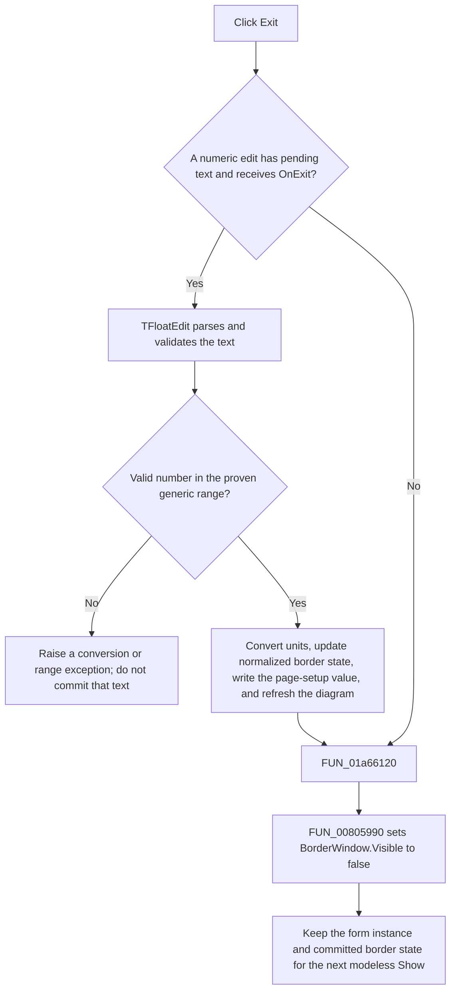

# Exit the Border window

> Analysis status: Complete. The recovered button handler, modeless show path, numeric edit handlers, page-setting writer, and VCL visibility routines support this behavior.

## Control

| Property | Recovered value |
| --- | --- |
| Form | BorderWindow |
| Form caption | Border |
| Component path | BorderWindow.OKBtn |
| Control class | TBitBtn |
| Caption | Exit |
| Kind | bkOK |
| Handler name | OKBtnClick |
| Handler address | 01a66120 |
| Recovered presentation | Persistent modeless form that is shown and hidden. |
| Graph node | `resource:dfm:BorderWindow/BorderWindow.OKBtn` |
| Handler node | `function:01a66120` |
| Graph layer | UI |

## What happens when clicked

`TBorderWindow.OKBtnClick` has one operation: it calls the common VCL hide wrapper. That wrapper clears the form's visible state. It does not release or destroy the form. The missing form argument in the decompiled call is an implicit-self recovery artifact; [`FUN_00805990`](../../../DecompiledSources/Tina16/functions/0000000000805990__FUN_00805990.c) requires the object and forwards it with `Visible = false`.

The recovered caller confirms that BorderWindow is modeless. [`FUN_01a80db0`](../../../DecompiledSources/Tina16/functions/0000000001A80DB0__FUN_01a80db0.c), the DFWindow Margin tool-button handler, calls the paired VCL `Show` wrapper on the persistent global BorderWindow instance and then refreshes its controls. It does not call `ShowModal`, wait for an OK result, or copy values back after the form is hidden.

The button therefore does not commit border values. Border changes are already committed by the four numeric edits when their `OnExit` events run. Exit only hides the editor after any focus-change event that VCL dispatches before the click.

## Exit flow

The `OnExit` branch is a VCL focus transition, not a direct call from `OKBtnClick`. The recovered OK handler does not force a still-focused edit to parse. If VCL does not dispatch that edit's `OnExit`, the handler only hides the form.

## Border and page-setting state

The form edits a normalized page border. Its controls and recovered formulas have these meanings:

- `LeftFE` supplies the left margin distance. [`FUN_01a65790`](../../../DecompiledSources/Tina16/functions/0000000001A65790__FUN_01a65790.c) divides that distance by the page width and stores the normalized left coordinate as `LeftMargin`.
- `RightFE` supplies the distance from the right page edge. [`FUN_01a65910`](../../../DecompiledSources/Tina16/functions/0000000001A65910__FUN_01a65910.c) stores `1 - distance / page width` as the normalized right coordinate named `RightMargin`.
- `TopFE` supplies the top margin distance. [`FUN_01a65ac0`](../../../DecompiledSources/Tina16/functions/0000000001A65AC0__FUN_01a65ac0.c) divides that distance by the page height and stores the normalized top coordinate as `TopMargin`.
- `WidthHeightFE` supplies the desired width-to-height ratio of the usable border rectangle. [`FUN_01a65c40`](../../../DecompiledSources/Tina16/functions/0000000001A65C40__FUN_01a65c40.c) derives the normalized bottom coordinate from the current left, right, and top coordinates, the page dimensions, and this ratio, then stores it as `BottomMargin`.

The unit drop-down contains `millimeter` and `inch`. Changing it selects the matching `mm` or `inch` notebook page and repopulates all four edits from the normalized model. Millimeter display values use page width and height directly. Inch values divide those dimensions by 25.4. The width-to-height ratio is dimensionless and is unchanged by the unit choice.

[`FUN_01a65f30`](../../../DecompiledSources/Tina16/functions/0000000001A65F30__FUN_01a65f30.c) performs this model-to-control refresh when the Margin tool opens the form, when the form is shown, and when the unit changes. This is not an accepted-result copy-back operation.

## Numeric validation and ranges

- The four edits are `TFloatEdit` controls. Their shared getter, [`FUN_00b90090`](../../../DecompiledSources/Tina16/functions/0000000000B90090__FUN_00b90090.c), reads and parses the control text.
- A parse failure raises a Delphi conversion exception. The BorderWindow change handler does not catch it, so the model update and page refresh that follow the getter do not run for that text.
- The shared getter rejects values less than `-1e50` or greater than `1e50`. The boundary values themselves pass this test.
- The getter can call an optional control-specific validator. The recovered BorderWindow DFM and form methods do not establish such a validator for these four edits.
- The recovered BorderWindow formulas do not add a zero, positive-only, page-size, or `0..1` guard. In particular, the width-to-height handler divides by the entered ratio without an explicit zero check. The recovered source does not establish a friendly error for that case.
- Each spin button changes its edit text through the FloatEdit setter: left, right, and top use steps of `1.0`; width-to-height uses `0.1`. The actual model update still belongs to the edit's `OnExit` handler.

## Staged and committed state

- Text that has not reached its edit's `OnExit` handler is only staged in that control.
- A successful `OnExit` converts the displayed millimeter or inch value to normalized page state, updates the corresponding live border object, and calls [`FUN_01ae7390`](../../../DecompiledSources/Tina16/functions/0000000001AE7390__FUN_01ae7390.c) with section `Diagram Page Setup` and key `LeftMargin`, `RightMargin`, `TopMargin`, or `BottomMargin`.
- The same successful handler then calls [`FUN_01a65d80`](../../../DecompiledSources/Tina16/functions/0000000001A65D80__FUN_01a65d80.c). That routine copies all four normalized margins to every object in the current diagram collection, clears two cached integer fields, recalculates the page geometry, and requests a redraw.
- Exit does not repeat these writes and does not copy data to a caller. It only changes visibility.

## Modal result, close veto, and cancel contrast

- The button resource has `Kind = bkOK`, but the recovered handler does not write a modal result. The opening path uses modeless `Show`, and no caller checks an OK result.
- Exit calls `Hide` directly. It bypasses [`FUN_00805200`](../../../DecompiledSources/Tina16/functions/0000000000805200__FUN_00805200.c), the common VCL Close routine. It therefore does not run a close query, dispatch `OnClose`, select a close action, or offer an application close veto.
- The form has no recovered Cancel button. There is no snapshot, rollback, or discard handler.
- Closing the form through the window close command is different from Exit: the VCL Close path can dispatch [`FUN_01a65d70`](../../../DecompiledSources/Tina16/functions/0000000001A65D70__FUN_01a65d70.c), whose only operation selects action value `1`, the VCL hide action. That path also does not restore earlier margins.
- Hiding the form keeps the instance and its control state. The Margin tool shows the same global instance later and refreshes its controls from the already committed normalized state.

## Error and no-op behavior

- A numeric conversion or generic-range error occurs in the edit's `OnExit` path, before that edit updates page state. The handlers have no local recovery branch.
- `OKBtnClick` itself has no condition, validation, error message, modal-result write, save call, or cleanup call.
- Calling Exit when the form is already hidden repeats `Visible = false` and has no additional effect.
- No custom glyph or image is present for Exit. Its evidence is the `Exit` caption, `bkOK` kind, handler body, and modeless caller path.

## Handler evidence

- Button handler: [FUN_01a66120](../../../DecompiledSources/Tina16/functions/0000000001A66120__FUN_01a66120.c)
- VCL hide wrapper: [FUN_00805990](../../../DecompiledSources/Tina16/functions/0000000000805990__FUN_00805990.c)
- Modeless Margin-tool caller: [FUN_01a80db0](../../../DecompiledSources/Tina16/functions/0000000001A80DB0__FUN_01a80db0.c)
- Recovered form evidence: [ui-evidence.json](../../../DecompiledSources/Tina16/resources/dfm/ui-evidence.json)
- Complexity: simple
- Distinct outgoing calls: 1

## Direct call

- `function:00805990` — Hides a VCL form by clearing its visible state.

## Analysis limits

- The normal focus-event order explains why a clicked button usually receives control only after the focused edit's `OnExit`. The decompiled OK handler does not call an edit handler, so this article keeps that event boundary explicit.
- The page-setup writer clearly receives a settings location, section, key, and value. The recovered call path does not identify the physical storage format in this article.
- No BorderWindow-specific numeric validator is visible in the DFM or recovered form methods. A custom control override outside this form could add behavior that is not resolved here.
