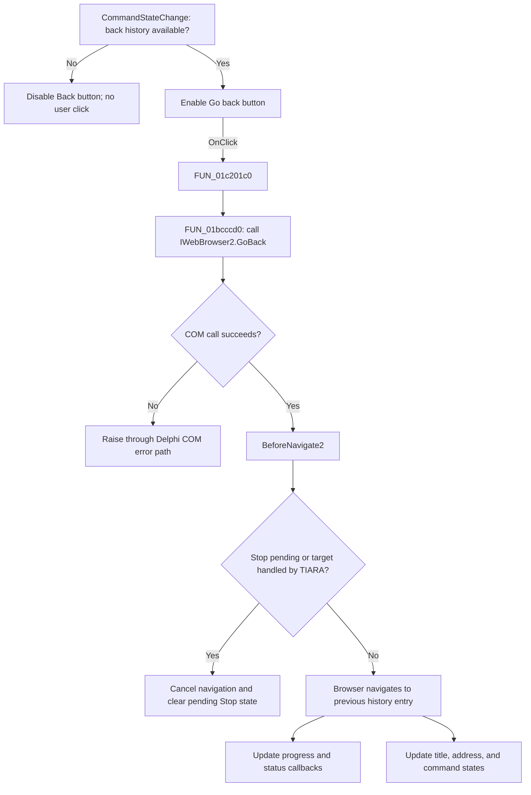

# Go back

This button asks the embedded `TWebBrowser` to navigate to its previous history entry.

## Control

| Property | Recovered value |
| --- | --- |
| Form | BrowserFrm |
| Component path | BrowserFrm.TopPL.BackBtn |
| Control class | TSpeedButton |
| Caption | Not present in the recovered resource. |
| Hint | Go back |
| Text | Not present in the recovered resource. |
| Handler name | BackBtnClick |
| Handler address | 01c201c0 |
| Graph node | `resource:dfm:BrowserFrm/BrowserFrm.TopPL.BackBtn` |
| Handler node | `function:01c201c0` |
| Graph layer | UI |

## What happens when clicked

`FUN_01c201c0` passes `BrowserFrm.MainBrowser` to `FUN_01bcccd0`. The callee acquires the browser's COM interface and invokes `IWebBrowser2.GoBack`. The browser owns the history stack. The click handler does not read or change an application-maintained history list.

The click also does not test the browser's busy state, stop-request flag, or current address. It submits `GoBack` and lets the browser raise its navigation events. `MainBrowser.OnCommandStateChange` enables or disables `BackBtn` when the COM browser reports that backward navigation is available or unavailable. Thus, the normal no-history state prevents a user click.

If the browser accepts `GoBack`, the existing callbacks handle the resulting navigation:

- `OnBeforeNavigate2` shows `Downloading <target>...`. It can cancel the request when a pending Stop action exists or when TIARA handles the target content itself.
- `OnProgressChange` updates the progress-bar range and position.
- `OnStatusTextChange` writes browser status text to the first status-bar panel, and `OnDownloadComplete` clears that panel.
- `OnTitleChange` copies the page title to the form caption.
- `OnDocumentComplete` reads the browser `LocationURL` property and copies it to the address combo box.
- `OnCommandStateChange` refreshes the Back and Forward enabled states after the browser history changes.

The GoBack wrapper checks the returned COM `HRESULT`. A negative result enters the Delphi COM error path. Neither `FUN_01bcccd0` nor this click handler catches that exception or shows a control-specific message. This matters if code invokes the handler while no back entry exists or if history availability changes after the button was enabled. No recovered `OnNavigateError` binding adds a form-specific error display.

## Click flow

## Handler evidence

- Source: [DecompiledSources/Tina16/functions/0000000001C201C0__FUN_01c201c0.c](../../../DecompiledSources/Tina16/functions/0000000001C201C0__FUN_01c201c0.c)
- Recovered role: Requests backward navigation in `MainBrowser`.
- Current graph summary: Handles `BrowserFrm.TopPL.BackBtn.OnClick` and calls the recovered `TWebBrowser.GoBack` wrapper.
- Input: The `MainBrowser` component stored at form field `+0x6c8`.
- Decision: The handler has no branch. Browser history availability is enforced by the separate command-state callback.
- State change: No form field changes in this handler. Navigation and UI changes arrive through browser callbacks.
- Output: A COM `GoBack` request, or a Delphi COM exception when the call returns a failing `HRESULT`.
- Complexity: simple
- Distinct outgoing calls: 1

## Direct calls

- `function:01bcccd0` — [FUN_01bcccd0](../../../DecompiledSources/Tina16/functions/0000000001BCCCD0__FUN_01bcccd0.c), which acquires the hosted browser interface, invokes vtable slot `0x38` (`IWebBrowser2.GoBack`), checks the `HRESULT`, and releases the interface reference.

Relevant asynchronous callbacks:

- [FUN_01c20280](../../../DecompiledSources/Tina16/functions/0000000001C20280__FUN_01c20280.c) handles `OnBeforeNavigate2`, status setup, application content interception, and cancellation.
- [FUN_01c20a60](../../../DecompiledSources/Tina16/functions/0000000001C20A60__FUN_01c20a60.c) maps browser command-state changes to the Back and Forward enabled states.
- [FUN_01c208e0](../../../DecompiledSources/Tina16/functions/0000000001C208E0__FUN_01c208e0.c) updates progress range and position.
- [FUN_01c20be0](../../../DecompiledSources/Tina16/functions/0000000001C20BE0__FUN_01c20be0.c) writes status text, and [FUN_01c20910](../../../DecompiledSources/Tina16/functions/0000000001C20910__FUN_01c20910.c) clears it after download completion.
- [FUN_01c20940](../../../DecompiledSources/Tina16/functions/0000000001C20940__FUN_01c20940.c) updates the form title, and [FUN_01c209b0](../../../DecompiledSources/Tina16/functions/0000000001C209B0__FUN_01c209b0.c) updates the displayed address from `LocationURL`.

## Resource evidence

- Kind: Not present in the recovered resource.
- Modal result: Not present in the recovered resource.
- Checked state: Not present in the recovered resource.
- List items: Not present in the recovered resource.
- Image reference: Not present in the recovered resource.
- Extracted glyph: [`0032_BrowserFrm_BrowserFrm_TopPL_BackBtn_Glyph_Data.png`](../../../glyph/0032_BrowserFrm_BrowserFrm_TopPL_BackBtn_Glyph_Data.png)

The resource sets `NumGlyphs` to `2`. The 48 by 24 bitmap contains a blue 24 by 24 left-arrow frame and a gray disabled-state frame. This matches the `Go back` hint and the source-proven `GoBack` call. The gray frame also agrees with the command-state callback that disables the button when no back history is available.

## Nearby label candidates

Nearby labels are layout candidates only. They are not proof of behavior.

- Rank 1: Address: at distance 1192.

## Analysis limits

- The handler does not cancel a currently busy navigation before it calls `GoBack`.
- The browser controls the exact history target and whether the request generates a navigation event.
- The distant **Address:** label is not used to identify the button's action. Address updates are established by `OnDocumentComplete` source evidence.
