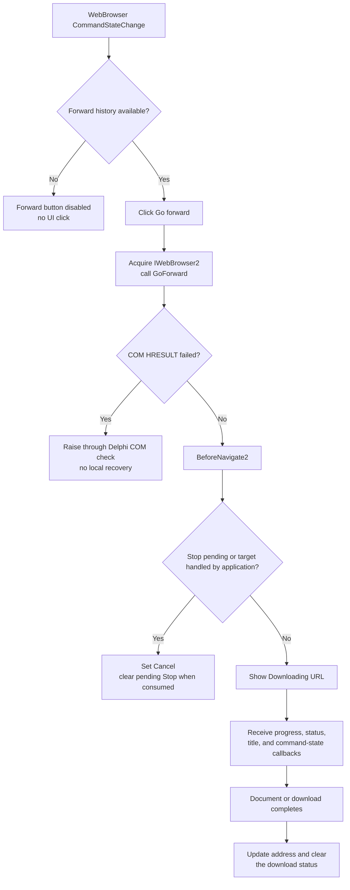

# Go forward

> Analysis status: Complete. The button requests `IWebBrowser2.GoForward`; browser callbacks own history availability, cancellation, progress, status, title, and address updates.

## Control

| Property | Recovered value |
| --- | --- |
| Form | BrowserFrm |
| Form caption | Browse |
| Component path | BrowserFrm.TopPL.ForwardBtn |
| Control class | TSpeedButton |
| Caption | Not present in the recovered resource. |
| Hint | Go forward |
| Glyph | Two 24 by 24 right-arrow frames, one blue and one gray. |
| Handler name | ForwardBtnClick |
| Handler address | 01c201e0 |
| Graph node | `resource:dfm:BrowserFrm/BrowserFrm.TopPL.ForwardBtn` |
| Handler node | `function:01c201e0` |
| Graph layer | UI |

## What happens when clicked

`FUN_01c201e0` passes `MainBrowser`, the form field at offset `+0x6C8`, to
`FUN_01bccd40`. That wrapper acquires the hosted browser's automation
interface, invokes vtable slot `+0x40`, checks the returned HRESULT, and
releases the interface. In the recovered `IWebBrowser2` method order, slot
`+0x40` is `GoForward`; the paired Back handler calls slot `+0x38`, `GoBack`.

The call asks the embedded WebBrowser to move to its next history entry. It
does not read or modify an application history list, URL string, selection, or
busy flag. The browser owns the history position and starts navigation through
its normal asynchronous event sequence.

## History and enabled state

`MainBrowserCommandStateChange` handles the browser's command-state callback.
Command identifier `1` is `CSC_NAVIGATEFORWARD`; the handler applies its
Boolean state to `ForwardBtn.Enabled`. Command identifier `2` similarly updates
the Back button. The gray frame in the recovered two-frame glyph supports this
enabled/disabled presentation, while the hint **Go forward**, the right arrows,
and the `GoForward` COM call independently agree on direction and purpose.

The click handler has no explicit `CanGoForward` or history-count check. During
normal UI use, the disabled Forward button prevents a click when the browser
reports that no forward history is available. If the handler is invoked while
the command is unavailable, it still calls `GoForward`. A negative COM HRESULT
passes to `FUN_0041d630`, which raises through the Delphi runtime. There is no
local no-history fallback or exception handler.

The handler also does not test `IWebBrowser2.Busy`. A click during an available
busy state is delegated to the WebBrowser. The recovered form updates busy
feedback through events rather than synchronously inside this click handler.

## Navigation callbacks and status changes

When `GoForward` starts navigation, the WebBrowser can call these recovered form
handlers:

- `MainBrowserBeforeNavigate2` clears the form's application-download marker
  and writes **Downloading &lt;URL&gt;** to the first status-bar panel. It can set
  the event's Cancel output for an application-handled target or a pending Stop
  request. A pending Stop request is then cleared.
- `MainBrowserProgressChange` copies `ProgressMax` and `Progress` to the form's
  progress bar.
- `MainBrowserStatusTextChange` copies browser-supplied status text to the first
  status-bar panel.
- `MainBrowserDownloadComplete` clears that status panel.
- `MainBrowserDocumentComplete` reads the browser's current `LocationURL` and
  writes it to the address combo box.
- `MainBrowserTitleChange` writes the browser title to the form caption.
- `MainBrowserCommandStateChange` refreshes the Forward and Back enabled states
  after the history position changes.

These are event callbacks. They are not direct callees of `ForwardBtnClick`,
and the click handler does not wait for document completion before it returns.

## Click flow

## Cancellation and error behavior

- A disabled button is the normal no-forward-history path. It prevents the UI
  event instead of making the handler a no-op.
- `BeforeNavigate2` can cancel the requested navigation. The proven causes are
  a pending Stop flag and a URL or content target handled by application code.
  Cancellation happens after the COM request and is not returned to the click
  handler as a Boolean result.
- The Stop button sets the pending Stop byte. The next relevant
  `BeforeNavigate2` consumes it, sets Cancel, and resets the byte. The Forward
  click does not clear or ignore a pending Stop itself.
- A synchronous failing HRESULT raises from the shared Delphi COM checker.
  `ForwardBtnClick` has no local `try`/`except`, retry, message, or state repair.
- The DFM does not bind a `NavigateError` event. Later asynchronous navigation
  failures therefore have no recovered BrowserFrm-specific error callback in
  this resource.
- A canceled or failed navigation does not have a recovered click-handler write
  to the address box or history state. Subsequent browser callbacks determine
  the visible state.

## Evidence

- [Forward handler `FUN_01c201e0`](../../../DecompiledSources/Tina16/functions/0000000001C201E0__FUN_01c201e0.c) passes form field `+0x6C8` directly to the browser forward wrapper and performs no other state change.
- [WebBrowser forward wrapper `FUN_01bccd40`](../../../DecompiledSources/Tina16/functions/0000000001BCCD40__FUN_01bccd40.c) acquires the browser interface, calls COM vtable slot `+0x40`, checks the HRESULT, and releases the interface.
- [Paired Back handler `FUN_01c201c0`](../../../DecompiledSources/Tina16/functions/0000000001C201C0__FUN_01c201c0.c) uses the same browser field and the adjacent wrapper whose COM slot is `+0x38`, confirming the forward/back pairing.
- [COM result checker `FUN_0041d630`](../../../DecompiledSources/Tina16/functions/000000000041D630__FUN_0041d630.c) returns successful HRESULTs and raises through the recovered Delphi error path for negative values.
- [Before-navigation callback `FUN_01c20280`](../../../DecompiledSources/Tina16/functions/0000000001C20280__FUN_01c20280.c) writes the Downloading status, performs application content handling, consumes a pending Stop, and sets the COM Cancel output where required.
- [Command-state callback `FUN_01c20a60`](../../../DecompiledSources/Tina16/functions/0000000001C20A60__FUN_01c20a60.c) maps browser command identifiers `1` and `2` to the enabled states of the Forward and Back controls.
- [Progress callback `FUN_01c208e0`](../../../DecompiledSources/Tina16/functions/0000000001C208E0__FUN_01c208e0.c) writes the browser progress maximum and current progress to the progress bar.
- [Status callback `FUN_01c20be0`](../../../DecompiledSources/Tina16/functions/0000000001C20BE0__FUN_01c20be0.c) writes browser status text to the first status-bar panel, while [download completion `FUN_01c20910`](../../../DecompiledSources/Tina16/functions/0000000001C20910__FUN_01c20910.c) clears that panel.
- [Document-complete callback `FUN_01c209b0`](../../../DecompiledSources/Tina16/functions/0000000001C209B0__FUN_01c209b0.c) reads `LocationURL` from `MainBrowser` and updates the address combo box.
- [Title callback `FUN_01c20940`](../../../DecompiledSources/Tina16/functions/0000000001C20940__FUN_01c20940.c) assigns the supplied browser title to the form.
- [Stop handler `FUN_01c20200`](../../../DecompiledSources/Tina16/functions/0000000001C20200__FUN_01c20200.c) sets the same pending-Stop byte that `BeforeNavigate2` tests and clears.
- [Extracted Forward glyph](../../../glyph/0033_BrowserFrm_BrowserFrm_TopPL_ForwardBtn_Glyph_Data.png) is a 48 by 24 PNG converted from the embedded Delphi BMP. It contains two 24 by 24 right-arrow frames, one blue and one gray; the DFM declares `NumGlyphs = 2`.

## Direct call

- `function:01bccd40` - invokes `IWebBrowser2.GoForward` and checks its COM
  result.

## Resource evidence

- Hint: **Go forward**.
- `TSpeedButton`, 53 by 39 pixels, anchored to the top-right of the toolbar
  panel.
- No caption, action, modal result, checked state, image-list reference, or
  nearby label proves additional behavior.
- The nearest recovered label is **Address:**. Its distance and separate
  address-entry purpose do not identify the Forward action.

## Analysis limits

- The original Delphi field names are not present in the C source. The DFM
  bindings, paired Back call, browser callbacks, and command-state constants
  establish the component mapping used here.
- The recovered source proves COM request dispatch and callback-driven UI
  changes. It does not expose the WebBrowser's internal history entries or
  network error page behavior.
- The blue and gray glyph frames support enabled-state presentation but do not
  prove the COM target by themselves. The handler and wrapper provide that
  proof.
