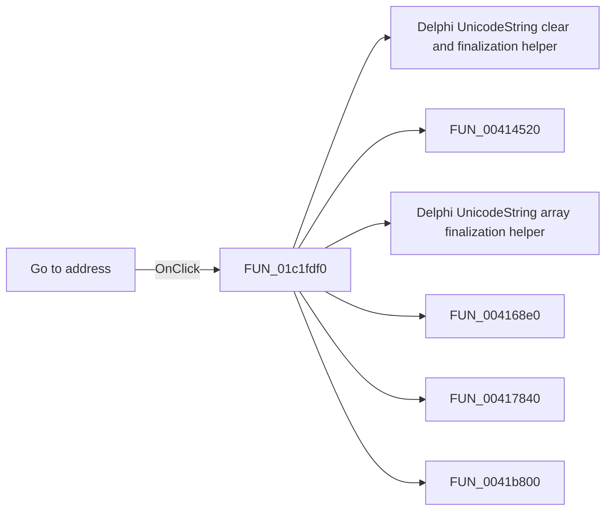

# Go to address

> Analysis status: Pending individual source review.

## Control

| Property | Recovered value |
| --- | --- |
| Form | BrowserFrm |
| Component path | BrowserFrm.TopPL.GoBtn |
| Control class | TSpeedButton |
| Caption | Not present in the recovered resource. |
| Hint | Go to address |
| Text | Not present in the recovered resource. |
| Handler name | GoBtnClick |
| Handler address | 01c1fdf0 |
| Graph node | `resource:dfm:BrowserFrm/BrowserFrm.TopPL.GoBtn` |
| Handler node | `function:01c1fdf0` |
| Graph layer | UI |

## What happens when clicked

Pending individual analysis. An agent must read the recovered handler source and its relevant callees before it replaces this text.

## Click flow

## Handler evidence

- Source: [DecompiledSources/Tina16/functions/0000000001C1FDF0__FUN_01c1fdf0.c](../../../DecompiledSources/Tina16/functions/0000000001C1FDF0__FUN_01c1fdf0.c)
- Recovered role: Not present in the recovered resource.
- Current graph summary: Handles 1 Delphi UI event: BrowserFrm.TopPL.GoBtn.OnClick.
- Current graph behavior: Not present in the recovered resource.
- Current graph evidence: Not present in the recovered resource.
- Complexity: complex
- Distinct outgoing calls: 13

## Direct calls

- `function:00414480` — Delphi UnicodeString clear and finalization helper
- `function:00414520` — FUN_00414520
- `function:00414560` — Delphi UnicodeString array finalization helper
- `function:004168e0` — FUN_004168e0
- `function:00417840` — FUN_00417840
- `function:0041b800` — FUN_0041b800
- `function:0041b890` — FUN_0041b890
- `function:0043dc90` — FUN_0043dc90
- `function:00450070` — FUN_00450070
- `function:0064dd90` — VCL control Unicode text reader
- `function:0065b870` — FUN_0065b870
- `function:00ddede0` — FUN_00ddede0
- `function:01bcce90` — FUN_01bcce90

## Resource evidence

- Kind: Not present in the recovered resource.
- Modal result: Not present in the recovered resource.
- Checked state: Not present in the recovered resource.
- List items: Not present in the recovered resource.
- Image reference: Not present in the recovered resource.
- Extracted glyph: [`0031_BrowserFrm_BrowserFrm_TopPL_GoBtn_Glyph_Data.png`](../../../glyph/0031_BrowserFrm_BrowserFrm_TopPL_GoBtn_Glyph_Data.png)

## Nearby label candidates

Nearby labels are layout candidates only. They are not proof of behavior.

- Rank 1: Address: at distance 1087.

## Analysis limits

- Do not infer behavior from the control class, caption, hint, glyph, or nearby label alone.
- Do not replace the pending status until the handler source and relevant call path provide enough evidence.
