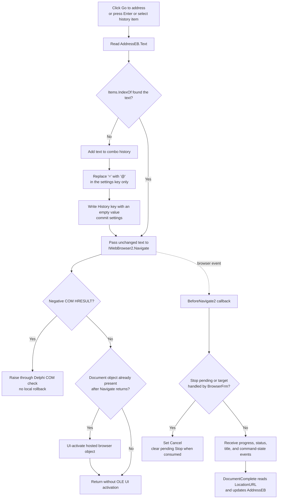

# Go to address

> Analysis status: Complete. The button records a new address in the BrowserFrm history, sends the unchanged edit text to `IWebBrowser2.Navigate`, and leaves progress and final display updates to browser events.

## Control

| Property | Recovered value |
| --- | --- |
| Form | BrowserFrm |
| Form caption | Browse |
| Component path | BrowserFrm.TopPL.GoBtn |
| Control class | TSpeedButton |
| Caption | Not present in the recovered resource. |
| Hint | Go to address |
| Glyph | One 24 by 24 right-pointing colored arrow. |
| Address input | BrowserFrm.TopPL.AddressEB (`TComboBox`) |
| Nearby label | Address: |
| Handler name | GoBtnClick |
| Handler address | 01c1fdf0 |
| Graph node | `resource:dfm:BrowserFrm/BrowserFrm.TopPL.GoBtn` |
| Handler node | `function:01c1fdf0` |
| Graph layer | UI |

## What happens when clicked

`FUN_01c1fdf0` reads the text from `AddressEB`, the form field at offset
`+0x6F8`. It asks the combo box item list for the index of that text. If the
item is not present, the handler adds the text to the list. It then replaces
every `=` character with `@` in a separate copy and writes that copy as a key
in the `History` settings section. The stored string value is empty. It calls the
settings commit operation immediately after the write.

The replacement does not change the navigation address. The handler reads the
edit text again, converts it to the automation string representation, and
passes it unchanged to `FUN_01bcce90`. That wrapper acquires the hosted
`IWebBrowser2` interface and calls:

`Navigate(URL, Empty, Empty, Empty, Empty)`

Therefore the request has no navigation flags, target frame, POST data, or
HTTP headers from this handler. After the request, the handler checks whether
the browser already has a Document object. If it does, it gets the browser
Application object as `IOleObject` and calls `DoVerb` with
`OLEIVERB_UIACTIVATE`. This activates the hosted browser object in its VCL
container. It does not change the URL.

## Address history and other entry routes

`AddressEBKeyPress` calls the same Go handler when the pressed character is
carriage return (`#13`). `AddressEBSelect` also calls it without another
condition. A toolbar click, Enter in the address combo box, and selection of a
saved item therefore use the same navigation and history path.

The history test is the result of `AddressEB.Items.IndexOf`. If it returns a
value other than `-1`, the handler does not add another item and does not write
or commit the `History` setting. It still navigates to the address.

The BrowserFrm launcher loads the keys from the `History` settings section
into `AddressEB.Items`. It converts `@` back to `=` during that load. This
confirms that the replacement is an escape for the settings key and is not URL
normalization. The launcher also saves the current address as `View/LastURL`
after the Browse workflow ends. The Go click itself does not write
`View/LastURL`.

## Input, failure, and cancellation behavior

The handler does not trim the text, add a URI scheme, resolve a relative URL,
or check URL syntax. It also has no explicit empty-string branch. An empty or
invalid string follows the same item lookup and `Navigate` path. If it is a
new item, the history-list and settings write are attempted before navigation.
Thus a later navigation failure does not roll back a history operation that
already completed.

`FUN_01bcce90` passes the COM result to `FUN_0041d630`. A negative HRESULT
raises through the Delphi COM error path. `GoBtnClick` has no local recovery,
retry, message, or rollback. It also does not inspect a result from the
settings calls or contain a local settings-error branch. If a settings call
raises, no local catch is visible before `Navigate`.

A successful `Navigate` HRESULT only means that the browser accepted the
request. `MainBrowserBeforeNavigate2` can still set the event's Cancel output.
It does this for a target that BrowserFrm handles as application content and
for a pending Stop request. The Stop flag is consumed and cleared by the
callback. The DFM has no `NavigateError` binding, so no BrowserFrm-specific
callback for a later asynchronous URL or network failure was recovered.

## Browser callbacks and visible state

The Go handler does not wait for a document. BrowserFrm uses these asynchronous
callbacks:

- In its normal branch, `MainBrowserBeforeNavigate2` clears its
  application-download marker and writes **Downloading &lt;URL&gt;** to the first
  status-bar panel. It can cancel an application-handled target. If a Stop
  request is already pending, it cancels and clears the request before those
  normal-branch updates.
- `MainBrowserProgressChange` copies `ProgressMax` and `Progress` to the
  progress bar.
- `MainBrowserStatusTextChange` copies browser status text to the first
  status-bar panel.
- `MainBrowserDownloadComplete` clears that status panel.
- `MainBrowserDocumentComplete` reads `MainBrowser.LocationURL` and writes the
  resulting address to `AddressEB`. This can replace the typed text with the
  browser's final location after a redirect.
- `MainBrowserTitleChange` writes the browser-supplied title to the form
  caption.
- `MainBrowserCommandStateChange` applies the browser's Forward and Back
  availability to the corresponding button enabled states.

## Click flow

## Evidence

- [Go handler `FUN_01c1fdf0`](../../../DecompiledSources/Tina16/functions/0000000001C1FDF0__FUN_01c1fdf0.c) reads form field `+0x6F8`, performs the item lookup and conditional history write, passes field `+0x6C8` and the unchanged text to the browser wrapper, and performs the conditional OLE activation.
- [BrowserFrm launcher `FUN_01c1de60`](../../../DecompiledSources/Tina16/functions/0000000001C1DE60__FUN_01c1de60.c) loads `History` keys into the same combo box, restores `@` to `=`, can start navigation through the same Go handler, and saves `View/LastURL` when the workflow ends.
- [Address key handler `FUN_01c1fdc0`](../../../DecompiledSources/Tina16/functions/0000000001C1FDC0__FUN_01c1fdc0.c) calls the Go handler only for character `#13`; [Address selection handler `FUN_01c1fde0`](../../../DecompiledSources/Tina16/functions/0000000001C1FDE0__FUN_01c1fde0.c) calls it directly.
- [WebBrowser Navigate wrapper `FUN_01bcce90`](../../../DecompiledSources/Tina16/functions/0000000001BCCE90__FUN_01bcce90.c) acquires the browser interface, calls its `Navigate` slot with the URL and four Empty variants, checks the HRESULT, and releases the interface.
- [String conversion helper `FUN_004168e0`](../../../DecompiledSources/Tina16/functions/00000000004168E0__FUN_004168e0.c) copies the full Unicode string length or clears the destination for a nil source. It has no URL-specific branch.
- [COM result checker `FUN_0041d630`](../../../DecompiledSources/Tina16/functions/000000000041D630__FUN_0041d630.c) returns nonnegative results and raises through the recovered runtime path for a negative result.
- [Before-navigation callback `FUN_01c20280`](../../../DecompiledSources/Tina16/functions/0000000001C20280__FUN_01c20280.c) writes the Downloading status and sets Cancel for application-handled content or a pending Stop.
- [Progress callback `FUN_01c208e0`](../../../DecompiledSources/Tina16/functions/0000000001C208E0__FUN_01c208e0.c), [status callback `FUN_01c20be0`](../../../DecompiledSources/Tina16/functions/0000000001C20BE0__FUN_01c20be0.c), and [download completion `FUN_01c20910`](../../../DecompiledSources/Tina16/functions/0000000001C20910__FUN_01c20910.c) update the progress and status controls.
- [Document-complete callback `FUN_01c209b0`](../../../DecompiledSources/Tina16/functions/0000000001C209B0__FUN_01c209b0.c) reads browser property `0xD3` (`LocationURL`) and writes it to the address combo box.
- [Title callback `FUN_01c20940`](../../../DecompiledSources/Tina16/functions/0000000001C20940__FUN_01c20940.c) writes the supplied title to the form, and [command-state callback `FUN_01c20a60`](../../../DecompiledSources/Tina16/functions/0000000001C20A60__FUN_01c20a60.c) updates Forward and Back enabled states.
- [Extracted Go glyph](../../../glyph/0031_BrowserFrm_BrowserFrm_TopPL_GoBtn_Glyph_Data.png) is a 24 by 24 PNG converted from the embedded Delphi BMP. Its right-pointing arrow and the **Go to address** hint support the action, while the handler and COM wrapper prove it.

## Direct application calls

- `function:01bcce90` - invokes `IWebBrowser2.Navigate` with four Empty optional parameters and checks the COM result.
- `function:0064dd90` - reads the address combo box text.
- `function:00450070` - replaces all `=` characters with `@` in the settings-key copy for a new history item.
- `function:00ddede0` and `function:0041b890` - obtain browser automation properties and query the Application object for `IOleObject` before UI activation.

## Analysis limits

- The recovered source proves that `Items.IndexOf` controls duplicate handling.
  It does not prove a stronger case or locale comparison rule for the combo box
  item list.
- `GoBtnClick` calls `UuidCreate`, but no later recovered statement consumes the
  generated value. This analysis does not assign a purpose to that call.
- The recovered BrowserFrm resource has no `NavigateError` event. It does not
  show how the WebBrowser control itself presents later network or protocol
  errors.
- The glyph and hint support the control purpose but do not prove the data
  path. The handler, settings load path, and COM wrapper provide that proof.
