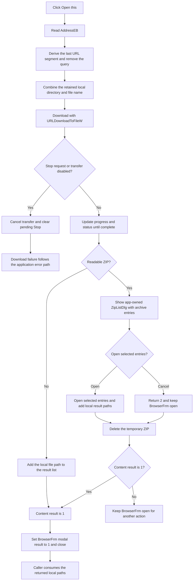

# Download and open the current address

> Analysis status: Source reviewed and behavior traced.

## Control

| Property | Recovered value |
| --- | --- |
| Form | BrowserFrm |
| Component path | BrowserFrm.TopPL.OpenBtn |
| Control class | TSpeedButton |
| Caption | Not present in the recovered resource. |
| Hint | Open this |
| Handler name | OpenBtnClick |
| Handler address | 01c20c60 |
| Graph node | `resource:dfm:BrowserFrm/BrowserFrm.TopPL.OpenBtn` |
| Handler node | `function:01c20c60` |
| Graph layer | UI |

## What happens when clicked

The handler reads the current text from `AddressEB` at form field `+0x6f8`. It derives a local file name from the text after the last `/` and removes a query beginning with `?`. It then starts a content transfer from the complete address to that file name under the caller-provided local directory at form field `+0x728`.

The transfer uses `URLDownloadToFileW` from `urlmon.dll`. The transfer object is owned by `BrowserFrm` and is destroyed after the synchronous transfer call returns. The handler does not open a Windows file picker, and it does not set a file-extension filter.

After the transfer, the handler passes the complete local destination path to the content-opening function. For a non-ZIP path, or a path that the ZIP reader does not accept, that function adds the local path to the form's result list at `+0x720` and returns 1.

For a readable ZIP, it enumerates archive entries into the custom **Files** dialog (`ZipListDlg`). This dialog says **Select files to open:** and has **Open** and **Cancel** buttons. It has no file-type filter control. If the user accepts, the function opens the selected archive entries, appends their local result paths to `+0x720`, and returns 1. If the user cancels, it returns 2 and leaves the Browser form open.

When content processing returns 1, `OpenBtnClick` sets the Browser form modal result to 1. This closes the Browser and returns the result list to its caller. A ZIP source file is deleted after ZIP processing when it exists, including the custom-dialog Cancel path.

## URL and local-file boundaries

`OpenBtnClick` treats the address text as a transfer source. It does not call `MainBrowser.Navigate`, and it does not add the address to browser history. Its transfer implementation directly passes the source text to `URLDownloadToFileW`.

The recovered handler has no separate branch for an HTTP URL, a `file:` URL, or a Windows local path. The name extractor only searches for `/`. Therefore, HTTP-style address handling is proven, but support for a raw Windows path with backslashes is not proven. The output consumed by the caller is always a local destination path.

Normal embedded-browser navigation is a separate path. `MainBrowserBeforeNavigate2` can allow a target to remain in the WebBrowser, open configured targets through the shell, or ask whether application content must be downloaded and opened. The Open button bypasses that classification and confirmation path. It directly transfers the current address.

## Progress, status, and cancellation

The transfer coordinator registers `FUN_01c20ac0` as its callback and sets the transfer-permitted byte at form offset `+0x718` before it starts.

- During transfer, the callback updates `ProgressBar.Max` and `ProgressBar.Position`.
- It writes the transfer status text to the first status-bar panel and processes pending application messages.
- `StopBtnClick` sets the pending-Stop byte at `+0x719`. The callback then sets its cancel output and clears that byte.
- The callback also cancels when the transfer-permitted byte is clear.
- On a completed transfer, the callback resets the progress position to zero.

The WebBrowser has separate progress, status, completion, address, title, and history-state callbacks. These callbacks describe embedded-browser navigation. They are not direct results of `OpenBtnClick`.

## Errors and retained state

The transfer routine raises through the application error path when `urlmon.dll` or `URLDownloadToFileW` is unavailable, or when `URLDownloadToFileW` returns a failure code. `OpenBtnClick` has no local exception handler and does not set modal result 1 on that path. A Stop request reaches the same download cancellation and failure boundary.

The content-opening function clears the form result list before it processes the new local file. Thus, the list contains only the current Open operation's results. The Browser form and the ZIP selection dialog are application-owned singleton forms and can be reused. The Browser entry function stores its caller-provided local directory in `+0x728`. After the Browser closes, it saves the current address as `View/LastURL`. Go-to-address navigation, not this Open handler, adds entries to `History`.

## Downstream consumers

The Schematic Editor's **Open File from Web** handler consumes each returned local path. It handles `.TSC` and `.SCH` schematics, `.TSM` macros, `.CIR` files, and `.LIB` or `.TLD` libraries with application-specific paths. It sends other file types to the shell-open path. The Macro Wizard's web-source handler instead tries to load the returned paths as source libraries.

These extension checks are downstream dispatch rules. They are not filters in `OpenBtnClick` or `ZipListDlg`.

## Click flow

## Handler and call-path evidence

- [FUN_01c20c60](../../../DecompiledSources/Tina16/functions/0000000001C20C60__FUN_01c20c60.c) reads `AddressEB`, derives a file name, runs the transfer, builds the local destination, invokes content processing, and sets form modal result 1 only when processing returns 1.
- [FUN_01c1e440](../../../DecompiledSources/Tina16/functions/0000000001C1E440__FUN_01c1e440.c) keeps the text after the last `/` and calls the query-removal helper with `?`.
- [FUN_01c1f390](../../../DecompiledSources/Tina16/functions/0000000001C1F390__FUN_01c1f390.c) creates the Browser-owned transfer object, assigns its source and destination strings, registers the progress/cancel callback, permits the transfer, runs it, and destroys it.
- [FUN_014bbda0](../../../DecompiledSources/Tina16/functions/00000000014BBDA0__FUN_014bbda0.c) loads `urlmon.dll`, resolves `URLDownloadToFileW`, downloads the source to the destination, and raises an application error for a missing API or failed result.
- [FUN_01c20ac0](../../../DecompiledSources/Tina16/functions/0000000001C20AC0__FUN_01c20ac0.c) updates progress and status, processes messages, and returns a cancellation request when transfer permission is clear or Stop is pending.
- [FUN_01c1f4d0](../../../DecompiledSources/Tina16/functions/0000000001C1F4D0__FUN_01c1f4d0.c) clears the result list, handles ordinary files or ZIP entries, shows `ZipListDlg`, appends local result paths, and removes a downloaded ZIP.
- [FUN_01c1de60](../../../DecompiledSources/Tina16/functions/0000000001C1DE60__FUN_01c1de60.c) creates the app-owned Browser and ZIP forms on first use, retains the local destination directory, returns the Browser result list, and saves `View/LastURL` after modal close.
- [FUN_01c20280](../../../DecompiledSources/Tina16/functions/0000000001C20280__FUN_01c20280.c) is the separate embedded-browser before-navigation handler. It applies configured content handling, can ask to open recognized content, and cancels browser navigation when the application handles the target.
- [FUN_01ca2170](../../../DecompiledSources/Tina16/functions/0000000001CA2170__FUN_01ca2170.c) dispatches returned paths by Schematic Editor file extension.
- [FUN_01c3c860](../../../DecompiledSources/Tina16/functions/0000000001C3C860__FUN_01c3c860.c) consumes returned paths in the Macro Wizard source-library path.
- Recovered role: Download the current browser address and return opened local content.
- Complexity: complex
- Distinct outgoing calls: 8

## Resource evidence

- The hint is **Open this**.
- The extracted [Open glyph](../../../glyph/0035_BrowserFrm_BrowserFrm_TopPL_OpenBtn_Glyph_Data.png) is a colorful open-folder image. It supports an open-content action, but it does not prove a local file picker.
- `AddressEB` is the form's address combo box.
- `ZipListDlg` has caption **Files**, label **Select files to open:**, Open modal result 1, and Cancel modal result 2.
- No `TOpenDialog`, file-dialog owner, initial directory, or file filter occurs in the recovered Open handler path.

## Analysis limits

- The handler does not validate the address text before it passes it to `URLDownloadToFileW`.
- Raw Windows-path support is not proven because file-name extraction searches only for `/`.
- The exact user-facing text of the URL download errors is not recovered in this source.
- A readable ZIP uses the custom archive-entry dialog. This is not a Windows file-open dialog.
- The ZIP cleanup is proven, but the source does not document a recovery path for an unreadable downloaded ZIP.
