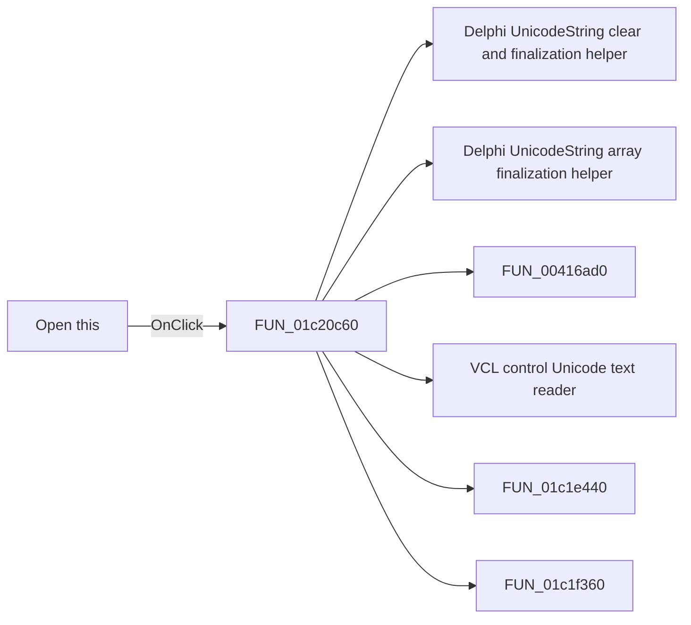

# Open this

> Analysis status: Pending individual source review.

## Control

| Property | Recovered value |
| --- | --- |
| Form | BrowserFrm |
| Component path | BrowserFrm.TopPL.OpenBtn |
| Control class | TSpeedButton |
| Caption | Not present in the recovered resource. |
| Hint | Open this |
| Text | Not present in the recovered resource. |
| Handler name | OpenBtnClick |
| Handler address | 01c20c60 |
| Graph node | `resource:dfm:BrowserFrm/BrowserFrm.TopPL.OpenBtn` |
| Handler node | `function:01c20c60` |
| Graph layer | UI |

## What happens when clicked

Pending individual analysis. An agent must read the recovered handler source and its relevant callees before it replaces this text.

## Click flow

## Handler evidence

- Source: [DecompiledSources/Tina16/functions/0000000001C20C60__FUN_01c20c60.c](../../../DecompiledSources/Tina16/functions/0000000001C20C60__FUN_01c20c60.c)
- Recovered role: Not present in the recovered resource.
- Current graph summary: Handles 1 Delphi UI event: BrowserFrm.TopPL.OpenBtn.OnClick.
- Current graph behavior: Not present in the recovered resource.
- Current graph evidence: Not present in the recovered resource.
- Complexity: complex
- Distinct outgoing calls: 8

## Direct calls

- `function:00414480` — Delphi UnicodeString clear and finalization helper
- `function:00414560` — Delphi UnicodeString array finalization helper
- `function:00416ad0` — FUN_00416ad0
- `function:0064dd90` — VCL control Unicode text reader
- `function:01c1e440` — FUN_01c1e440
- `function:01c1f360` — FUN_01c1f360
- `function:01c1f390` — Browser content-transfer coordinator
- `function:01c1f4d0` — FUN_01c1f4d0

## Resource evidence

- Kind: Not present in the recovered resource.
- Modal result: Not present in the recovered resource.
- Checked state: Not present in the recovered resource.
- List items: Not present in the recovered resource.
- Image reference: Not present in the recovered resource.
- Extracted glyph: [`0035_BrowserFrm_BrowserFrm_TopPL_OpenBtn_Glyph_Data.png`](../../../glyph/0035_BrowserFrm_BrowserFrm_TopPL_OpenBtn_Glyph_Data.png)

## Nearby label candidates

Nearby labels are layout candidates only. They are not proof of behavior.

- Rank 1: Address: at distance 1297.

## Analysis limits

- Do not infer behavior from the control class, caption, hint, glyph, or nearby label alone.
- Do not replace the pending status until the handler source and relevant call path provide enough evidence.
