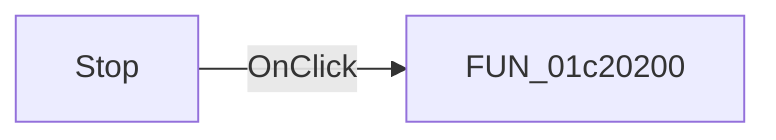

# Stop

> Analysis status: Pending individual source review.

## Control

| Property | Recovered value |
| --- | --- |
| Form | BrowserFrm |
| Component path | BrowserFrm.TopPL.StopBtn |
| Control class | TSpeedButton |
| Caption | Not present in the recovered resource. |
| Hint | Stop |
| Text | Not present in the recovered resource. |
| Handler name | StopBtnClick |
| Handler address | 01c20200 |
| Graph node | `resource:dfm:BrowserFrm/BrowserFrm.TopPL.StopBtn` |
| Handler node | `function:01c20200` |
| Graph layer | UI |

## What happens when clicked

Pending individual analysis. An agent must read the recovered handler source and its relevant callees before it replaces this text.

## Click flow

## Handler evidence

- Source: [DecompiledSources/Tina16/functions/0000000001C20200__FUN_01c20200.c](../../../DecompiledSources/Tina16/functions/0000000001C20200__FUN_01c20200.c)
- Recovered role: Browser pending-cancellation button handler
- Current graph summary: Sets a pending cancellation flag. Browser navigation and content-transfer callbacks consume and clear it, so this handler does not stop the browser synchronously. Handles 1 Delphi UI event: BrowserFrm.TopPL.StopBtn.OnClick.
- Current graph behavior: Sets a pending cancellation flag. Browser navigation and content-transfer callbacks consume and clear it, so this handler does not stop the browser synchronously.
- Current graph evidence: StopBtn has the hint Stop and a red-circle, white-X glyph. The handler only sets form byte 0x719. FUN_01c20280 and FUN_01c20ac0 test that byte, set their cancellation outputs, and clear it.
- Complexity: simple
- Distinct outgoing calls: 0

## Direct calls

- No direct call edge is present in the recovered graph.

## Resource evidence

- Kind: Not present in the recovered resource.
- Modal result: Not present in the recovered resource.
- Checked state: Not present in the recovered resource.
- List items: Not present in the recovered resource.
- Image reference: Not present in the recovered resource.
- Extracted glyph: [`0034_BrowserFrm_BrowserFrm_TopPL_StopBtn_Glyph_Data.png`](../../../glyph/0034_BrowserFrm_BrowserFrm_TopPL_StopBtn_Glyph_Data.png)

## Nearby label candidates

Nearby labels are layout candidates only. They are not proof of behavior.

- Rank 1: Address: at distance 1140.

## Analysis limits

- Do not infer behavior from the control class, caption, hint, glyph, or nearby label alone.
- Do not replace the pending status until the handler source and relevant call path provide enough evidence.
