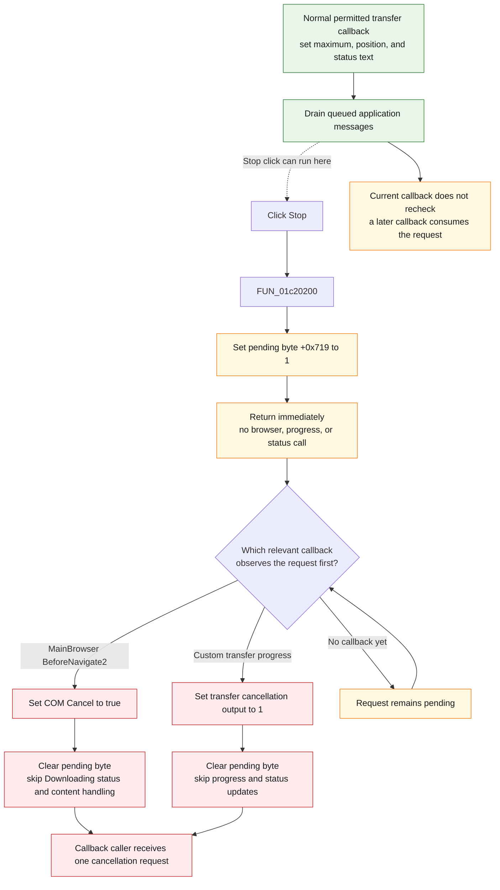

# Stop pending browser work

> Analysis status: Complete. The recovered click handler, browser navigation event, custom-transfer registration and callback, form initialization, progress and status controls, hint, and glyph establish the deferred cancellation behavior.

## Control

| Property | Recovered value |
| --- | --- |
| Form | BrowserFrm |
| Form caption | Browse |
| Component path | BrowserFrm.TopPL.StopBtn |
| Control class | TSpeedButton |
| Caption | Not present in the recovered resource. |
| Hint | Stop |
| Handler name | StopBtnClick |
| Handler address | 01c20200 |
| Graph node | `resource:dfm:BrowserFrm/BrowserFrm.TopPL.StopBtn` |
| Handler node | `function:01c20200` |
| Graph layer | UI |

## What happens when clicked

The Stop button requests cancellation. It does not stop `MainBrowser` or an active content transfer during the click handler itself.

`FUN_01c20200` performs one operation: it sets byte `+0x719` in `TBrowserFrm` to `1`. It does not call a browser `Stop` method, a transfer object, the progress bar, or the status bar. It also does not clear the flag. The click returns with the request pending.

Two later callbacks can consume this flag:

1. `MainBrowserBeforeNavigate2` (`FUN_01c20280`) checks it before normal navigation handling. When set, the callback writes COM `VARIANT_BOOL` true (`0xffff`) to the event's `Cancel` output and clears byte `+0x719` to zero. It skips the normal Downloading status and content-handling branch.
2. The custom content-transfer callback (`FUN_01c20ac0`) checks it before progress handling. When set, the callback writes `1` to its cancellation output and clears byte `+0x719` to zero. It skips progress-bar, status-text, and message-pump updates for that callback.

The first of these callbacks that sees the pending byte consumes it. Cancellation is therefore deferred until a cooperating callback runs and acts on its cancellation output.

## Transfer callback context

`FUN_01c1f390` creates the custom transfer operation, stores `FUN_01c20ac0` in its callback slot, sets the separate transfer-permitted byte at `+0x718` to `1`, and runs the transfer object.

When no Stop request is pending, the transfer callback uses these branches:

- When current progress equals total progress, it resets `ProgressBar.Position` to zero.
- When transfer byte `+0x718` is zero, it resets the progress position and requests cancellation without using the Stop latch.
- During an active permitted transfer, it sets the progress maximum from the total, sets the position from the current value, writes the callback text to the first `StatusBar` panel, and drains queued application messages.

The callback tests byte `+0x719` before it drains messages. A Stop click dispatched by that message drain sets the byte after the current callback's test. A later navigation or transfer callback must consume it.

## Inputs, state, and outputs

| Stage | Proven behavior |
| --- | --- |
| Click input | No control value or browser state is read. |
| Immediate state | Sets pending-cancellation byte `TBrowserFrm +0x719` to `1`. |
| Immediate UI effect | None. The handler does not change button state, progress, status text, address text, or browser content. |
| Navigation consumer | `MainBrowser.OnBeforeNavigate2` sets its `Cancel` output to true and clears the pending byte. |
| Transfer consumer | The registered content-transfer callback sets its cancellation output to `1` and clears the pending byte. |
| Progress effect | The Stop branch skips progress updates. The displayed value remains as it was until another callback or event changes it. |
| Status effect | The Stop branch writes no status text. The previous first-panel text remains until another event changes it. |
| Initialization | `BrowserFrm.FormCreate` initializes both the transfer-permitted byte at `+0x718` and pending-cancellation byte at `+0x719` to zero. |
| Output timing | The request takes effect only when a later callback returns its cancellation output to the browser or transfer operation. |

## Deferred cancellation flow

## Handler and callback evidence

- Stop click handler: [FUN_01c20200](../../../DecompiledSources/Tina16/functions/0000000001C20200__FUN_01c20200.c)
- Main browser before-navigation consumer: [FUN_01c20280](../../../DecompiledSources/Tina16/functions/0000000001C20280__FUN_01c20280.c)
- Content-transfer callback registration: [FUN_01c1f390](../../../DecompiledSources/Tina16/functions/0000000001C1F390__FUN_01c1f390.c)
- Content-transfer progress and cancellation consumer: [FUN_01c20ac0](../../../DecompiledSources/Tina16/functions/0000000001C20AC0__FUN_01c20ac0.c)
- Form initialization: [FUN_01c1fcc0](../../../DecompiledSources/Tina16/functions/0000000001C1FCC0__FUN_01c1fcc0.c)
- Main browser progress event: [FUN_01c208e0](../../../DecompiledSources/Tina16/functions/0000000001C208E0__FUN_01c208e0.c)
- Main browser download-complete status clear: [FUN_01c20910](../../../DecompiledSources/Tina16/functions/0000000001C20910__FUN_01c20910.c)
- Status-text event handler: [FUN_01c20be0](../../../DecompiledSources/Tina16/functions/0000000001C20BE0__FUN_01c20be0.c)
- VCL application message drain: [FUN_0080cc70](../../../DecompiledSources/Tina16/functions/000000000080CC70__FUN_0080cc70.c)
- Recovered handler role: Browser pending-cancellation button handler.
- Likely Delphi method: `TBrowserFrm.StopBtnClick`.
- Complexity: simple
- Distinct outgoing calls: 0

The handler has no direct call edge because it only stores the byte. The relevant relationship is shared-state data flow: both callbacks read and clear the same byte that the click handler sets.

`FUN_006e6860` changes the progress-bar maximum through the VCL range setter. `FUN_006e6920` sends progress-bar message `PBM_SETPOS` (`0x402`) or stores the pending position. `FUN_006d85c0` changes a status-panel string only when the new text differs.

## Resource and glyph evidence

- `StopBtn` is a `TSpeedButton` on the top browser panel with the direct hint **Stop** and no caption.
- The extracted [`0034_BrowserFrm_BrowserFrm_TopPL_StopBtn_Glyph_Data.png`](../../../glyph/0034_BrowserFrm_BrowserFrm_TopPL_StopBtn_Glyph_Data.png) is a 24 by 24 PNG recovered from a 1,786-byte Delphi BMP resource. It shows a white X inside a red circle.
- The hint and glyph agree with cancellation intent. The handler byte and both consumers establish the behavior; the image alone does not.
- The only nearby label candidate is **Address:** at distance 1140. It identifies the address editor area and gives no evidence about Stop behavior.
- The form also contains `MainBrowser`, `ProgressBar`, and `StatusBar`. The callback source accesses the latter two through form fields `+0x6e0` and `+0x6d8`.

## Boundary, no-op, and error behavior

- Repeated clicks before a consumer runs store `1` in the same byte. They coalesce into one pending request; they do not queue several cancellations.
- The first navigation or transfer callback to see the byte clears it. The other callback does not receive the same request unless Stop is clicked again.
- If Stop is clicked while no relevant operation produces a callback, the byte remains set. A later `MainBrowser.BeforeNavigate2` or custom-transfer callback can consume that earlier request.
- A pending Stop request takes priority over the transfer callback's completion test. Even when current equals total, the Stop branch sets cancellation and does not reset the progress position.
- The standard `MainBrowser.OnProgressChange` handler updates the same progress bar but does not read or clear byte `+0x719`. It is not a Stop consumer.
- The click handler cannot report failure: it has no branch, call, dialog, or result check. It only writes one byte in the live form object.
- The two cancellation branches contain only output and flag stores. They show no cancellation message and no local retry or rollback.
- The callback caller controls when work actually stops after it receives the cancellation output. The recovered code does not prove that an in-flight native operation ends before the callback returns.

## Analysis limits

- No recovered Delphi field name exists for bytes `+0x718` and `+0x719`. Their writers, readers, callback registration, and outputs establish their transfer-permission and pending-cancellation roles.
- The main browser uses a COM `BeforeNavigate2` cancellation output. The custom transfer uses a separate byte output. They share the pending request but not the underlying cancellation mechanism.
- The recovered path proves a deferred request and two consumers. It does not show a direct call to the embedded browser's synchronous `Stop` method.
