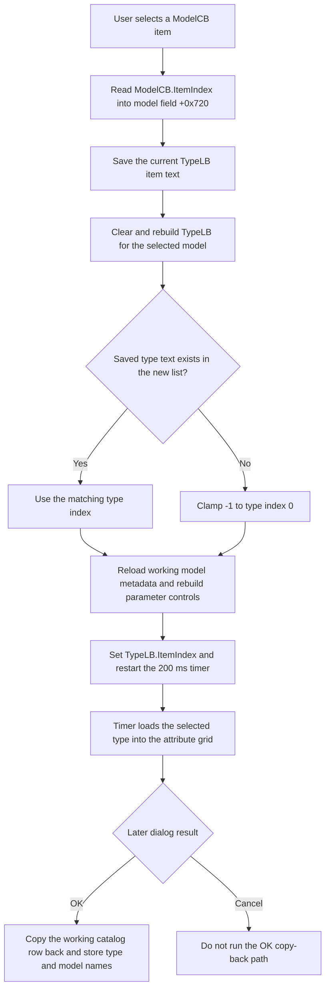

# ModelCB

> Analysis status: Reviewed from recovered source and dialog resource evidence.

## Control

| Property | Recovered value |
| --- | --- |
| Form | CatalogEditorDlg |
| Component path | CatalogEditorDlg.ModelCB |
| Control class | TComboBox |
| Style | `csDropDownList` |
| Caption | Not present on the combo box. The adjacent label is `&Model`. |
| Hint | Not present in the recovered resource. |
| Handler name | ModelCBClick |
| Handler address | 013f0060 |
| Graph node | `resource:dfm:CatalogEditorDlg/CatalogEditorDlg.ModelCB` |
| Handler node | `function:013f0060` |
| Graph layer | UI |

## What happens when clicked

`ModelCB` selects the model whose types and parameters the dialog edits. Form creation fills this combo from the catalog's model-name list. The displayed spelling `Hibrid-P` is corrected to `Hybrid-P`, but the underlying list is kept for the later commit.

The click handler performs these operations:

1. It reads `ModelCB.ItemIndex` and stores the selected model index in the dialog field at `+0x720`.
2. It reads the text of the currently selected `TypeLB` item. This preserves type identity across the model change instead of preserving only an index.
3. It clears and refills `TypeLB` with the types for the selected model. `FUN_0172c5d0`, called through `FUN_0172c930`, skips the type groups for preceding models, returns their cumulative type count in field `+0x724`, and decodes the selected model's type names.
4. It searches the new type list for the saved type text. If the text exists, it keeps that type selected. If the search returns `-1`, `FUN_00b905e0(index, 0)` changes the result to index 0.
5. It reloads the selected model's parameter layout into the dialog's working catalog row, clears the attribute grid, rebuilds the parameter-name list, and repopulates the grid.
6. It assigns the resolved index to `TypeLB`, updates the list-position indicator, and restarts a 200 ms timer. The timer later runs `FUN_013f0230`, which combines the model's base type offset with the selected list index and loads that type's values into the attribute grid.

The handler does not compare the new model with the old model. Selecting the same model again performs the complete rebuild.

## Selection and commit boundary

The model click changes dialog working state. It does not close the dialog or write an external file.

The constructor obtains a working catalog object through a virtual clone/copy operation and stores it at form offset `+0x710`. `FormCreate` obtains the edited row from that working object. On the valid OK path, `FUN_013f05c0` copies the working buffer back to the caller-owned catalog at `+0x708`, writes the selected type name to the row's 20-byte type field, writes the selected model name to its 16-byte model field, and requests downstream catalog rebuilding when either name changed.

`CancelBtn` is the built-in `bkCancel` button and has no custom click handler. Therefore it does not execute the OK copy-back path. The recovered callers request the application refresh only when the dialog returns modal result 1.

## Click flow

## Handler evidence

- Primary source: [FUN_013f0060](../../../DecompiledSources/Tina16/functions/00000000013F0060__FUN_013f0060.c).
- Form setup: [FUN_013ef5e0](../../../DecompiledSources/Tina16/functions/00000000013EF5E0__FUN_013ef5e0.c) fills `ModelCB`, initializes model and type indexes, builds `TypeLB`, and prepares the attribute grid.
- Type-list rebuild: [FUN_0172c930](../../../DecompiledSources/Tina16/functions/000000000172C930__FUN_0172c930.c) clears the destination list and replaces it with the selected model's decoded types. [FUN_0172c5d0](../../../DecompiledSources/Tina16/functions/000000000172C5D0__FUN_0172c5d0.c) computes the preceding-model type count and decodes the chosen type group.
- Parameter rebuild: [FUN_013efcf0](../../../DecompiledSources/Tina16/functions/00000000013EFCF0__FUN_013efcf0.c), [FUN_0172ca20](../../../DecompiledSources/Tina16/functions/000000000172CA20__FUN_0172ca20.c), and [FUN_013efd90](../../../DecompiledSources/Tina16/functions/00000000013EFD90__FUN_013efd90.c) reload the model metadata, parameter labels, and attribute-grid rows.
- Deferred type application: [FUN_013f0440](../../../DecompiledSources/Tina16/functions/00000000013F0440__FUN_013f0440.c) restarts the timer, and [FUN_013f0da0](../../../DecompiledSources/Tina16/functions/00000000013F0DA0__FUN_013f0da0.c) calls [FUN_013f0230](../../../DecompiledSources/Tina16/functions/00000000013F0230__FUN_013f0230.c) when it expires.
- Commit path: [FUN_013f05c0](../../../DecompiledSources/Tina16/functions/00000000013F05C0__FUN_013f05c0.c) performs accepted-only copy-back and stores the selected names.
- Complexity: complex; 10 distinct outgoing calls.

## Direct calls

- `function:00414480` - releases the temporary Unicode string that holds the old type text.
- `function:0064dbe0` - updates visibility of the list-position indicator.
- `function:0068bbb0` - obtains the list-box layout metric used for that visibility decision.
- `function:00b0b020` - clears the attribute grid from its first data column.
- `function:00b905e0` - clamps a missing type lookup from `-1` to 0.
- `function:013efcf0` - reloads model-dependent metadata in the working row.
- `function:013efd90` - rebuilds the attribute-grid rows and values.
- `function:013f0440` - restarts the delayed type-selection timer.
- `function:0172c930` - rebuilds the selected model's type list and returns its global base offset.
- `function:0172ca20` - rebuilds the parameter-name strings used by the attribute grid.

## Resource evidence

- The combo uses `csDropDownList`, so normal user input is limited to recovered list entries.
- The adjacent `&Model` label and the FormCreate population loop identify this control as the model selector.
- The adjacent `&Type` label identifies the dependent `TypeLB` list.
- The `Model &Parameters` label and the handler's grid rebuild identify the dependent attribute area.
- There is no hint, image, or embedded glyph for this control.
- The recovered form has no separate category selector. The proven filter is model to type: changing the model rebuilds the available type list.

## No-op and error behavior

- A saved type name that is not valid for the new model selects the first new type. It is not a no-op.
- The handler has no early return for a repeated model selection.
- The handler has no explicit guard for an invalid model index or an empty rebuilt type list. Normal `csDropDownList` use and form initialization supply a valid model and type. Malformed catalog data is not handled locally.
- The handler has no local exception handler and shows no error message. Failures from catalog decoding, list operations, or grid rebuilding follow the application's normal Delphi exception path.

## Analysis limits

- Recovered field names are unavailable. Offsets are used only where source flow identifies their purpose.
- The source proves model-to-type filtering. It does not prove a separate catalog-category filter.
- The click rebuilds working data. Persistence beyond the caller-owned catalog object is outside this handler and was not inferred.
