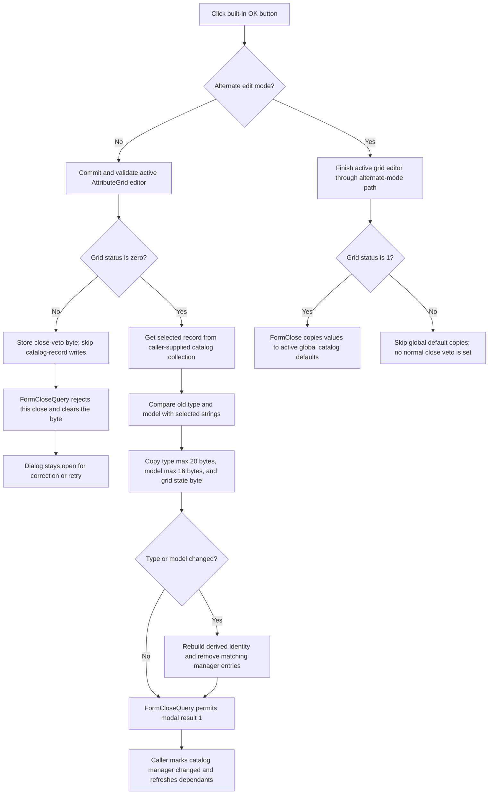

# Validate and commit the selected catalog entry

> Analysis status: Source reviewed. Grid validation, type and model commit, cache invalidation, close veto, caller ownership, Cancel behavior, and persistence boundaries are documented.

## Control

| Property | Recovered value |
| --- | --- |
| Form | CatalogEditorDlg |
| Component path | CatalogEditorDlg.OKBtn |
| Control class | TBitBtn |
| Caption | Standard `bkOK` caption. |
| Kind | `bkOK` |
| Handler name | OKBtnClick |
| Handler address | 013f05c0 |
| Graph node | `resource:dfm:CatalogEditorDlg/CatalogEditorDlg.OKBtn` |
| Handler node | `function:013f05c0` |
| Graph layer | UI |

## Ownership and selected values

`FUN_013ef440`, the recovered `TCatalogEditorDlg` constructor, receives a
catalog collection and a selected entry index from its caller. It stores them
at form offsets `+0x708` and `+0x718`. It also gets a related backing object
from the collection and stores that object at `+0x710`.

The dialog therefore edits a record in the caller-supplied collection. It does
not build a separate result record for the caller to copy back. The normal OK
path uses these selections:

| Selection or state | Recovered storage |
| --- | --- |
| Selected catalog entry | Collection `+0x708`, zero-based index `+0x718` |
| Selected model | Model list `+0x738`, byte index `+0x720` |
| Selected type | `TypeLB.Items` through control `+0x6D0`, word index `+0x722` |
| Active parameter editor | `AttributeGrid` at `+0x6F8` |
| One-use close-veto flag | Form byte `+0x850` |

`FormCreate` fills the Model combo and Type list, selects the values from the
current catalog record, and binds the AttributeGrid to that record's parameter
data. The DFM sets `ModelCB.Style = csDropDownList`, so users select a listed
model instead of entering free text.

## Normal OK path

When the recovered global alternate-mode byte is zero, `FUN_013f05c0` follows
these steps:

1. It calls `FUN_00b0a890` to finish the active AttributeGrid cell editor. It
   stores the returned validation status in form byte `+0x850`.
2. If the status is nonzero, it returns without retrieving or changing the
   selected catalog record.
3. On success, it synchronizes the selected collection entry with the related
   backing object, then gets the mutable selected record through collection
   VMT slot `0x2D0`.
4. It reads the selected Type list string. It converts the Unicode value to a
   Delphi ShortString and copies at most 20 bytes to record offset `0`.
5. It reads the selected Model string. It converts it in the same way and
   copies at most 16 bytes to record offset `+0x15`.
6. It copies the AttributeGrid state byte at grid offset `+0x66A` to record
   byte `+0x2E`.
7. Before the copies, it compares both old record strings with the selected
   strings. If either value differs, it rebuilds derived collection identity
   state and removes matching manager entries for this collection and its
   one-based selected index.

The fixed ShortString copies are truncation rules, not validation rules. A
type longer than 20 converted bytes or a model longer than 16 converted bytes
is shortened. The handler does not display a length error.

## Validation and close veto

The `bkOK` resource requests modal result `1` before VCL dispatches
`OKBtnClick`. `FUN_00b0a890` returns zero when no active grid editor exists. If
one exists, it validates the current row and column, commits the editor value,
runs the cell callbacks, and updates grid state. An invalid active cell returns
a nonzero status.

On a nonzero status, `OKBtnClick` skips every explicit catalog-record write.
VCL then asks `FUN_013f0cd0`, the form's `OnCloseQuery`, whether the form can
close. It sets `CanClose` to false while byte `+0x850` is nonzero. It then
clears the byte. The dialog stays open for this attempt, and the user can
correct the active cell or try OK again.

The OK handler and close-query handler have no direct error-message call. An
indirect cell callback can report its own problem, but no specific text is
proven in this path.

## Alternate edit mode

When the recovered global alternate-mode byte is nonzero, `OKBtnClick` skips
the collection, type, and model path. It asks `FUN_00b0a960` to finish the
active AttributeGrid editor. If the grid reports status `1`, both that helper
and the handler set modal result `1`.

`FormClose` checks the same alternate-mode byte and grid status. For status
`1`, it copies the edited grid values into one of two recovered global catalog
default areas, selected by a second global mode value. This is an in-memory
global update. No file, registry, or database write is present in the traced
close path. If the grid status is not `1`, `FormClose` skips those copies. The
alternate OK branch does not set the normal close-veto byte, so no close retry
is established for that status in the recovered code.

## Caller result and persistence boundary

Two recovered modal caller paths, `FUN_015232c0` and `FUN_017c9350`, pass their
catalog collection and selected index to `FUN_013ef440`, call `ShowModal`, and
destroy the dialog afterward.

When `ShowModal` returns `1`, each caller calls `FUN_0199e310` on the catalog
manager. That routine sets its change byte at `+0x3A8`, updates dependent
state, and notifies open application windows. The callers skip this
accepted-change notification for other modal results. They then call
`FUN_01994230` to refresh catalog-dependent objects after both OK and Cancel.

Neither `OKBtnClick` nor these caller branches write a catalog file. The
recovered flow proves an in-memory record update, a manager change marker, and
application refresh. Durable catalog persistence happens outside this traced
path, if it happens at all.

## Cancel contrast

`CancelBtn` has `Kind = bkCancel` and no custom `OnClick`. It requests modal
result `2`. It does not run `FUN_013f05c0`, so it does not perform the OK
handler's type or model copies, record flag copy, derived-identity rebuild, or
matching manager-entry removal. The modal callers also skip their accepted
change notification when the result is not `1`.

Cancel is not proven to restore a complete pre-dialog snapshot. Other form
events bind and edit the live AttributeGrid, and the constructor stores the
caller's collection directly. The recovered code has no general rollback
routine. Therefore, Cancel avoids the explicit OK commit, but this analysis
does not claim that it reverses every edit that another control may already
have applied.

## Acceptance flow

## Handler evidence

- Source: [FUN_013f05c0](../../../DecompiledSources/Tina16/functions/00000000013F05C0__FUN_013f05c0.c)
- Recovered role: Validate the AttributeGrid and commit the selected type and
  model to the caller-owned catalog entry.
- Behavior: Stops on grid validation failure. On success, updates the selected
  record's two bounded ShortStrings and grid-state byte, and invalidates
  matching manager state when type or model changed.
- Complexity: complex
- Distinct outgoing calls: 12

## Supporting source evidence

- [Dialog constructor](../../../DecompiledSources/Tina16/functions/00000000013EF440__FUN_013ef440.c)
  stores the caller's collection and selected entry index.
- [FormCreate](../../../DecompiledSources/Tina16/functions/00000000013EF5E0__FUN_013ef5e0.c)
  retrieves the selected record, fills the Model and Type controls, restores
  their selection indexes, and binds the AttributeGrid.
- [Active-grid validation](../../../DecompiledSources/Tina16/functions/0000000000B0A890__FUN_00b0a890.c)
  returns zero with no active cell, or delegates its commit status to
  [FUN_00b0a150](../../../DecompiledSources/Tina16/functions/0000000000B0A150__FUN_00b0a150.c).
- [ShortString conversion](../../../DecompiledSources/Tina16/functions/0000000000416910__FUN_00416910.c)
  converts a Unicode string to a length-prefixed byte string.
- [Bounded ShortString copy](../../../DecompiledSources/Tina16/functions/0000000000415020__FUN_00415020.c)
  clips the source length to the supplied maximum before it copies the bytes.
- [FormCloseQuery](../../../DecompiledSources/Tina16/functions/00000000013F0CD0__FUN_013f0cd0.c)
  applies and clears the one-use close-veto byte.
- [FormClose](../../../DecompiledSources/Tina16/functions/00000000013F08F0__FUN_013f08f0.c)
  owns the alternate-mode global default copies.
- [First modal caller](../../../DecompiledSources/Tina16/functions/00000000015232C0__FUN_015232c0.c)
  and [second modal caller](../../../DecompiledSources/Tina16/functions/00000000017C9350__FUN_017c9350.c)
  construct the dialog over their collection, test result `1`, destroy the
  dialog, and refresh catalog-dependent state.
- [Accepted-change notifier](../../../DecompiledSources/Tina16/functions/000000000199E310__FUN_0199e310.c)
  sets the catalog-manager change byte and notifies open windows.
- [Dependent-object refresh](../../../DecompiledSources/Tina16/functions/0000000001994230__FUN_01994230.c)
  visits the manager's catalog-dependent objects after dialog closure.

## Direct calls

- `function:00b0a890` validates and commits the active AttributeGrid cell.
- `function:00b0a960` handles the alternate-mode active grid editor.
- `function:01cfd6a0` and `function:01cfd560` get and synchronize the selected
  collection backing state.
- `function:004169a0`, `function:00416910`, `function:00415020`, and
  `function:00416db0` convert, compare, and copy the two bounded strings.
- `function:01d07850`, `function:019a4600`, and `function:01d08870` update
  derived collection state and remove matching manager entries after a type or
  model change.
- `function:00414560` finalizes local managed strings.

## Resource evidence

- [Recovered UI evidence](../../../DecompiledSources/Tina16/resources/dfm/ui-evidence.json)
  binds `OKBtnClick`, `FormClose`, and `FormCloseQuery` to the recovered
  addresses.
- `OKBtn` has built-in kind `bkOK`. It has no custom caption, hint, image, or
  extracted glyph.
- `CancelBtn` has built-in kind `bkCancel` and no custom event.
- `ModelCB` is a non-editable drop-down list. `TypeLB` is a list box.
- The labels **Model**, **Type**, and **Model Parameters** identify the three
  input areas. The hidden `00000/00000` label is a status display, not an OK
  input.

## Error and invalid-selection boundaries

- The normal grid failure path makes no explicit catalog-record write and
  blocks one close attempt. It has no direct error-dialog call.
- The handler has no explicit bounds check for the selected catalog, model, or
  type indexes. Form construction and selection events establish those values.
  If an invalid index reaches OK, collection or VCL list access owns the
  result; this handler has no recovery branch.
- Long type and model strings are truncated to 20 and 16 converted bytes.
  They are not rejected.
- No local exception handler protects collection access, string conversion,
  cache invalidation, or the alternate global update.
- Shared runtime and AttributeGrid helpers are not assigned new descriptions
  here. Their established roles remain owned by their canonical annotation
  fragments.
