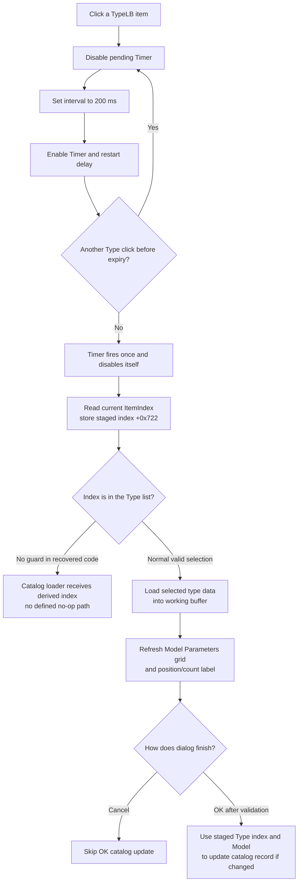

# Debounce a type selection and refresh its model parameters

> Analysis status: Complete. A Type-list click restarts a 200 ms timer. When
> that timer expires, the dialog loads the current type's catalog data and
> refreshes the model-parameter grid. The click does not rebuild the list or
> commit the catalog directly.

## Control

| Property | Recovered value |
| --- | --- |
| Form | CatalogEditorDlg |
| Form caption | Catalog Editor |
| Component path | CatalogEditorDlg.TypeLB |
| Control class | TListBox |
| Nearby field label | Type (`&Type`) |
| Related grid label | Model Parameters |
| Handler name | TypeLBClick |
| Handler address | 013f0440 |
| Graph node | `resource:dfm:CatalogEditorDlg/CatalogEditorDlg.TypeLB` |
| Handler node | `function:013f0440` |
| Graph layer | UI |

## What happens when selected

The list box updates its own `ItemIndex` before Delphi calls the event handler.
`FUN_013f0440` then operates only on the form's `Timer` component at field
`+0x700`:

1. Disable the timer.
2. Set its interval to `200` milliseconds.
3. Enable the timer.

Disabling and enabling the timer restarts the delay. Several clicks within the
same 200 ms window are therefore coalesced. The eventual refresh reads the
latest `TypeLB.ItemIndex`, not the item from the first click.

The timer setters skip their internal update when the requested value is
already present. Even so, a click while the timer is enabled changes it to
disabled and then enabled again, which restarts the countdown.

## Delayed selected-type lookup and grid refresh

`TimerTimer` (`FUN_013f0da0`) disables the timer first, so the callback is
one-shot, and calls `FUN_013f0230`.

The refresh routine performs these steps:

1. Read the current `TypeLB.ItemIndex` and store its 16-bit value at form field
   `+0x722`. This is the dialog's staged selected-type index.
2. Add the model-specific base index at `+0x724` and pass the result, the
   selected model metadata, and catalog-reader state to `FUN_0172cc40`.
3. Load the selected type's name and typed parameter values into the working
   buffer at `+0x750`.
4. Build the first `AttributeGrid` cell from a localized label and the loaded
   type name, write it at column `0`, row `0`, and refresh columns `1` and `2`
   for the parameter rows.
5. Update the bottom status label from the one-based selected position and the
   current Type-list item count. The recovered DFM initializes that label as
   `00000/00000`.

No catalog record is written by this timer path. Its state changes are limited
to the staged index and type buffer, the parameter grid, and the status label.

## Related Model-to-Type list rebuild

The Type click does not filter or rebuild `TypeLB`. The reverse dependency is
in `ModelCBClick` (`FUN_013f0060`): changing the **Model** drop-down rebuilds the
available **Type** list.

Before that rebuild, the Model handler reads the text at the previously staged
Type index. It loads the new model's available type names into `TypeLB.Items`,
searches the new list for the saved text, and preserves the matching index when
found. If the text is absent, it clamps the search result to index `0`. It then
rebuilds the model-parameter rows, selects the chosen Type index, updates the
position label, and calls `TypeLBClick` to schedule the same delayed selected-
type refresh.

Thus type selection is preserved by displayed text across a Model change when
possible. It resets to the first Type when that text is unavailable. The
recovered code does not preserve by an internal type identifier.

## Staged state and later OK use

The VCL list selection changes immediately, but the form's staged field
`+0x722` changes only when the 200 ms timer callback runs. The Type click does
not force that callback synchronously.

In the normal `OKBtnClick` path, the dialog validates or commits the
`AttributeGrid`, then uses field `+0x722` to read the selected Type text from
`TypeLB.Items`. It copies that text and the selected Model name into the catalog
record and invokes catalog-update routines only when the recovered comparison
shows a relevant change.

The OK handler does not read the current `TypeLB.ItemIndex` and does not flush
the pending timer. Therefore, the recovered source contains a short stale-
selection window: if OK is activated before the 200 ms callback, it can use the
previous staged Type index. This is a source-level data-flow finding; normal
human interaction can often allow the timer to fire first, but the handler does
not enforce that ordering.

If grid validation reports a failure, OK sets the form's close-block flag.
`FormCloseQuery` rejects that close once and clears the flag. The `bkCancel`
button has no Type or catalog-update handler, so it closes without the OK
catalog-write path.

## Selection, refresh, and commit flow

## Invalid index, no-op, and error behavior

- `TypeLBClick` has no empty-list or `ItemIndex = -1` check. It always schedules
  the timer.
- `FUN_013f0230` also has no bounds check. It stores the current index as a
  16-bit value, adds the model-specific base, and passes the derived value to a
  catalog reader that calculates a record offset from it. A negative or out-of-
  range index is therefore not a documented no-op.
- If a Model rebuild cannot find the previous Type text, it selects index `0`.
  If the rebuilt list is empty, the recovered clamp still requests `0`; no
  separate empty-list branch is visible.
- Repeated Type clicks before expiry do not rebuild the grid repeatedly. They
  restart the single timer, and only the latest selection is read on expiry.
- The handler, timer callback, and refresh routine have no local exception
  handler or rollback. Catalog-read, string, or grid exceptions propagate
  through the Delphi runtime. The staged index can already be changed when a
  later refresh operation fails.
- Cancel is not an error and does not invoke the normal OK catalog-update path.
- An OK validation failure blocks that close through `FormCloseQuery`; it does
  not make the Type click itself fail.

## Evidence

- [Type-list click handler `FUN_013f0440`](../../../DecompiledSources/Tina16/functions/00000000013F0440__FUN_013f0440.c) disables the form timer, sets `200`, and enables it.
- [Timer enabled setter `FUN_00742eb0`](../../../DecompiledSources/Tina16/functions/0000000000742EB0__FUN_00742eb0.c) changes the timer's enabled byte only when needed and updates its scheduling state.
- [Timer interval setter `FUN_00742ed0`](../../../DecompiledSources/Tina16/functions/0000000000742ED0__FUN_00742ed0.c) changes the interval field and updates scheduling state only when the value differs.
- [Timer callback `FUN_013f0da0`](../../../DecompiledSources/Tina16/functions/00000000013F0DA0__FUN_013f0da0.c) disables the timer and calls the selected-type refresh.
- [Selected-type refresh `FUN_013f0230`](../../../DecompiledSources/Tina16/functions/00000000013F0230__FUN_013f0230.c) reads `TypeLB.ItemIndex`, stores it at `+0x722`, loads the type data, updates the parameter grid, and sets the position/count label.
- [Catalog type reader `FUN_0172cc40`](../../../DecompiledSources/Tina16/functions/000000000172CC40__FUN_0172cc40.c) derives a catalog record offset from the supplied type index and loads the type name plus its typed fields without an index guard.
- [Model change handler `FUN_013f0060`](../../../DecompiledSources/Tina16/functions/00000000013F0060__FUN_013f0060.c) saves the prior Type text, refreshes model-dependent type data, preserves its new index or clamps to zero, rebuilds the grid, selects the Type, and schedules the timer.
- [Model-specific Type-list loader `FUN_0172c930`](../../../DecompiledSources/Tina16/functions/000000000172C930__FUN_0172c930.c) clears and repopulates the supplied Type string list for the selected model.
- [Parameter-grid rebuild `FUN_013efd90`](../../../DecompiledSources/Tina16/functions/00000000013EFD90__FUN_013efd90.c) rebuilds model-parameter rows and editors from the selected model's field metadata.
- [OK handler `FUN_013f05c0`](../../../DecompiledSources/Tina16/functions/00000000013F05C0__FUN_013f05c0.c) validates the grid, reads Type text through staged index `+0x722`, copies Type and Model names into the catalog record, and updates the catalog when required.
- [Close-query guard `FUN_013f0cd0`](../../../DecompiledSources/Tina16/functions/00000000013F0CD0__FUN_013f0cd0.c) rejects a close when the OK handler set the validation-failure flag, then clears that flag.

## Direct calls

- `function:00742eb0` - disables and then enables the debounce timer.
- `function:00742ed0` - sets the debounce interval to 200 milliseconds.

## Resource evidence

- `TypeLB` is a `TListBox` below the nearby **Type** label.
- `ModelCB` is a drop-down-only combo box below **Model**.
- `AttributeGrid` is beside both controls under **Model Parameters**.
- `Timer` is a nonvisual `TTimer`, disabled in the recovered DFM, whose
  `OnTimer` event resolves to `FUN_013f0da0`.
- `OKBtn` and `CancelBtn` use Delphi `bkOK` and `bkCancel` kinds.
- `TypeLB` has no caption, hint, embedded items, glyph, or image. Its role comes
  from selection, timer, catalog-reader, and grid data flow rather than nearby
  text alone.

## Analysis limits

- Original Delphi names for the staged index, model base, catalog reader, and
  working buffer are absent. This article uses recovered offsets.
- The catalog file format is outside this control review. The important local
  fact is that the supplied Type index selects a catalog record and typed
  parameter data.
- The exact UI message shown by grid validation is owned by the grid helper and
  is not established in this click path.
