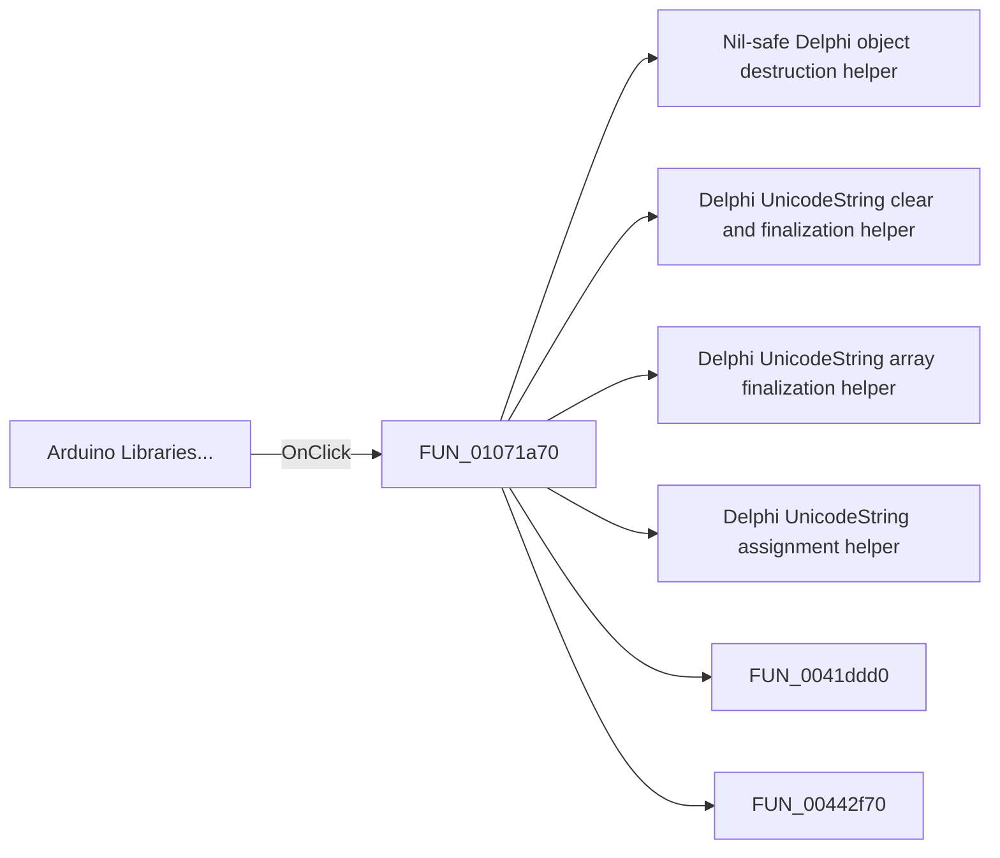

#  Arduino Libraries...

> Analysis status: Pending individual source review.

## Control

| Property | Recovered value |
| --- | --- |
| Form | CCompilerSettings |
| Component path | CCompilerSettings.pcOptions.tsAVR.bArduinoLibraries |
| Control class | TButton |
| Caption |  Arduino Libraries... |
| Hint | Not present in the recovered resource. |
| Text | Not present in the recovered resource. |
| Handler name | bArduinoLibrariesClick |
| Handler address | 01071a70 |
| Graph node | `resource:dfm:CCompilerSettings/CCompilerSettings.pcOptions.tsAVR.bArduinoLibraries` |
| Handler node | `function:01071a70` |
| Graph layer | UI |

## What happens when clicked

Pending individual analysis. An agent must read the recovered handler source and its relevant callees before it replaces this text.

## Click flow

## Handler evidence

- Source: [DecompiledSources/Tina16/functions/0000000001071A70__FUN_01071a70.c](../../../DecompiledSources/Tina16/functions/0000000001071A70__FUN_01071a70.c)
- Recovered role: Not present in the recovered resource.
- Current graph summary: Handles 1 Delphi UI event: CCompilerSettings.pcOptions.tsAVR.bArduinoLibraries.OnClick.
- Current graph behavior: Not present in the recovered resource.
- Current graph evidence: Not present in the recovered resource.
- Complexity: complex
- Distinct outgoing calls: 13

## Direct calls

- `function:00410f20` — Nil-safe Delphi object destruction helper
- `function:00414480` — Delphi UnicodeString clear and finalization helper
- `function:00414560` — Delphi UnicodeString array finalization helper
- `function:00414ad0` — Delphi UnicodeString assignment helper
- `function:0041ddd0` — FUN_0041ddd0
- `function:00442f70` — FUN_00442f70
- `function:0072d440` — FUN_0072d440
- `function:007fc180` — FUN_007fc180
- `function:0105a9e0` — FUN_0105a9e0
- `function:0105aa90` — FUN_0105aa90
- `function:0105f390` — FUN_0105f390
- `function:0105fed0` — FUN_0105fed0
- `function:01070030` — FUN_01070030

## Resource evidence

- Kind: Not present in the recovered resource.
- Modal result: Not present in the recovered resource.
- Checked state: Not present in the recovered resource.
- List items: Not present in the recovered resource.
- Image reference: Not present in the recovered resource.
- Extracted glyph: None.

## Nearby label candidates

Nearby labels are layout candidates only. They are not proof of behavior.

- No same-parent label candidate is available.

## Analysis limits

- Do not infer behavior from the control class, caption, hint, glyph, or nearby label alone.
- Do not replace the pending status until the handler source and relevant call path provide enough evidence.
