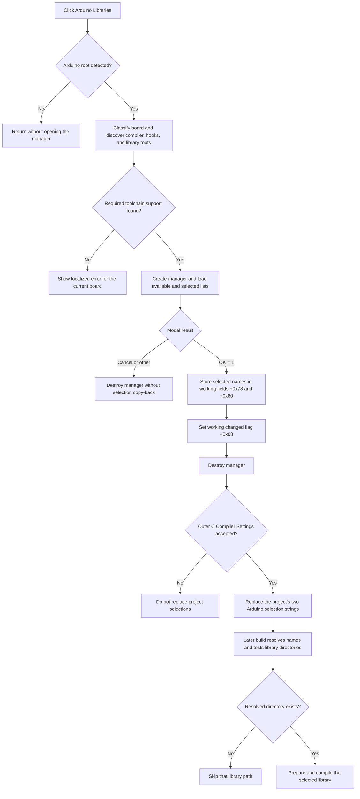

# Manage Arduino libraries

> Analysis status: Source reviewed and behavior traced.

## Control

| Property | Recovered value |
| --- | --- |
| Form | CCompilerSettings |
| Form caption | C Compiler Settings |
| Tab | AVR |
| Component path | CCompilerSettings.pcOptions.tsAVR.bArduinoLibraries |
| Control class | TButton |
| Caption | Arduino Libraries... |
| Handler name | bArduinoLibrariesClick |
| Handler address | 01071a70 |
| Graph node | `resource:dfm:CCompilerSettings/CCompilerSettings.pcOptions.tsAVR.bArduinoLibraries` |
| Handler node | `function:01071a70` |
| Graph layer | UI |

## What happens when clicked

The handler prepares an Arduino toolchain working object before it opens the **Arduino Library Manager**:

1. It tries to detect the Arduino installation and obtain a nonempty root path. If this step fails, the handler returns without opening a dialog or showing a message.
2. It classifies the current board identifier. A name that contains `atsam` selects mode 1, `atmega4809` selects mode 2, and `nrf51822` selects mode 3. Other names use mode 0. Modes 1 and 3 select the `arm-none-eabi` compiler tools; the other modes keep the object defaults.
3. It copies the detected root into the active toolchain-root field and runs compiler and support-file discovery. This search selects a compiler for the mode, searches the root and package tool directories, and requires `hooks.c`.
4. A discovery failure shows a localized VCL error dialog. The error text receives the current board identifier as its format value. The handler does not construct the library manager after this error.
5. A successful discovery refreshes the available library catalogs. The handler then creates `TArduinoLibrary` with the application as owner, supplies the working Arduino configuration and current project selections, and shows the form modally.

The handler always destroys the created manager after `ShowModal` returns.

## Initial lists and path discovery

Toolchain discovery prepares three library roots and three comma-delimited catalogs:

- The Arduino core `libraries` directory is stored at working-object field `+0x40`.
- The selected board package's `libraries` directory is stored at `+0x48`.
- The user's `Documents\Arduino\libraries` directory is stored at `+0x50` when that shell folder can be resolved.
- The names found immediately below these roots are stored as the core standard, package standard, and user catalogs at `+0x60`, `+0x68`, and `+0x70`.

Manager initialization expands both standard catalogs into `lbStandardLibs` and the user catalog into `lbUserLibs`. These are the two **Available** lists.

The manager also receives the project's current Arduino-library settings list. On show, it loads the first item into **Selected standard libraries** and the second item into **Selected user libraries**, but only when the input list has exactly two items. A list with another size leaves both selected lists empty. The manager borrows the configuration and current-selection objects; it does not free them.

## OK, Cancel, and changed state

The manager has separate built-in `bkOK` and `bkCancel` buttons:

- The OK handler serializes all selected standard-library names to working field `+0x78` and all selected user-library names to `+0x80`. `ShowModal` then returns result `1`. `FUN_01071a70` responds by setting the working object's changed flag at byte `+0x08`.
- Cancel has no custom click handler. It does not run the manager's serialization handler. A result other than `1` does not set the changed flag. Changes made only in the manager's list boxes are therefore discarded when the form is destroyed.

Opening the manager can still refresh toolchain and available-catalog fields before the user cancels. The accepted-only rule applies to the selected-library fields and changed flag.

The outer **C Compiler Settings** form is also modal. Its caller reads the working object only when that outer dialog returns result `1`. If the Arduino changed flag is set, it clears the project's two-item Arduino-library settings list and appends working fields `+0x78` and `+0x80`. Canceling the outer settings dialog does not perform this project copy-back. The traced functions contain no direct registry or settings-file write for these selections.

## Modal and copy-back flow

## Later validation and compilation use

The selected values are library names, not full paths. Arduino build preparation later parses both accepted strings:

- A standard name is resolved against the core root at `+0x40` or the board-package root at `+0x48`. Membership in the package catalog at `+0x68` selects the package root.
- A user name is resolved against the user root at `+0x50`, or against the bundled Arduino-library root at `+0x58` when the name belongs to that catalog and the bundled root exists.
- The build path appends each name to its resolved root and tests that directory. It processes only paths that exist.
- The library build stage iterates the accepted standard and user selections. It handles `LiquidCrystal` in a separate standard-library pass.

The manager does not repeat these path tests when the user clicks OK. A library directory can therefore disappear between discovery, selection, and compilation.

## Failure and no-op behavior

| Condition | Proven result |
| --- | --- |
| Arduino root detection fails | Return silently; do not create the manager. |
| Compiler or `hooks.c` discovery fails | Show a localized error dialog with the board identifier; do not create the manager. |
| Manager Cancel or non-OK result | Do not serialize selected lists and do not set the Arduino changed flag. |
| Manager OK | Serialize both selected lists and set the changed flag after modal result `1`. |
| Outer C Compiler Settings Cancel | Do not copy the working selections to the project list. |
| Accepted name resolves to a missing directory | Later build preparation skips that path. |
| Toolchain validation fails during a later build | The build path raises its formatted toolchain error instead of continuing. |

`FUN_01071a70` has no local retry or exception-recovery branch. Error-dialog construction is proven, but the localized message text itself is not recovered as a readable string. No handler-specific glyph or hint supplies more error detail.

## Source evidence

- [Click handler `FUN_01071a70`](../../../DecompiledSources/Tina16/functions/0000000001071A70__FUN_01071a70.c) implements root detection, target classification, discovery, failure reporting, modal construction, accepted-result handling, changed-state propagation, and manager destruction.
- [Arduino root helper `FUN_0105fed0`](../../../DecompiledSources/Tina16/functions/000000000105FED0__FUN_0105fed0.c) clears its output and returns success only after Arduino installation detection supplies a nonempty root.
- [Target classifier `FUN_0105aa90`](../../../DecompiledSources/Tina16/functions/000000000105AA90__FUN_0105aa90.c) maps the current board identifier to modes 0 through 3. [Target setter `FUN_0105a9e0`](../../../DecompiledSources/Tina16/functions/000000000105A9E0__FUN_0105a9e0.c) stores that mode and selects ARM tools for modes 1 and 3.
- [Toolchain discovery `FUN_0105f390`](../../../DecompiledSources/Tina16/functions/000000000105F390__FUN_0105f390.c) searches compiler and package paths, requires `hooks.c`, and invokes library discovery.
- [Library discovery `FUN_0105ee90`](../../../DecompiledSources/Tina16/functions/000000000105EE90__FUN_0105ee90.c) builds and enumerates the core, package, and user roots.
- [Manager initialization `FUN_01070030`](../../../DecompiledSources/Tina16/functions/0000000001070030__FUN_01070030.c) stores the borrowed inputs and fills the available lists. [Manager show `FUN_010702a0`](../../../DecompiledSources/Tina16/functions/00000000010702A0__FUN_010702a0.c) fills the selected lists from an exact two-item input.
- [Manager OK `FUN_010707b0`](../../../DecompiledSources/Tina16/functions/00000000010707B0__FUN_010707b0.c) serializes the two selected lists into working fields `+0x78` and `+0x80`.
- [Outer settings caller `FUN_0108c580`](../../../DecompiledSources/Tina16/functions/000000000108C580__FUN_0108c580.c) gates all project copy-back on the outer modal result and the Arduino changed flag. [Project list updater `FUN_0160e060`](../../../DecompiledSources/Tina16/functions/000000000160E060__FUN_0160e060.c) replaces the project list with the two accepted strings.
- [Build preparation `FUN_010629c0`](../../../DecompiledSources/Tina16/functions/00000000010629C0__FUN_010629c0.c) parses the accepted names, resolves roots, tests directories, and prepares library inputs. [Library build stage `FUN_01062160`](../../../DecompiledSources/Tina16/functions/0000000001062160__FUN_01062160.c) consumes the standard and user selections during compilation.
- [Recovered DFM evidence](../../../DecompiledSources/Tina16/resources/dfm/ui-evidence.json) supplies the compiler-settings control binding and the manager's labels, list boxes, built-in OK and Cancel kinds, and lifecycle handlers.

## Analysis limits

- The exact localized toolchain error text is not readable in the recovered resource-string reference. Its formatting call, board argument, error-dialog path, and stop-before-manager behavior are proven.
- The build functions have responsibilities beyond library selection. This article describes only their address-backed use of fields `+0x78` and `+0x80`.
- The final durable settings save occurs outside the traced click and outer-copy functions. The proven output is the updated in-memory project list.
