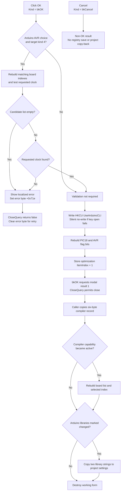

# OK

> Analysis status: Recovered handler, validation, form close query, registry persistence, caller copy-back, and Cancel path reviewed.

## Control

| Property | Recovered value |
| --- | --- |
| Form | CCompilerSettings |
| Form caption | C Compiler Settings |
| Component path | CCompilerSettings.bOk |
| Control class | TBitBtn |
| Kind | bkOK |
| Explicit DFM caption | Not present |
| Explicit DFM `ModalResult` | Not present |
| Handler name | bOkClick |
| Handler address | 01071890 |
| Close-query handler | FormCloseQuery at `010716d0` |
| Graph node | `resource:dfm:CCompilerSettings/CCompilerSettings.bOk` |
| Handler node | `function:01071890` |
| Graph layer | UI |

## What happens when clicked

`TCCompilerSettings.bOkClick` first decides if Arduino-board validation is
necessary. Validation runs only when the **AVR Compiler** radio group selects
item `1`, which the DFM identifies as **Arduino**, and the caller supplied
target-kind value `4`.

The validation helper reads the board catalog through the object at form field
`+0x728`. It rebuilds the temporary integer array at `+0x720` with board
indexes whose recovered metadata field matches the current target string at
`+0x730`. It also reports whether the catalog contains the requested clock at
`+0x740`, converted from hertz to megahertz.

The handler rejects the click in either of these cases:

- The candidate-index array is empty.
- Candidates exist, but the catalog does not contain the requested clock.

Each case loads a different localized message and calls the common message
helper. That helper shows the message once and sets form error byte `+0x71e`
to `1`. The recovered sources do not expose the text behind the two resource
pointers, so this article does not invent the exact message wording.

If validation is not required, or if it succeeds, the error byte stays zero.
The handler then persists the Arduino CLI setting and builds the accepted
compiler-settings record.

## Accepted option copies

| Setting | Recovered input | Accepted output |
| --- | --- | --- |
| Use Arduino CLI | Cached integer at `+0x760`; the checkbox handler writes `0` or `1` here | Written to the current-user `UseArduinoCLI` registry value |
| PIC18 Compiler | `rgPIC18Compiler.ItemIndex` at control `+0x6e0` | Index `1` (**MPLab XC8**) sets bit `0x0001` in flags at `+0x71a`; index `0` clears it |
| AVR Compiler | `rgAVRCompiler.ItemIndex` at control `+0x6e8` | Index `1` (**Arduino**) sets bit `0x0002`; index `2` (**Atmel Studio**) sets bit `0x2000`; index `0` (**WinAVR**) sets neither |
| Optimization level | `cbOptimization.ItemIndex` at control `+0x708` | Stores `ItemIndex + 1` in output byte `+0x718`; the DFM lists the seven choices from `-O0` through `-Og` |

Before it copies the compiler flags, the handler clears the four-byte field at
`+0x71a`. Thus an accepted click reconstructs the PIC18 and AVR choice bits
from the current controls instead of retaining old bits.

The **Use Arduino CLI** checkbox does not write the registry when it is
toggled. Its click handler only updates form field `+0x760`. The OK handler
calls the preference saver after validation succeeds. The saver opens
`HKCU\SOFTWARE\DesignSoft\<product>` and writes the integer value named
`UseArduinoCLI`.

## Modal close and validation veto

The DFM stores `Kind = bkOK` and `NumGlyphs = 2`. It has no explicit caption or
`ModalResult` property. The built-in VCL kind supplies the standard OK action,
including modal result `1`, after the click handler returns.

`TCCompilerSettings.FormCloseQuery` sets `CanClose` to true only when error
byte `+0x71e` is zero. It then clears that byte for the next attempt.

- On validation failure, the handler skips the registry saver and every option
  copy. The close query rejects the OK close and resets the error byte, so the
  user can correct the selection and retry.
- On success, the error byte is zero. The close query permits modal result `1`
  to close the dialog.

The handler does not set the modal result or call `Close` directly.

## Caller-owned commit and modified state

The **Compiler Options** command in `MCUProjectForm` owns the outer transaction.
It constructs this form with a copy of the current six-byte compiler record
and shows it modally. It copies results only when `ShowModal` returns `1`.

For an accepted result, the caller:

1. Reads the six-byte record at form offsets `+0x718` through `+0x71d` and
   copies it to project compiler configuration offset `+0x28`.
2. Detects a transition into the recovered compiler-capability condition. On
   that transition, it rebuilds the project board candidates, updates the
   selected board index at project field `+0xaa0`, and refreshes the board UI.
3. Checks changed byte `+0x08` in the working Arduino-library object returned
   by the form. If set, it replaces the project's two Arduino-library strings
   with working-object fields `+0x78` and `+0x80`.

The changed byte is set only when the nested **Arduino Library Manager** returns
modal result `1`. Accepting that nested dialog is therefore not enough to
change the project. The user must also accept this outer compiler-settings
dialog.

## Cancel contrast and side effects

`bCancel` has `Kind = bkCancel` and no application click handler. Its non-OK
modal result bypasses all caller copy-back:

- The project compiler record remains unchanged.
- A changed working Arduino-library object is not applied to the project.
- A checkbox change in form field `+0x760` is not written to the registry,
  because only this OK handler calls the saver.

The working forms and objects are destroyed after either modal result. No
recovered function in the OK path writes a project file. The Arduino-library
copy-back changes in-memory project settings only; a later durable project-save
point is outside this click path.

The registry write is the one proven durable side effect in the accepted click
path. If the product key cannot be opened, the saver performs no write, returns
no status, and shows no error. The handler still accepts and copies the other
options. There is no file-write fallback.

## Click flow

## Handler and call-path evidence

- OK handler: [FUN_01071890](../../../DecompiledSources/Tina16/functions/0000000001071890__FUN_01071890.c)
- Board-catalog validation: [FUN_01055a50](../../../DecompiledSources/Tina16/functions/0000000001055A50__FUN_01055a50.c)
- Message-and-error helper: [FUN_01b1cf30](../../../DecompiledSources/Tina16/functions/0000000001B1CF30__FUN_01b1cf30.c)
- Form close veto: [FUN_010716d0](../../../DecompiledSources/Tina16/functions/00000000010716D0__FUN_010716d0.c)
- Arduino CLI saver: [FUN_01071e10](../../../DecompiledSources/Tina16/functions/0000000001071E10__FUN_01071e10.c)
- Checkbox state cache: [FUN_01071fc0](../../../DecompiledSources/Tina16/functions/0000000001071FC0__FUN_01071fc0.c)
- Modal caller and project copy-back: [FUN_0108c580](../../../DecompiledSources/Tina16/functions/000000000108C580__FUN_0108c580.c)
- Form output accessor: [FUN_010716b0](../../../DecompiledSources/Tina16/functions/00000000010716B0__FUN_010716b0.c)
- Arduino-library copy-back: [FUN_0160e060](../../../DecompiledSources/Tina16/functions/000000000160E060__FUN_0160e060.c)
- Recovered form evidence: [ui-evidence.json](../../../DecompiledSources/Tina16/resources/dfm/ui-evidence.json)

## Direct calls

- `FUN_01055a50` — Rebuilds candidate board indexes and checks catalog clocks.
- `FUN_01b1cf30` — Shows one validation message and sets the error byte.
- `FUN_01071e10` — Saves the current Arduino CLI preference.
- `FUN_0041ddd0` — Loads a localized validation message.
- `FUN_00414560` — Finalizes temporary Delphi strings.

## Resource evidence

- The form caption is **C Compiler Settings**.
- `bOk` has `Kind = bkOK`; `bCancel` has `Kind = bkCancel` and no custom click
  handler.
- **AVR Compiler** contains **WinAVR**, **Arduino**, and **Atmel Studio**.
- **PIC18 Compiler** contains **MPLab C18** and **MPLab XC8**.
- **Optimization level** contains seven options: `-O0`, `-O1`, `-O2`, `-O3`,
  `-Ofast`, `-Os`, and `-Og`.
- The checkbox caption is **Use Arduino CLI**.
- The OK button has no explicit hint, text, action, image reference, or custom
  embedded glyph. Its two standard glyph states come from `bkOK`.

## Analysis limits

- One recovered board metadata field has no symbol. The matching operation is
  proven, but this article does not assign an unproven field name.
- The two validation message strings are indirect localized resources. Their
  branch conditions are proven; their exact displayed wording is not.
- The registry saver does not return a success value. Acceptance does not prove
  that the registry write succeeded.
- No general project-modified flag write is visible in this call path. The
  compiler record, board selection, and Arduino-library changed byte are the
  proven state changes.
