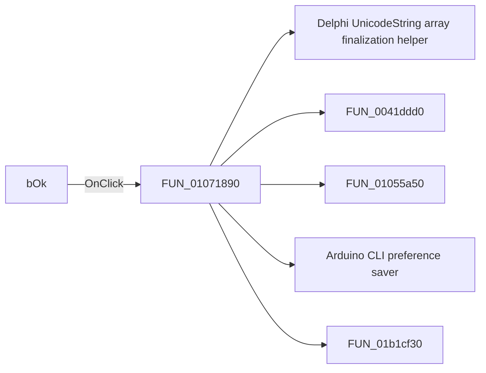

# bOk

> Analysis status: Pending individual source review.

## Control

| Property | Recovered value |
| --- | --- |
| Form | CCompilerSettings |
| Component path | CCompilerSettings.bOk |
| Control class | TBitBtn |
| Caption | Not present in the recovered resource. |
| Hint | Not present in the recovered resource. |
| Text | Not present in the recovered resource. |
| Handler name | bOkClick |
| Handler address | 01071890 |
| Graph node | `resource:dfm:CCompilerSettings/CCompilerSettings.bOk` |
| Handler node | `function:01071890` |
| Graph layer | UI |

## What happens when clicked

Pending individual analysis. An agent must read the recovered handler source and its relevant callees before it replaces this text.

## Click flow

## Handler evidence

- Source: [DecompiledSources/Tina16/functions/0000000001071890__FUN_01071890.c](../../../DecompiledSources/Tina16/functions/0000000001071890__FUN_01071890.c)
- Recovered role: C Compiler Settings acceptance handler
- Current graph summary: Validates and accepts the compiler settings and persists the Arduino CLI option. Handles 1 Delphi UI event: CCompilerSettings.bOk.OnClick.
- Current graph behavior: Validates and accepts the compiler settings and persists the Arduino CLI option.
- Current graph evidence: The bkOK button resolves here. After its validation path, it calls FUN_01071e10 before it copies the other option states.
- Complexity: complex
- Distinct outgoing calls: 5

## Direct calls

- `function:00414560` — Delphi UnicodeString array finalization helper
- `function:0041ddd0` — FUN_0041ddd0
- `function:01055a50` — FUN_01055a50
- `function:01071e10` — Arduino CLI preference saver
- `function:01b1cf30` — FUN_01b1cf30

## Resource evidence

- Kind: bkOK
- Modal result: Not present in the recovered resource.
- Checked state: Not present in the recovered resource.
- List items: Not present in the recovered resource.
- Image reference: Not present in the recovered resource.
- Extracted glyph: None.

## Nearby label candidates

Nearby labels are layout candidates only. They are not proof of behavior.

- No same-parent label candidate is available.

## Analysis limits

- Do not infer behavior from the control class, caption, hint, glyph, or nearby label alone.
- Do not replace the pending status until the handler source and relevant call path provide enough evidence.
