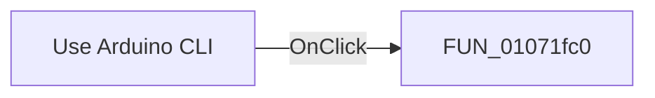

# Use Arduino CLI

> Analysis status: Pending individual source review.

## Control

| Property | Recovered value |
| --- | --- |
| Form | CCompilerSettings |
| Component path | CCompilerSettings.pcOptions.tsOptions.cbUseArduinoCLI |
| Control class | TCheckBox |
| Caption | Use Arduino CLI |
| Hint | Not present in the recovered resource. |
| Text | Not present in the recovered resource. |
| Handler name | cbUseArduinoCLIClick |
| Handler address | 01071fc0 |
| Graph node | `resource:dfm:CCompilerSettings/CCompilerSettings.pcOptions.tsOptions.cbUseArduinoCLI` |
| Handler node | `function:01071fc0` |
| Graph layer | UI |

## What happens when clicked

Pending individual analysis. An agent must read the recovered handler source and its relevant callees before it replaces this text.

## Click flow

## Handler evidence

- Source: [DecompiledSources/Tina16/functions/0000000001071FC0__FUN_01071fc0.c](../../../DecompiledSources/Tina16/functions/0000000001071FC0__FUN_01071fc0.c)
- Recovered role: Arduino CLI option checkbox change handler
- Current graph summary: When the update guard is enabled, it copies the Use Arduino CLI checkbox state into compiler-settings field 0x760. Handles 1 Delphi UI event: CCompilerSettings.pcOptions.tsOptions.cbUseArduinoCLI.OnClick.
- Current graph behavior: When the update guard is enabled, it copies the Use Arduino CLI checkbox state into compiler-settings field 0x760.
- Current graph evidence: The checkbox caption is Use Arduino CLI and resolves here. The handler reads its checked state and writes exactly zero or one.
- Complexity: simple
- Distinct outgoing calls: 0

## Direct calls

- No direct call edge is present in the recovered graph.

## Resource evidence

- Kind: Not present in the recovered resource.
- Modal result: Not present in the recovered resource.
- Checked state: Not present in the recovered resource.
- List items: Not present in the recovered resource.
- Image reference: Not present in the recovered resource.
- Extracted glyph: None.

## Nearby label candidates

Nearby labels are layout candidates only. They are not proof of behavior.

- Rank 1: Optimization level: at distance 69.

## Analysis limits

- Do not infer behavior from the control class, caption, hint, glyph, or nearby label alone.
- Do not replace the pending status until the handler source and relevant call path provide enough evidence.
