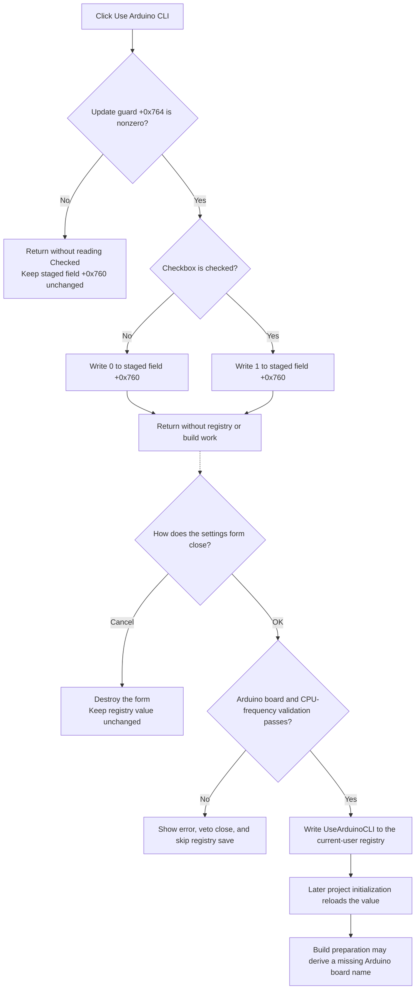

# Use Arduino CLI

> Analysis status: Source reviewed and behavior traced.

## Control

| Property | Recovered value |
| --- | --- |
| Form | CCompilerSettings |
| Component path | CCompilerSettings.pcOptions.tsOptions.cbUseArduinoCLI |
| Control class | TCheckBox |
| Caption | Use Arduino CLI |
| Hint | Not present in the recovered resource. |
| Text | Not present in the recovered resource. |
| Handler name | cbUseArduinoCLIClick |
| Handler address | 01071fc0 |
| Graph node | `resource:dfm:CCompilerSettings/CCompilerSettings.pcOptions.tsOptions.cbUseArduinoCLI` |
| Handler node | `function:01071fc0` |
| Graph layer | UI |

## What happens when clicked

The VCL checkbox changes its visual `Checked` state before it invokes `cbUseArduinoCLIClick`. The handler tests the form byte at `+0x764` first.

- If `+0x764` is zero, the handler returns. It does not read `cbUseArduinoCLI.Checked`, and it does not change the staged value at `+0x760`.
- If `+0x764` is nonzero, the handler reads `Checked` from the checkbox at form field `+0x710`. It writes `0` to `+0x760` for unchecked and `1` for checked.

This is an in-memory update only. The click does not open the registry, start `arduino-cli.exe`, validate an Arduino installation, or update the active MCU project. It has no direct recovered call edge.

`FormCreate` sets the guard at `+0x764` to `1`. No other writer of this byte is present in the recovered C Compiler Settings methods. The zero case is still an exact no-op path in this handler. The recovered source does not establish when another path can select that zero value or why the guard exists.

## Load, save, and cancel timing

`FormShow` loads the persisted option before the user edits it. The loader opens `HKEY_CURRENT_USER\SOFTWARE\DesignSoft\<product>`. If the `UseArduinoCLI` integer exists, it copies the integer to `+0x760`. If the key opens but the value is absent, it writes zero. It then checks the box when `+0x760` is greater than zero. A registry-key open failure has no message and does not explicitly assign the field.

The checkbox click normalizes the staged field to exactly zero or one. It does not save it. Persistence occurs in the separate `bOkClick` handler:

1. For the applicable Arduino target selection, OK verifies that a matching board exists and that the selected CPU frequency matches recovered board data.
2. A failed validation displays the first error, sets form byte `+0x71e`, skips the preference saver, and prevents the form from closing through `FormCloseQuery`.
3. When validation succeeds, OK calls the preference saver. The saver opens or creates the same current-user product key and writes `+0x760` as the `UseArduinoCLI` integer.
4. The built-in `bkOK` action then supplies modal result `1`. `FormCloseQuery` permits the close when `+0x71e` is zero.

`bCancel` is a built-in `bkCancel` button with no application click handler. It does not call the preference saver. The dialog caller destroys the C Compiler Settings form after both OK and non-OK modal results. Therefore, a checkbox change followed by Cancel changes only the discarded form instance; it does not change the stored current-user value. After a failed OK validation, `FormCloseQuery` clears the error byte, so the user can correct the settings and retry or cancel.

The registry saver does not return a status to OK. If it cannot open the key, it makes no write and shows no setting-specific error. OK continues its normal acceptance path.

## Downstream use

A later MCU-project initialization path reads the same current-user `UseArduinoCLI` value into its field `+0xaac`. The build path passes this integer to `FUN_01064650` while it prepares an Arduino build.

That consumer has a narrower effect than a global on/off switch:

- If the board record already has an Arduino fully qualified board name, the consumer succeeds without testing the option.
- If that board name is missing and `UseArduinoCLI` is greater than zero, it tries to derive a fully qualified board name for known Uno, Nano, Mega, Mini, Micro, Nano Every, and MKR1000 variants.
- If the board-name check returns false, the build path calls its alternate preparation function. If the check returns true, the later CLI branch finds `arduino-cli.exe`, writes an Arduino CLI configuration and compile command, and prepares the batch build.

The C Compiler Settings caller does not copy form field `+0x760` directly to the already initialized MCU-project field `+0xaac`. The traced consumer gets the value through its separate registry-load path. The recovered source does not establish when an existing MCU-project form refreshes that field after the preference changes.

## Click flow

## Handler and call-path evidence

- [FUN_01071fc0](../../../DecompiledSources/Tina16/functions/0000000001071FC0__FUN_01071fc0.c) tests guard `+0x764`, reads `Checked` through the checkbox at `+0x710`, and writes exactly zero or one to `+0x760`. It has no direct call.
- [FUN_010716f0](../../../DecompiledSources/Tina16/functions/00000000010716F0__FUN_010716f0.c), `FormCreate`, sets the guard to `1`.
- [FUN_010717a0](../../../DecompiledSources/Tina16/functions/00000000010717A0__FUN_010717a0.c), `FormShow`, calls the registry loader and sets the checkbox from the positive state of `+0x760`.
- [FUN_01071c20](../../../DecompiledSources/Tina16/functions/0000000001071C20__FUN_01071c20.c) opens the current-user DesignSoft product key and loads `UseArduinoCLI` into `+0x760`.
- [FUN_01071890](../../../DecompiledSources/Tina16/functions/0000000001071890__FUN_01071890.c), `bOkClick`, runs the applicable Arduino board validation and calls the saver only when form error byte `+0x71e` is zero.
- [FUN_01071e10](../../../DecompiledSources/Tina16/functions/0000000001071E10__FUN_01071e10.c) writes field `+0x760` as the current-user `UseArduinoCLI` registry integer.
- [FUN_010716d0](../../../DecompiledSources/Tina16/functions/00000000010716D0__FUN_010716d0.c), `FormCloseQuery`, permits close when the error byte is zero and then clears that byte.
- [FUN_0108c580](../../../DecompiledSources/Tina16/functions/000000000108C580__FUN_0108c580.c) owns the modal C Compiler Settings form and destroys it after either modal result. It applies other accepted settings only for result `1`; it does not copy `+0x760` to the caller.
- [FUN_0108d0e0](../../../DecompiledSources/Tina16/functions/000000000108D0E0__FUN_0108d0e0.c) separately loads the persisted `UseArduinoCLI` value into MCU-project field `+0xaac`.
- [FUN_0107fa70](../../../DecompiledSources/Tina16/functions/000000000107FA70__FUN_0107fa70.c) passes `+0xaac` to [FUN_01064650](../../../DecompiledSources/Tina16/functions/0000000001064650__FUN_01064650.c). That function uses the option only when it must derive a missing Arduino board identifier. The later [FUN_01064d30](../../../DecompiledSources/Tina16/functions/0000000001064D30__FUN_01064d30.c) branch constructs the `arduino-cli.exe` compile command.
- Recovered role: Arduino CLI option checkbox change handler.
- Complexity: simple
- Distinct outgoing calls: 0

## Resource evidence

- The form caption is **C Compiler Settings**.
- The checkbox is on the **Options** tab and has the direct caption **Use Arduino CLI**.
- The checkbox has no recovered hint, initial checked state, image, or glyph. FormShow source, not a DFM default, proves the initial state.
- The nearby **Optimization level:** label belongs to another control. Its layout distance does not describe this checkbox.
- `bOk` has built-in kind `bkOK` and resolves to the acceptance handler. `bCancel` has built-in kind `bkCancel` and no application OnClick binding.

## No-op, validation, and error limits

- Guard value zero makes the click a full no-op for the form field. The visual checkbox state can already have changed before OnClick, so the control and staged field can differ while the guard is zero.
- The click does not validate the Arduino CLI executable, the selected board, or the compiler installation.
- OK validation is shared compiler-settings validation. It can prevent saving, but it is not a test of the `UseArduinoCLI` Boolean itself.
- A missing registry value becomes zero when the key opens. Registry open and write failures have no option-specific message or retry in these functions.
- A saved zero does not prove that every later Arduino CLI build is disabled. The downstream board test returns success without this option when the board record already contains a fully qualified board name.
