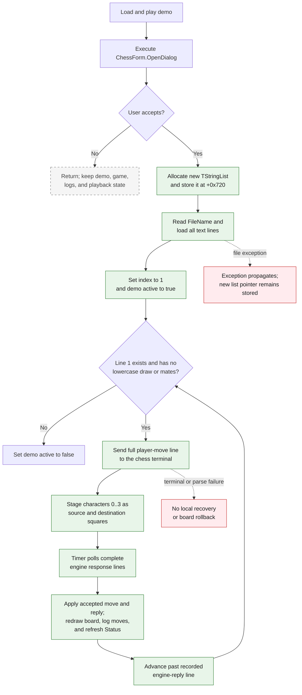

# Load and play demo

> Analysis status: Complete. The recovered handler, form setup, paired Save Game handler, demo dispatcher, terminal-response loop, resource caption, and status-label data flow agree on this control's behavior.

## Control

| Property | Recovered value |
| --- | --- |
| Form | ChessForm |
| Form class | `TChessForm` |
| Component path | ChessForm.Panel1.bLoad |
| Control class | TButton |
| Caption | Load and play demo |
| Initial enabled state | `false` |
| Hint | Not present in the recovered resource. |
| Handler name | bLoadClick |
| Handler address | 01ba3dc0 |
| Graph node | `resource:dfm:ChessForm/ChessForm.Panel1.bLoad` |
| Handler node | `function:01ba3dc0` |
| Graph layer | UI |

## What happens when clicked

The button selects a text demo file and starts chess-move playback. It does not load a serialized board position.

`FUN_01ba3dc0` first executes the form's `TOpenDialog` at offset `+0x700`.

- If the user cancels the dialog, the handler only finalizes its temporary file-name string. It does not replace the demo list, change the playback index or active flag, send an engine command, reset the board, clear a log, or change the status.
- If the user accepts the dialog, the handler allocates a new `TStringList` and stores it at `+0x720`. It reads `OpenDialog.FileName` through `FUN_00724270` and invokes the list's `LoadFromFile` virtual method with that path.
- After a successful file load, the handler sets the demo-line index at `+0x734` to `1`, sets the demo-active byte at `+0x738` to true, and calls `FUN_01ba42f0` to submit the first replay move.

The click does not repaint the board itself. The timer polls the engine terminal. The handled-move branches in `FUN_01ba4480` change the chess model, redraw the board, append move text to the game log, refresh the **Status:** label, and request the next demo move.

## File-dialog setup and current path

`FUN_01ba3f80`, the form's show handler, configures both the open and save dialogs with filter **Text file (txt)|*.txt** and default extension **txt**. The recovered `bLoadClick` path does not assign `FileName`, `InitialDir`, or another current-path field before it executes the dialog. Therefore, this form does not force a start path for each click. The accepted path comes from the dialog's `FileName` property.

The selected path is used only for `TStringList.LoadFromFile`. The form does not copy it to a persistent setting or display it in a control. Any directory or file-name state that the VCL dialog keeps is dialog-owned state, not a separate chess-demo path field established by this handler.

## Demo format and replay sequence

The paired **Save Game** handler proves the file's source. `FUN_01ba3e80` saves `eLog.Lines` through the save dialog. The response handler writes these entries to `eLog`:

- line `0` is `>> Ready` after the engine becomes ready;
- an accepted player move is logged after the engine returns `ok`;
- the engine's reply move is logged after it returns the move text.

The load handler starts at line index `1`, so it skips `>> Ready`. `FUN_01ba42f0` sends the selected line and increments the index once. After the engine completes its reply, `FUN_01ba4480` increments the index again before it requests the next line. This exact two-step advance replays the player-move entries and skips the recorded engine-reply entries.

For each replayed line, `FUN_01ba42f0` does the following work:

1. It tests the current index against `TStringList.Count`.
2. It gets the line at that index.
3. It stops playback if the case-sensitive line contains lowercase `draw` or `mates`.
4. Otherwise, it sends the full line to the embedded terminal with `FUN_01ba2ef0`.
5. It reads characters 0 through 3 with `FUN_01ba11e0` to stage the source and destination squares used by the response path.
6. It increments the line index.

The file is a move transcript, not a complete replacement state. The click handler does not create a new game or reset the current chess engine, board, status, or logs. Playback starts against the current game state.

## Click and playback flow

## State and UI effects

| Offset | Recovered role | Click or playback effect |
| --- | --- | --- |
| `+0x6d0` | `eLog` memo | The click does not clear it. Engine response processing appends accepted player and engine moves. Save Game writes these lines to a text file. |
| `+0x6e0` | Raw terminal log memo | The timer appends polled terminal output. The click does not clear it. |
| `+0x6e8` | `lStatus` label | Response handling calls `FUN_01ba4180`, which formats engine status and assigns the label caption. |
| `+0x6f8` | `bLoad` button | The DFM starts it disabled. The engine-ready response enables it. The click does not disable it during playback. |
| `+0x700` | `TOpenDialog` | Supplies the accepted demo path. FormShow sets its TXT filter and default extension. |
| `+0x710` | Chess engine and board-state object | Receives each replay command. Engine responses change its board and state fields. |
| `+0x720` | Owned demo `TStringList` | Replaced with a newly allocated list before `LoadFromFile` runs. |
| `+0x734` | Demo-line index | Set to `1`; incremented after submission and again after a complete engine reply. |
| `+0x738` | Demo-active flag | Set true after a successful load. Cleared at the end of the list or at a line that contains lowercase `draw` or `mates`. |

The button is disabled in the recovered DFM. `FUN_01ba4480` enables it only after the terminal reports `ready`. This UI state is the normal engine-readiness guard. `bLoadClick` has no separate readiness or re-entry test. The user can select another demo while playback is active because the handler does not disable the button.

## Validation and boundary behavior

- Empty file: the new list has no line at index `1`; playback is immediately set inactive.
- One-line file: line `0` is skipped and no replay command is sent.
- Normal saved transcript: line `0` is `>> Ready`; playback submits player-move lines at indexes `1`, `3`, `5`, and so on.
- Lowercase stop marker: a line that contains `draw` or `mates` stops playback without sending that line. The search is case-sensitive.
- Short or malformed move: there is no length, file-letter, rank, or board-boundary check before submission. The full text is sent first. The square parser then reads the first four characters and converts them arithmetically.
- Illegal move: the engine can return `illegal`, but the load handler does not prevalidate the move and has no rollback path.
- End of list: `FUN_01ba42f0` clears the active flag and sends no more commands.
- Second load: the handler does not reset the board or logs. The next transcript starts from the current engine state.

## Ownership, errors, and partial state

The form-show path allocates the first list at `+0x720`, and the form-close path destroys the pointer currently stored there. `bLoadClick` stores a new list pointer without first destroying the old list. Thus, each accepted load loses the previous pointer, and the previous list is not released by this path.

The handler has no local exception handler or transaction:

- If allocation fails after dialog acceptance, no demo field has changed.
- After allocation succeeds, the new pointer is already stored at `+0x720`.
- If file-name retrieval or `LoadFromFile` then raises, the exception propagates. The old pointer has already been lost, the new list remains stored, and the index and active flag keep their prior values because their assignments occur only after loading succeeds.
- If a later replay line fails or is rejected, earlier moves can already have changed the board. The handler does not restore the pre-load game state.

The handler does not show a file error message. It does not check file existence, encoding, line count, transcript structure, or move syntax before playback. Normal file and memory errors use the surrounding Delphi exception mechanism.

## Evidence

- Click handler: [FUN_01ba3dc0](../../../DecompiledSources/Tina16/functions/0000000001BA3DC0__FUN_01ba3dc0.c)
- Form setup and dialog configuration: [FUN_01ba3f80](../../../DecompiledSources/Tina16/functions/0000000001BA3F80__FUN_01ba3f80.c)
- Paired Save Game handler: [FUN_01ba3e80](../../../DecompiledSources/Tina16/functions/0000000001BA3E80__FUN_01ba3e80.c)
- Next-demo-line dispatcher: [FUN_01ba42f0](../../../DecompiledSources/Tina16/functions/0000000001BA42F0__FUN_01ba42f0.c)
- Move-line square parser: [FUN_01ba11e0](../../../DecompiledSources/Tina16/functions/0000000001BA11E0__FUN_01ba11e0.c)
- Terminal command sender: [FUN_01ba2ef0](../../../DecompiledSources/Tina16/functions/0000000001BA2EF0__FUN_01ba2ef0.c)
- Timer polling and response-line dispatch: [FUN_01ba49e0](../../../DecompiledSources/Tina16/functions/0000000001BA49E0__FUN_01ba49e0.c)
- Chess response and demo coordinator: [FUN_01ba4480](../../../DecompiledSources/Tina16/functions/0000000001BA4480__FUN_01ba4480.c)
- Status-label refresh: [FUN_01ba4180](../../../DecompiledSources/Tina16/functions/0000000001BA4180__FUN_01ba4180.c)
- Board renderer: [FUN_01ba2180](../../../DecompiledSources/Tina16/functions/0000000001BA2180__FUN_01ba2180.c)
- Form-close ownership cleanup: [FUN_01ba3f20](../../../DecompiledSources/Tina16/functions/0000000001BA3F20__FUN_01ba3f20.c)

The recovered resource supplies the direct caption **Load and play demo**, `Enabled=false`, and the `bLoadClick` binding. It supplies no hint or glyph. The nearby **Status:** label is not used by proximity alone: `FUN_01ba4180` proves the mapping by assigning the label at form offset `+0x6e8` after engine responses.

## Analysis limits

- The recovered source does not give Delphi field names for the demo list, line index, or active flag. Their construction and all readers and writers establish their roles.
- The source proves the saved-log layout and the two index increments. It does not define a separate file-format version or schema.
- The handler does not expose how the VCL chooses the dialog's initial folder when no `InitialDir` is assigned.
- The source does not prove that every hand-written text file is safe to replay. The missing syntax and bounds checks show the opposite.
