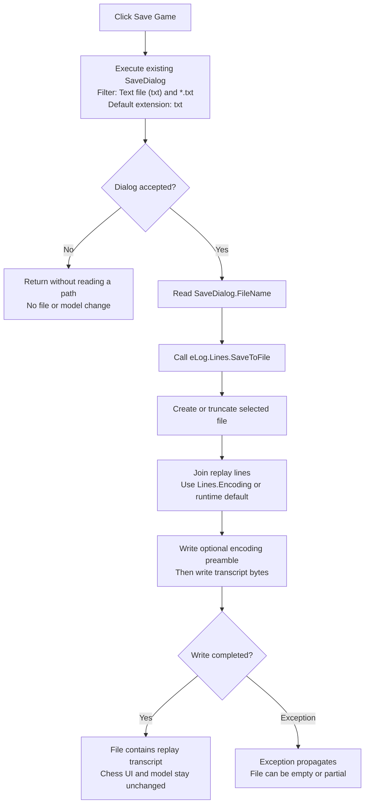

# Save Game

> Analysis status: Complete from the recovered handler, its Delphi `TStrings` save path, the ChessForm resource, and the replay consumer.

## Control

| Property | Recovered value |
| --- | --- |
| Form | ChessForm |
| Component path | ChessForm.Panel1.bSaveGame |
| Control class | TButton |
| Caption | Save Game |
| Hint | Not present in the recovered resource. |
| Text | Not present in the recovered resource. |
| Initial enabled state | false |
| Handler name | bSaveGameClick |
| Handler address | 01ba3e80 |
| Graph node | `resource:dfm:ChessForm/ChessForm.Panel1.bSaveGame` |
| Handler node | `function:01ba3e80` |
| Graph layer | UI |

## What happens when clicked

The handler executes the form's existing `TSaveDialog`. During successful ChessForm setup, the form configures this dialog with the filter `Text file (txt)|*.txt` and the default extension `txt`. The handler does not set a title, file name, initial directory, or current path before it opens the dialog. The DFM also contains no saved value for these properties. The first shown folder and name therefore come from the common-dialog runtime state. After an accepted selection, the dialog holds the selected full file name.

If the user cancels, the handler does not read a file name and does not write a file. It only clears its temporary Delphi string before it returns. If the user accepts, the handler reads `SaveDialog.FileName` and passes it to `eLog.Lines.SaveToFile`.

Despite the caption **Save Game**, the command does not serialize the chess board or the engine object. It saves the current lines of `ChessForm.Panel3.eLog`, a read-only memo. The chess response path appends replay text to this memo. Proven entries include the `>> Ready` marker and normalized move or engine-response lines. The Load and play demo path loads this text into a string list, starts at line index 1, and submits later lines to the chess engine until it reaches the end or a `draw` or `mates` line. The saved file is therefore a replay transcript. It is not a complete binary snapshot of all in-memory game state. `eLog2` is not part of this save.

The inherited `TStrings` writer joins the memo entries with its configured line break and follows its trailing-line-break option. It then encodes the complete text. The no-encoding overload uses `Lines.Encoding` when it is set. Otherwise, it uses the `TStrings` default encoding object, which is created from a runtime system code-page value. The write-BOM option asks that encoding for a preamble before it writes the encoded text. This path does not select a fixed UTF-8 or UTF-16 encoding, and the recovered handler does not override the encoding.

The file stream opens the accepted path in create mode. This creates a new file or truncates an existing file before it writes the optional encoding preamble and transcript bytes. The handler has no separate file-existence test or overwrite prompt. The standard save dialog can handle overwrite confirmation before it returns acceptance, but its effective default option set is not present in the recovered DFM. Therefore, a custom or guaranteed prompt is not proven. Once the dialog returns acceptance, the write path replaces the selected file.

On success, the handler does not clear or change either memo, the board, the engine, the status label, the button state, or a recovered dirty flag. Its application output is only the file and the save dialog's selected-file state. File creation, encoding, and write exceptions are not caught here. An error propagates through the Delphi runtime. Because create mode truncates the destination before the write finishes, an error after creation can leave an empty or partial file. The handler has no rollback or local error message.

## Click flow

## Handler and call-path evidence

- Handler source: [FUN_01ba3e80](../../../DecompiledSources/Tina16/functions/0000000001BA3E80__FUN_01ba3e80.c) calls `SaveDialog.Execute`. It reads the dialog file name and calls virtual slot `0x100` on `eLog.Lines` only when Execute returns true.
- Dialog setup: [FUN_01ba3f80](../../../DecompiledSources/Tina16/functions/0000000001BA3F80__FUN_01ba3f80.c) assigns `Text file (txt)|*.txt` to both ChessForm file dialogs and assigns the recovered `txt` constant as their default extension after successful chess-engine setup.
- File-name read: [FUN_00724270](../../../DecompiledSources/Tina16/functions/0000000000724270__FUN_00724270.c) is the shared file-dialog file-name getter used after acceptance.
- Save dispatch: the recovered `TStringList` virtual table maps slot `0x100` to [FUN_004b4900](../../../DecompiledSources/Tina16/functions/00000000004B4900__FUN_004b4900.c). It forwards to the encoding-aware file writer [FUN_004b4920](../../../DecompiledSources/Tina16/functions/00000000004B4920__FUN_004b4920.c), which creates the file stream and calls the stream writer.
- Text and encoding: [FUN_004b49c0](../../../DecompiledSources/Tina16/functions/00000000004B49C0__FUN_004b49c0.c) gets the complete strings text, chooses the supplied or default encoding, writes an encoding preamble when configured, and then writes the encoded text bytes. [FUN_004b28b0](../../../DecompiledSources/Tina16/functions/00000000004B28B0__FUN_004b28b0.c) initializes the default encoding and string options.
- Transcript production: [FUN_01ba4280](../../../DecompiledSources/Tina16/functions/0000000001BA4280__FUN_01ba4280.c) appends text to `eLog.Lines`. [FUN_01ba4480](../../../DecompiledSources/Tina16/functions/0000000001BA4480__FUN_01ba4480.c) supplies the ready marker and processed chess responses.
- Replay consumer: [FUN_01ba3dc0](../../../DecompiledSources/Tina16/functions/0000000001BA3DC0__FUN_01ba3dc0.c) loads the selected text file into a replay string list and starts at index 1. [FUN_01ba42f0](../../../DecompiledSources/Tina16/functions/0000000001BA42F0__FUN_01ba42f0.c) submits later entries to the engine and stops replay on `draw` or `mates` text.
- Complexity: moderate.
- Distinct direct outgoing calls recorded in the graph: 2. The call to `TStrings.SaveToFile` is virtual and is not a direct graph edge.

## Resource evidence

- The recovered DFM binds `ChessForm.Panel1.bSaveGame.OnClick` to `bSaveGameClick` at `01ba3e80`.
- The button caption is `Save Game`, and its initial `Enabled` value is false. The chess response path enables it after the engine reaches the ready state.
- `ChessForm.Panel3.eLog` is a read-only `TMemo`. `ChessForm.Panel3.eLog2` is a separate memo.
- `ChessForm.SaveDialog` is a `TSaveDialog`. Its DFM has no non-default filter, default extension, file name, initial directory, or options; runtime setup supplies the filter and default extension.
- The nearby `Status:` label is not read or written by this handler.
- No glyph is present for this button.

## Analysis limits

- The runtime system code page can vary by Windows configuration. The recovered code proves selection of the runtime default encoding, but it does not prove one fixed numeric code page for every installation.
- The DFM omits default dialog options. The handler proves replacement after acceptance, but the recovered artifact does not prove the exact overwrite-confirmation behavior of the installed VCL/common-dialog version.
- The writer can raise file-system or encoding exceptions. The exact message shown by the application-wide exception handler is outside this click path.
