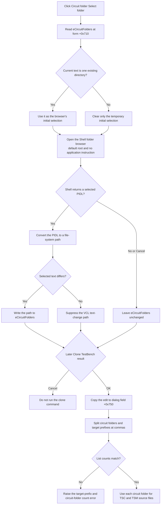

# Select one circuit folder

> Analysis status: Source reviewed and behavior traced.

## Control

| Property | Recovered value |
| --- | --- |
| Form | CloneTestBench |
| Form caption | Clone TestBench |
| Component path | CloneTestBench.bCircuitFolder |
| Control class | TButton |
| Caption | Select folder |
| Hint | Not present in the recovered resource. |
| Handler name | bCircuitFolderClick |
| Handler address | 012e8b60 |
| Target edit | CloneTestBench.eCircuitFolders |
| Graph node | `resource:dfm:CloneTestBench/CloneTestBench.bCircuitFolder` |
| Handler node | `function:012e8b60` |
| Graph layer | UI |

The DFM places this button on the same row as `eCircuitFolders` and the **Circuit folder(s):** label. More importantly, the handler reads and writes form field `+0x710`. The **OK** handler reads the same field as the circuit-folder value. The separate **T** button also writes its imported path list to `+0x710`. These independent data paths identify the target as `eCircuitFolders`.

## What happens when clicked

`FUN_012e8b60` reads the current `eCircuitFolders` text and passes it by reference to the shared Shell folder-browser helper. This text is only an initial selection. If it does not name an existing file-system directory, the helper clears the temporary selection before it opens the browser. It does not clear the edit. A comma-separated folder list therefore does not seed a single initial directory unless the complete text also names one valid directory.

This call supplies no application title or root folder. More exactly, the recovered `BROWSEINFO` title field is null, so the application supplies no instruction above the tree and does not control the native window caption. The dialog uses the application window as its owner and the Shell default root. Its recovered native flags are `0x71`: `BIF_RETURNONLYFSDIRS`, `BIF_EDITBOX`, `BIF_VALIDATE`, and `BIF_NEWDIALOGSTYLE`. The dialog therefore selects file-system directories, has an edit box, validates typed names, and uses the resizable Shell interface. When the dialog initializes, its callback selects the valid initial directory and centers the browser.

If the user accepts a folder, the Shell returns a PIDL and the helper converts it to a file-system path. The handler sends that path to the VCL text setter for `eCircuitFolders`. The setter compares the selected path with the current text and sends the text-change path only when they differ. The click does not copy files, start cloning, or commit the edit to the caller.

## Cancel, validation, and error behavior

- **Cancel or no Shell item:** the folder helper returns false. The handler skips the text setter, so `eCircuitFolders` stays unchanged.
- **Invalid typed folder:** the Shell sends `BFFM_VALIDATEFAILED` because `BIF_VALIDATE` is set. The callback builds an error message that includes the rejected text, displays it, and returns nonzero so the browse dialog stays open. The recovered global format text is not available, so its exact wording is unknown.
- **Invalid initial edit text:** the helper removes it only from the temporary initial-selection string. The existing edit remains unchanged unless the user accepts another folder.
- **Accepted text equals current text:** the VCL setter suppresses the text-change path.
- **Allocation or browse setup failure:** the helper returns false and the edit remains unchanged. The click handler does not display its own error.
- **Path-conversion failure after a PIDL is returned:** the helper does not test the result of its `SHGetPathFromIDListW` call before it reports success and assigns the buffer. Microsoft documents that conversion can fail for an item such as a bare network server even with `BIF_RETURNONLYFSDIRS`. The recovered code does not provide a reliable fallback for this case.
- **Unexpected exception:** this handler has no local exception branch. Normal Delphi exception handling applies.

There is no application-side trimming, separator change, trailing-slash cleanup, environment expansion, or canonicalization after selection. The edit receives the path text produced by the Shell conversion.

## Commit and later clone use

The selected path is staged in the edit. Clicking the form's **OK** button copies `eCircuitFolders` from control field `+0x710` to dialog string field `+0x750`. The OK handler does not validate the folder. If the form returns modal result 1, `FUN_012f5430` reads `+0x750`, splits it at literal commas, and does the same for the target-prefix text. The splitter does not trim entries or normalize paths. A different number of circuit folders and target prefixes raises the exact error **Number of items in target_prefix and in circuit_folders mismatch!**

For each matched pair, `FUN_012f5430` passes the circuit-folder entry to `FUN_012f4f80`. That clone helper uses the selected circuit folder as the source directory for `*.tsc` and `*.tsm` files. It uses the separate source-folder value for `*.csv`, `*.mtb`, and, when enabled, `*.ac` and `*.tr` files. The destination directory is derived from the source folder by replacing the source prefix with the paired target prefix, or by concatenating the target prefix when the source prefix is absent.

Closing the form stores only `eSourceFolder` in `TINA.INI`. It does not store `eCircuitFolders`. Cancelling the Clone TestBench form prevents the caller from entering the clone branch, so the staged circuit-folder text has no clone effect.

## Click flow

## Evidence

- [Click handler `FUN_012e8b60`](../../../DecompiledSources/Tina16/functions/00000000012E8B60__FUN_012e8b60.c) reads form field `+0x710`, opens the folder browser with option byte `0x2b`, and writes the returned string to the same control only when the helper returns true.
- [Shared folder-browser helper `FUN_00b96980`](../../../DecompiledSources/Tina16/functions/0000000000B96980__FUN_00b96980.c) checks the initial directory, builds the Shell browse structure, derives native flags `0x71`, and returns false when it receives no PIDL. It does not test the path-conversion result.
- [Folder-browser callback `FUN_00b96eb0`](../../../DecompiledSources/Tina16/functions/0000000000B96EB0__FUN_00b96eb0.c) centers the dialog, sends message `0x467` to select a non-empty initial path, and handles validation-failure messages 3 and 4 by displaying an error and returning 1.
- [Directory predicate `FUN_00440b00`](../../../DecompiledSources/Tina16/functions/0000000000440B00__FUN_00440b00.c) checks file attributes and directory accessibility. It does not rewrite the supplied string.
- [VCL text reader `FUN_0064dd90`](../../../DecompiledSources/Tina16/functions/000000000064DD90__FUN_0064dd90.c) reads the current control text. [VCL text setter `FUN_0064de00`](../../../DecompiledSources/Tina16/functions/000000000064DE00__FUN_0064de00.c) sends the text-change path only for a different value.
- [OK handler `FUN_012e89c0`](../../../DecompiledSources/Tina16/functions/00000000012E89C0__FUN_012e89c0.c) copies control `+0x710` to dialog string `+0x750` without a folder check.
- [Text-file path-list handler `FUN_012e8bf0`](../../../DecompiledSources/Tina16/functions/00000000012E8BF0__FUN_012e8bf0.c) writes its imported path list to the same `+0x710` control.
- [Clone command `FUN_012f5430`](../../../DecompiledSources/Tina16/functions/00000000012F5430__FUN_012f5430.c) runs only after modal result 1, splits `+0x750` and the target-prefix field at commas, checks their counts, and passes each pair to the clone helper.
- [Comma splitter `FUN_01b21190`](../../../DecompiledSources/Tina16/functions/0000000001B21190__FUN_01b21190.c) divides text at the supplied delimiter without a trim or path-normalization call.
- [Clone helper `FUN_012f4f80`](../../../DecompiledSources/Tina16/functions/00000000012F4F80__FUN_012f4f80.c) uses the circuit-folder argument for `*.tsc` and `*.tsm` copies and the source-folder argument for the other recovered file patterns.
- [Form-close handler `FUN_012e8d40`](../../../DecompiledSources/Tina16/functions/00000000012E8D40__FUN_012e8d40.c) writes only the source-folder control at `+0x6c8` to `TINA.INI`.
- The recovered [DFM evidence](../../../DecompiledSources/Tina16/resources/dfm/ui-evidence.json) identifies `bCircuitFolder`, `eCircuitFolders`, the **Circuit folder(s):** label, the sibling text-file import button, and the form's OK and Cancel buttons.
- Microsoft documents the meanings of the recovered [`BROWSEINFOW` fields and flags](https://learn.microsoft.com/en-us/windows/win32/api/shlobj_core/ns-shlobj_core-browseinfow), the [null result on `SHBrowseForFolderW` cancellation](https://learn.microsoft.com/en-us/windows/win32/api/shlobj_core/nf-shlobj_core-shbrowseforfolderw), and the [`SHGetPathFromIDListW` conversion contract](https://learn.microsoft.com/en-us/windows/win32/api/shlobj_core/nf-shlobj_core-shgetpathfromidlistw).

## Direct calls

- `function:0064dd90` reads the current `eCircuitFolders` text.
- `function:00b96980` opens the shared Shell folder browser and updates the temporary path on selection.
- `function:0064de00` assigns the returned path to `eCircuitFolders` only when it differs.
- `function:00414480` finalizes the temporary Delphi UnicodeString.

## Analysis limits

- The shared folder-browser helper has many callers. Its canonical function annotation belongs to Bead `TIARA-diz.6.7.170`; this control article only explains the arguments and outcomes used by `bCircuitFolder`.
- The exact localized validation-error format referenced through `PTR_PTR_020055e8` was not recovered.
- The decompiler does not name the form fields. The DFM layout, the sibling importer, the OK handler, and the modal caller together establish the `+0x710` and `+0x750` identities.
