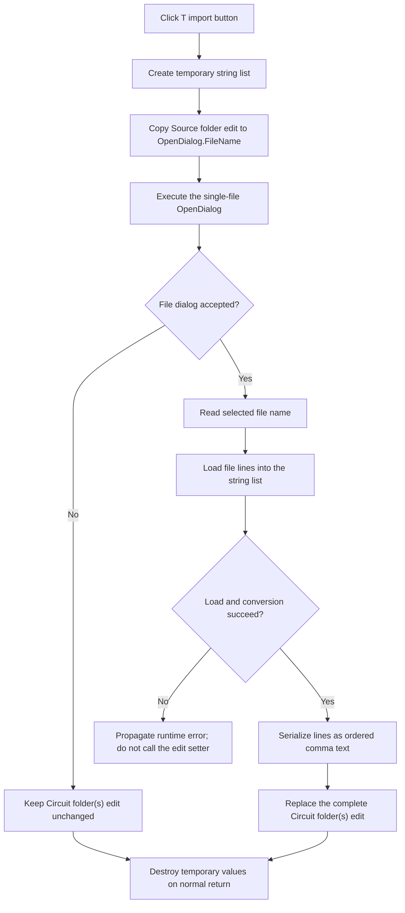

# Import circuit-folder paths from a text file

> Analysis status: Source reviewed and behavior traced.

## Control

| Property | Recovered value |
| --- | --- |
| Form | CloneTestBench |
| Component path | CloneTestBench.bCircuitFolders |
| Control class | TButton |
| Caption | T |
| Hint | Get it from a text file (new line separated path names) |
| Handler name | bCircuitFoldersClick |
| Handler address | 012e8bf0 |
| Graph node | `resource:dfm:CloneTestBench/CloneTestBench.bCircuitFolders` |
| Handler node | `function:012e8bf0` |
| Graph layer | UI |

## What happens when clicked

`FUN_012e8bf0` imports a list of circuit-folder paths from one text file. It
does not open a multi-folder picker and it does not edit the list one item at a
time.

The handler performs these operations in order:

1. Create a temporary Delphi string-list object.
2. Read the current Source folder edit at form offset `+0x6C8` and assign that
   value to the form's `TOpenDialog.FileName` property at `+0x728`. This is the
   only initial dialog value that the handler supplies.
3. Execute the open-file dialog.
4. If the user cancels the file dialog, skip all list and edit changes.
5. If the user accepts, read the selected file name and load that file into the
   temporary string list.
6. Serialize the loaded lines with Delphi `TStrings.CommaText` rules and
   replace the complete Circuit folder(s) edit at form offset `+0x710`.
7. Destroy the temporary list and finalize the temporary strings on the normal
   return path.

The edit is replaced only after the file has loaded and the comma-text value is
ready. The button does not append to the current value.

## Initial state and list conversion

The recovered DFM gives `eCircuitFolders` no initial text, so a new form starts
with an empty circuit-folder list. `FormShow` loads only the Source folder from
`TINA.INI`, section `ModelTest Settings`, key `CT_SourceFolder`. It does not
load a saved circuit-folder list. The import handler then uses that Source
folder value to initialize `OpenDialog.FileName`; it does not initialize the
dialog from the current circuit-folder text.

The text file supplies one string-list item per loaded line. The comma-text
serializer visits the items in their original order and joins them with comma
delimiters. It uses a double quote as the quote character, so an item that
contains a delimiter, a quote, or another character that requires quoting is
not copied as plain text. An empty loaded list produces an empty comma-text
value and therefore clears the Circuit folder(s) edit.

No folder existence check, duplicate removal, sorting, or path normalization is
visible in this click handler. Any line normalization performed by the file
load is the behavior of the recovered Delphi string-list runtime, not custom
CloneTestBench validation.

## Import flow

## Acceptance, cancellation, and later clone use

File-dialog acceptance changes only the edit inside the open CloneTestBench
form. It does not start cloning and it does not write the list to a settings or
data file.

The separate OK handler (`FUN_012e89c0`) copies the four edits into form-owned
string fields. The circuit-folder text goes to offset `+0x750`. The recovered
caller (`FUN_012f5430`) uses these fields only when the outer form returns modal
result 1. Outer Cancel therefore prevents the imported folder list from being
used for a clone. `FormClose` persists the Source folder to `TINA.INI`, but it
does not persist the circuit-folder list.

After outer acceptance, the caller splits both Target prefix and Circuit
folder(s) on literal commas. It raises an exception with
`Number of items in target_prefix and in circuit_folders mismatch!` when their
item counts differ. When the counts match, it keeps the entered order and pairs
each target prefix with the circuit folder at the same index before it calls
the clone worker. The worker then creates or resolves the target directory and
copies the relevant `.tsc`, `.csv`, `.tsm`, `.mtb`, and optional result files.
Missing required source files raise later errors; the import click itself does
not test for them.

## Errors and limits

- Canceling the open-file dialog is a no-op for the Circuit folder(s) edit.
- The handler has no local error dialog, retry, or fallback for file access,
  decoding, allocation, or string-list load failures. Such a failure occurs
  before the edit setter and therefore does not replace the current text.
- No explicit text encoding is passed to the one-argument file-load method.
  The recovered code does not prove the exact default encoding or byte-order
  mark behavior of this Delphi runtime.
- The DFM does not recover a file filter, default extension, title, or
  multi-select option for `OpenDialog`. The handler reads one `FileName` after
  acceptance.
- The later comma splitter is a literal separator search. It does not remove or
  interpret the double-quote escaping produced by `CommaText`. A folder line
  that needs quoting, such as a path with a comma, can therefore be split or
  passed incorrectly during later cloning. The handler does not detect this
  incompatibility.
- The source does not prove how `TOpenDialog` presents an initial value that is
  a directory rather than a file name.

## Evidence

- [Import handler `FUN_012e8bf0`](../../../DecompiledSources/Tina16/functions/00000000012E8BF0__FUN_012e8bf0.c)
  creates the temporary list, seeds and executes the file dialog, loads the
  accepted file, converts the list, and replaces the edit.
- [Comma-text wrapper `FUN_004b37d0`](../../../DecompiledSources/Tina16/functions/00000000004B37D0__FUN_004b37d0.c)
  temporarily selects comma and double-quote characters before serialization.
- [Delimited serializer `FUN_004b3880`](../../../DecompiledSources/Tina16/functions/00000000004B3880__FUN_004b3880.c)
  visits the list in index order, quotes items when required, and removes the
  final delimiter.
- [Open-dialog file-name reader `FUN_00724270`](../../../DecompiledSources/Tina16/functions/0000000000724270__FUN_00724270.c)
  returns the selected `FileName` value.
- [Open-dialog file-name setter `FUN_00724420`](../../../DecompiledSources/Tina16/functions/0000000000724420__FUN_00724420.c)
  receives the current Source folder before the dialog executes.
- [OK handler `FUN_012e89c0`](../../../DecompiledSources/Tina16/functions/00000000012E89C0__FUN_012e89c0.c)
  copies `eCircuitFolders` into the form field later read at `+0x750`.
- [Clone command `FUN_012f5430`](../../../DecompiledSources/Tina16/functions/00000000012F5430__FUN_012f5430.c)
  gates work on outer modal result 1, splits the two lists, checks their counts,
  preserves index pairing, and invokes the clone worker.
- [Literal comma splitter `FUN_01b21190`](../../../DecompiledSources/Tina16/functions/0000000001B21190__FUN_01b21190.c)
  repeatedly searches for a separator and adds the unchanged substrings.
- [Per-folder clone worker `FUN_012f4f80`](../../../DecompiledSources/Tina16/functions/00000000012F4F80__FUN_012f4f80.c)
  applies the selected circuit folder and matching prefix to the later file-copy
  operation and raises errors for missing required file types.
- [Form show initialization `FUN_012e8e40`](../../../DecompiledSources/Tina16/functions/00000000012E8E40__FUN_012e8e40.c)
  loads only the saved Source folder from `TINA.INI`.
- [Form close persistence `FUN_012e8d40`](../../../DecompiledSources/Tina16/functions/00000000012E8D40__FUN_012e8d40.c)
  writes only the current Source folder back to `TINA.INI`.
- [Direct circuit-folder picker `FUN_012e8b60`](../../../DecompiledSources/Tina16/functions/00000000012E8B60__FUN_012e8b60.c)
  is the adjacent single-folder alternative and is not called by this import
  handler.

## Resource evidence

- `bCircuitFolders` is a `TButton` with caption `T`, hint
  `Get it from a text file (new line separated path names)`, and no glyph.
- The same form contains the adjacent `Circuit folder(s):` label, the
  `eCircuitFolders` edit, and a separate `Select folder` button.
- `OpenDialog` is a nonvisual `TOpenDialog` component owned by the form.
- `eTargetPrefix` starts with `NJW4143,NJW4144`; this provides resource evidence
  that the clone form represents parallel values as comma-separated lists.

## Annotation scope

The annotation fragment for this control describes only `FUN_012e8bf0`.
Generic Delphi string-list and dialog helpers are shared runtime code. The
adjacent folder controls in Beads `.167` and `.170` own their handlers and the
shared folder-picker analysis.
