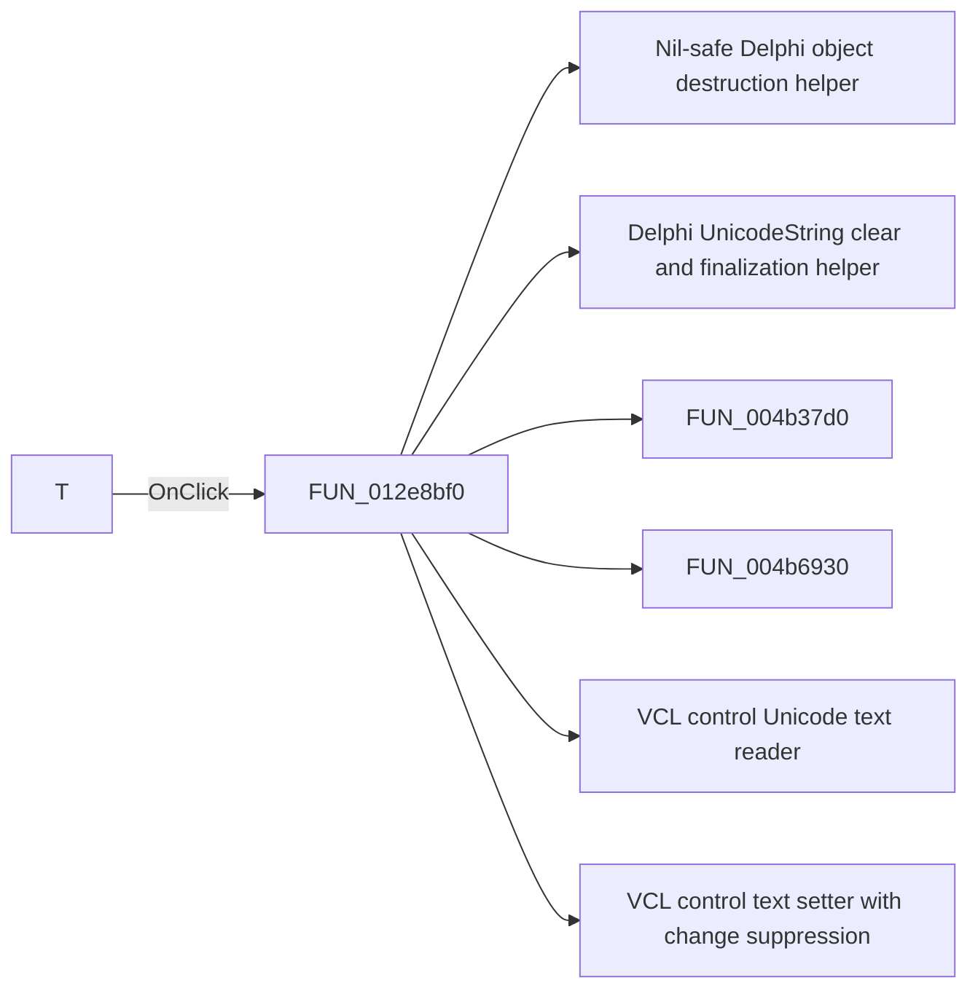

# T

> Analysis status: Pending individual source review.

## Control

| Property | Recovered value |
| --- | --- |
| Form | CloneTestBench |
| Component path | CloneTestBench.bCircuitFolders |
| Control class | TButton |
| Caption | T |
| Hint | Get it from a text file (new line separated path names) |
| Text | Not present in the recovered resource. |
| Handler name | bCircuitFoldersClick |
| Handler address | 012e8bf0 |
| Graph node | `resource:dfm:CloneTestBench/CloneTestBench.bCircuitFolders` |
| Handler node | `function:012e8bf0` |
| Graph layer | UI |

## What happens when clicked

Pending individual analysis. An agent must read the recovered handler source and its relevant callees before it replaces this text.

## Click flow

## Handler evidence

- Source: [DecompiledSources/Tina16/functions/00000000012E8BF0__FUN_012e8bf0.c](../../../DecompiledSources/Tina16/functions/00000000012E8BF0__FUN_012e8bf0.c)
- Recovered role: Not present in the recovered resource.
- Current graph summary: Handles 1 Delphi UI event: CloneTestBench.bCircuitFolders.OnClick.
- Current graph behavior: Not present in the recovered resource.
- Current graph evidence: Not present in the recovered resource.
- Complexity: complex
- Distinct outgoing calls: 8

## Direct calls

- `function:00410f20` — Nil-safe Delphi object destruction helper
- `function:00414480` — Delphi UnicodeString clear and finalization helper
- `function:004b37d0` — FUN_004b37d0
- `function:004b6930` — FUN_004b6930
- `function:0064dd90` — VCL control Unicode text reader
- `function:0064de00` — VCL control text setter with change suppression
- `function:00724270` — FUN_00724270
- `function:00724420` — FUN_00724420

## Resource evidence

- Kind: Not present in the recovered resource.
- Modal result: Not present in the recovered resource.
- Checked state: Not present in the recovered resource.
- List items: Not present in the recovered resource.
- Image reference: Not present in the recovered resource.
- Extracted glyph: None.

## Nearby label candidates

Nearby labels are layout candidates only. They are not proof of behavior.

- Rank 1: Circuit folder(s): at distance 499.
- Rank 2: Source folder: at distance 525.
- Rank 3: Source prefix: at distance 539.

## Analysis limits

- Do not infer behavior from the control class, caption, hint, glyph, or nearby label alone.
- Do not replace the pending status until the handler source and relevant call path provide enough evidence.
