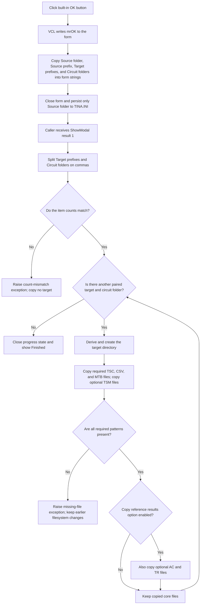

# OK and start clone processing

> Analysis status: Source reviewed. The recovered handler, VCL `bkOK` path,
> form persistence handlers, modal caller, and file-copy workers support the
> documented capture, acceptance, and downstream clone behavior.

## Control

| Property | Recovered value |
| --- | --- |
| Form | CloneTestBench |
| Component path | CloneTestBench.bOK |
| Control class | TBitBtn |
| Button kind | bkOK |
| Caption | Supplied by the built-in `bkOK` kind. |
| Hint | Not present in the recovered resource. |
| Handler name | bOKClick |
| Handler address | 012e89c0 |
| Graph node | `resource:dfm:CloneTestBench/CloneTestBench.bOK` |
| Handler node | `function:012e89c0` |
| Graph layer | UI |

## What happens when clicked

The click accepts the Clone TestBench dialog and snapshots its four edit
values. The handler itself does not validate a folder, create a directory, or
copy a file.

The recovered VCL `bkOK` path first writes modal result `1` (`mrOK`) to the
parent form. It then dispatches `bOKClick`. `FUN_012e89c0` reads the four
Unicode edit texts and assigns them to form-owned strings:

| Edit | Form string | Later use |
| --- | --- | --- |
| Source folder | `+0x738` | Source directory and base for the derived destination directory. |
| Source prefix | `+0x740` | Prefix to replace in destination paths, file names, and selected file contents. |
| Target prefix list | `+0x748` | Comma-separated target prefixes. |
| Circuit folder list | `+0x750` | Comma-separated circuit directories paired with the target prefixes. |

The source-prefix and target-prefix field mapping is established by the
accepted caller: it splits `+0x748`, compares that list with `+0x750`, and
passes `+0x740` as the old prefix to the per-target clone worker.

After a normal handler return, the dialog closes with `mrOK`; the form has no
recovered `OnCloseQuery` veto. Its `OnClose` handler writes the current Source
folder edit to `TINA.INI`, section `ModelTest Settings`, key
`CT_SourceFolder`. It saves no prefix or circuit-folder list. This Source
folder write also occurs when the form closes through Cancel because it is a
form-close action, not an OK-only action.

## Validation and derived destination directories

There is no target-folder edit on this form. The downstream clone code derives
one destination directory for each target prefix:

- If the Source folder path contains the Source prefix, it replaces that
  prefix with the current Target prefix.
- Otherwise, it appends the Target prefix to the Source folder string.
- It then calls the recovered recursive directory-creation helper for that
  destination.

`bOKClick` accepts empty strings and copies them unchanged. The accepted caller
performs only one input-shape check before cloning: it splits the Target prefix
and Circuit folder(s) strings on literal commas and requires equal item counts.
It raises
`Number of items in target_prefix and in circuit_folders mismatch!` when the
counts differ. It does not trim, normalize, deduplicate, or test the entered
paths before this check.

If both list strings are empty, both split lists have zero items. Their counts
match, so the command performs no clone iteration and reaches its normal
finished path. If the lists match, each target prefix stays paired with the
circuit-folder item at the same index.

Missing Source or Circuit directories are detected only indirectly when the
clone worker enumerates required file patterns. Destination-directory creation
is requested, but its Boolean result is not tested. An invalid empty path can
raise from the directory helper; another creation failure can continue into
the later copy path. The first missing required pattern raises its specific
exception:

- At least one `.tsc` file must exist in the paired Circuit folder.
- At least one `.csv` file must exist in the Source folder.
- At least one `.mtb` file must exist in the Source folder.
- `.tsm` files from the Circuit folder are optional.

The error texts call each input a source directory even though `.tsc` and
`.tsm` use the paired Circuit folder.

## Clone options and file changes

The dialog has no clone-option control. The worker reads the existing INI
option `ModelTest Settings/Opt_CopyRefResults`, with recovered default value
`1`:

- It always attempts to copy `.tsc`, `.csv`, `.tsm`, and `.mtb` files.
- When `Opt_CopyRefResults` is true, it also attempts to copy `.ac` and `.tr`
  reference-result files from the Source folder.
- Missing `.ac`, `.tr`, or `.tsm` files do not raise the required-file errors.

For each matching file, the worker replaces the Source prefix with the Target
prefix in the destination file name. It calls a CopyFile-compatible import
with the third argument set to zero. The recovered call shape and Boolean
wrapper are consistent with allowing an existing destination file to be
replaced. The copy return value is ignored.

For `.csv` and `.mtb` files, the worker then loads the destination file as a
string list, replaces every Source-prefix occurrence with the Target prefix in
each line, and saves the file again. It does not rewrite `.tsc`, `.tsm`, `.ac`,
or `.tr` contents.

## Click and clone flow

## Overwrite, partial failure, and rollback

- The clone is not transactional. It creates the destination directory and
  copies files one pattern and one target at a time.
- Existing destination files can be replaced. No backup is made, and the
  recovered code has no overwrite confirmation.
- A required-pattern error can occur after the destination directory or prior
  file groups already changed. A later target can also fail after earlier
  target pairs completed.
- The caller ignores the recursive directory helper's Boolean result. A failed
  directory creation can therefore surface later as a copy, load, or save
  failure, or as an ignored copy failure.
- There is no rollback, target-directory cleanup, or restoration of replaced
  files.
- Finding a matching source file marks that pattern as present before the
  actual copy result is known. Because the copy return is ignored, a copy
  failure for a file that does not need content rewriting can be silent. For
  `.csv` and `.mtb`, the later load or save can expose a failed copy as a
  runtime exception.
- Neither the OK handler nor the downstream clone command catches these
  exceptions locally. The recovered code does not guarantee that the normal
  `Finished` message appears after an error.
- If reading or assigning an edit string fails inside `bOKClick`, its ordered
  assignments can leave only some form-owned strings updated. It has no local
  rollback. No filesystem work has started at that point.

## Evidence

- [OK handler `FUN_012e89c0`](../../../DecompiledSources/Tina16/functions/00000000012E89C0__FUN_012e89c0.c)
  reads four edit controls and assigns their text to form strings `+0x738`
  through `+0x750`; it has no validation or clone call.
- [TBitBtn kind setter `FUN_0082bc30`](../../../DecompiledSources/Tina16/functions/000000000082BC30__FUN_0082bc30.c)
  maps `bkOK` to standard modal result `1`, caption, glyph, and default state.
- [VCL button click `FUN_00687f30`](../../../DecompiledSources/Tina16/functions/0000000000687F30__FUN_00687f30.c)
  writes the button modal result to its form before it dispatches `OnClick`.
- [Form-close persistence `FUN_012e8d40`](../../../DecompiledSources/Tina16/functions/00000000012E8D40__FUN_012e8d40.c)
  writes only `eSourceFolder` to `ModelTest Settings/CT_SourceFolder`.
- [Clone command `FUN_012f5430`](../../../DecompiledSources/Tina16/functions/00000000012F5430__FUN_012f5430.c)
  gates work on modal result `1`, splits the two lists, checks their counts,
  preserves index pairing, and starts one worker call per pair.
- [Comma splitter `FUN_01b21190`](../../../DecompiledSources/Tina16/functions/0000000001B21190__FUN_01b21190.c)
  searches for literal comma characters and adds the unchanged substrings.
- [Per-target worker `FUN_012f4f80`](../../../DecompiledSources/Tina16/functions/00000000012F4F80__FUN_012f4f80.c)
  derives the destination, creates it, selects the file patterns, reads
  `Opt_CopyRefResults`, and raises the required-pattern errors.
- [File-set worker `FUN_012f4c00`](../../../DecompiledSources/Tina16/functions/00000000012F4C00__FUN_012f4c00.c)
  enumerates matching files, builds renamed destination paths, copies each
  file, and optionally rewrites destination text.
- [File-copy thunk `FUN_00427810`](../../../DecompiledSources/Tina16/functions/0000000000427810__FUN_00427810.c)
  is the recovered indirect three-argument file-copy call. Its native symbol
  name is not present in the exported source.
- [Per-line replacement `FUN_01b229f0`](../../../DecompiledSources/Tina16/functions/0000000001B229F0__FUN_01b229f0.c)
  replaces all old-prefix occurrences in each loaded string-list line.

## Resource evidence

- The form caption is `Clone TestBench`.
- The labels identify Source folder, Circuit folder(s), Source prefix, and
  Target prefix inputs.
- `eSourcePrefix` starts with `NJW4142`.
- `eTargetPrefix` starts with `NJW4143,NJW4144`, which supports its later
  comma-separated list use.
- `bOK` is a 75-by-25 `TBitBtn` with `Kind = bkOK` and `NumGlyphs = 2`.
  There are no custom glyph bytes to extract; VCL supplies the standard OK
  text and glyph states.
- `bCancel` uses `bkCancel` and has no application `OnClick` handler. A Cancel
  result prevents the clone caller from reading the form-owned snapshot.

## Analysis limits

- The native import name behind `FUN_00427810` is not present in the recovered
  source. Its arguments and repeated call pattern support CopyFile-compatible
  semantics, but this article does not claim a recovered `CopyFileW` symbol.
- The destination-path code uses direct prefix search, replacement, or
  concatenation. The recovered code does not establish that every user input
  produces a valid or safely separated path.
- The handler and caller do not expose a separate target-folder choice or a
  per-run overwrite option.
- Shared clone functions and the menu command are documented as downstream
  evidence. Their graph annotations belong to their own control or shared
  analysis owners.
