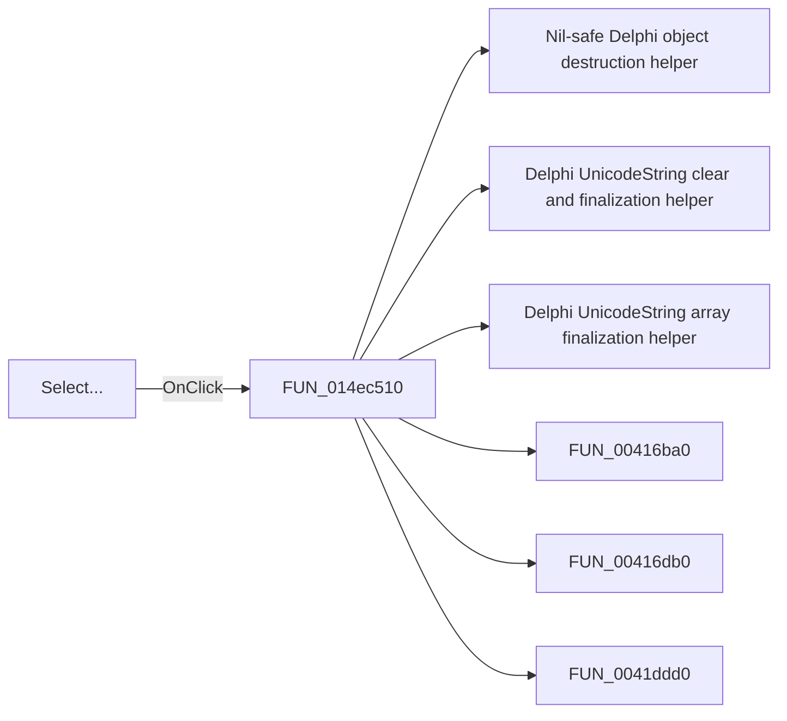

# Select...

> Analysis status: Pending individual source review.

## Control

| Property | Recovered value |
| --- | --- |
| Form | CompilePackage |
| Component path | CompilePackage.SimplePanel.bCompile |
| Control class | TButton |
| Caption | Select... |
| Hint | Select source file to compile |
| Text | Not present in the recovered resource. |
| Handler name | bCompileClick |
| Handler address | 014ec510 |
| Graph node | `resource:dfm:CompilePackage/CompilePackage.SimplePanel.bCompile` |
| Handler node | `function:014ec510` |
| Graph layer | UI |

## What happens when clicked

Pending individual analysis. An agent must read the recovered handler source and its relevant callees before it replaces this text.

## Click flow

## Handler evidence

- Source: [DecompiledSources/Tina16/functions/00000000014EC510__FUN_014ec510.c](../../../DecompiledSources/Tina16/functions/00000000014EC510__FUN_014ec510.c)
- Recovered role: Not present in the recovered resource.
- Current graph summary: Handles 1 Delphi UI event: CompilePackage.SimplePanel.bCompile.OnClick.
- Current graph behavior: Not present in the recovered resource.
- Current graph evidence: Not present in the recovered resource.
- Complexity: complex
- Distinct outgoing calls: 15

## Direct calls

- `function:00410f20` — Nil-safe Delphi object destruction helper
- `function:00414480` — Delphi UnicodeString clear and finalization helper
- `function:00414560` — Delphi UnicodeString array finalization helper
- `function:00416ba0` — FUN_00416ba0
- `function:00416db0` — FUN_00416db0
- `function:0041ddd0` — FUN_0041ddd0
- `function:0043e1a0` — FUN_0043e1a0
- `function:00441640` — FUN_00441640
- `function:00441a10` — FUN_00441a10
- `function:004b6930` — FUN_004b6930
- `function:00724270` — FUN_00724270
- `function:00724300` — FUN_00724300
- `function:014ebd10` — FUN_014ebd10
- `function:014ec1f0` — FUN_014ec1f0
- `function:016fd940` — FUN_016fd940

## Resource evidence

- Kind: Not present in the recovered resource.
- Modal result: Not present in the recovered resource.
- Checked state: Not present in the recovered resource.
- List items: Not present in the recovered resource.
- Image reference: Not present in the recovered resource.
- Extracted glyph: None.

## Nearby label candidates

Nearby labels are layout candidates only. They are not proof of behavior.

- Rank 1: Library search list:  at distance 24.
- Rank 2: Target Library: at distance 60.

## Analysis limits

- Do not infer behavior from the control class, caption, hint, glyph, or nearby label alone.
- Do not replace the pending status until the handler source and relevant call path provide enough evidence.
