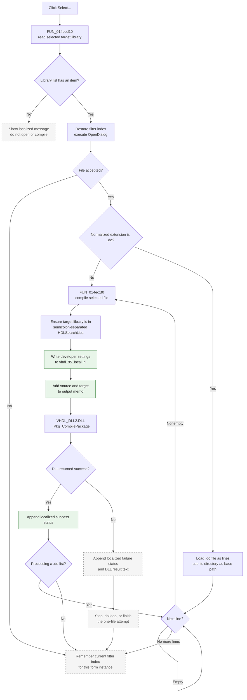

# Compile a selected source into the target library

> Analysis status: Complete. The recovered handler, target-library selector, list-file loop, compiler helper, VHDL DLL import, memo helpers, settings writer, and abort consumer agree on this behavior.

## Control

| Property | Recovered value |
| --- | --- |
| Form | CompilePackage |
| Form caption | Manage Libraries |
| Component path | CompilePackage.SimplePanel.bCompile |
| Control class | TButton |
| Caption | Select... |
| Hint | Select source file to compile |
| Text | Not present in the recovered resource. |
| Handler name | bCompileClick |
| Handler address | 014ec510 |
| Graph node | `resource:dfm:CompilePackage/CompilePackage.SimplePanel.bCompile` |
| Handler node | `function:014ec510` |
| Graph layer | UI |

## What happens when clicked

The button compiles one selected source, or a list of sources from a selected `.do` file, into the library currently selected in **Target Library:**. The handler first reads `cbLibraryList`. If the combo has no items, it shows a localized message and does not open the file dialog or call the compiler.

When a target library is available, the handler restores the file dialog's last filter index for this form instance and opens `CompilePackage.OpenDialog`. The recovered DFM does not contain the dialog filter text, default extension, initial directory, or file-existence options. Therefore, the exact file types shown in the dialog are unknown.

If the user accepts a file, the handler normalizes its extension for comparison:

- A file whose extension is `.do` is loaded into a temporary string list. Each nonempty line is combined with the `.do` file's directory and compiled in list order. An empty line is skipped. The loop stops after the first compiler failure.
- Any other accepted file is sent to the compile helper once. The handler does not restrict its extension after the dialog returns.

The compile helper passes the full source path, the selected target-library name, a fixed value of `1`, and a result buffer to `VHDL_DLL2.DLL::_Pkg_CompilePackage`. The DLL performs the actual package compilation. The recovered application code does not expose the created file names, output extension, temporary files, or replacement policy inside the DLL.

## Inputs, compiler setup, and state changes

| Stage | Proven behavior |
| --- | --- |
| Target selection | `FUN_014ebd10` returns the item at `cbLibraryList.ItemIndex`. If the combo has no items, it returns an empty string. `OnShow` normally fills this combo from `_Pkg_GetLibraryList` and selects its last item. |
| Source selection | `FUN_014ec510` uses the form's `TOpenDialog`. Cancel skips all source loading and compiler calls. |
| Direct source | A selected file whose normalized extension is not `.do` is compiled once with its full dialog path. |
| `.do` list | The list file is loaded as text. Each nonempty line is appended to the list file's directory and passed as a source path. The original line is also used as the display name in the log. |
| Search-list preparation | Before each compiler call, `FUN_014ec1f0` reads `eHDLSearchLibs`, splits it on `;`, and adds the selected target library if that exact item is absent. It does not write the changed value back to the visible edit. |
| Settings write | The helper passes the prepared search list to `FUN_00e06220`, which writes `Developer / HDLSearchLibs` and the other current developer settings to `vhdl_95_local.ini`. This write occurs before the compiler call. |
| Compiler invocation | `_Pkg_CompilePackage(source, targetLibrary, 1, resultBuffer)` is an external-DLL call through the recovered `VHDL_DLL2.DLL` import. |
| Visible output | Before the DLL call, the helper adds a localized source-and-library line to the read-only output memo. It appends a localized success or failure suffix to that line after the call. On failure, it adds the DLL result buffer as another memo line. |
| Library view | This route does not refresh `cbLibraryList` after compilation. The selected item and displayed list stay as they were unless another command refreshes them. |
| Dialog filter | After a normal dialog return, including Cancel, the handler stores the current filter index in form field `+0x2380` for the next click. `FormCreate` resets this field to `1`, so the recovered code does not establish durable filter persistence. |

## Compile flow

## Handler and compiler evidence

- Click handler: [FUN_014ec510](../../../DecompiledSources/Tina16/functions/00000000014EC510__FUN_014ec510.c)
- Per-source compile helper: [FUN_014ec1f0](../../../DecompiledSources/Tina16/functions/00000000014EC1F0__FUN_014ec1f0.c)
- Selected-library reader: [FUN_014ebd10](../../../DecompiledSources/Tina16/functions/00000000014EBD10__FUN_014ebd10.c)
- Output-memo line appender: [FUN_014ebd70](../../../DecompiledSources/Tina16/functions/00000000014EBD70__FUN_014ebd70.c)
- Output-memo status appender: [FUN_014ebde0](../../../DecompiledSources/Tina16/functions/00000000014EBDE0__FUN_014ebde0.c)
- Developer-settings writer: [FUN_00e06220](../../../DecompiledSources/Tina16/functions/0000000000E06220__FUN_00e06220.c)
- External compiler import: [VHDL_DLL2.DLL::_Pkg_CompilePackage](../../../DecompiledSources/Tina16/functions/0000000000E03CE0__VHDL_DLL2.DLL___Pkg_CompilePackage.c)
- Form creation and filter-index initialization: [FUN_014ec080](../../../DecompiledSources/Tina16/functions/00000000014EC080__FUN_014ec080.c)
- Form show and target-library population: [FUN_014ec0d0](../../../DecompiledSources/Tina16/functions/00000000014EC0D0__FUN_014ec0d0.c)
- Abort click: [FUN_014ec7c0](../../../DecompiledSources/Tina16/functions/00000000014EC7C0__FUN_014ec7c0.c)
- Advanced package loop that consumes the abort byte: [FUN_014ecfb0](../../../DecompiledSources/Tina16/functions/00000000014ECFB0__FUN_014ecfb0.c)

`FUN_014ec510` gets the library before it opens the dialog. It checks the lowercased selected-file extension against the recovered Unicode constant `.do`. In list mode, it loads the selected file through a `TStringList`, combines its directory with each nonempty line, and stops when `FUN_014ec1f0` returns false.

`FUN_014ec1f0` prepares the semicolon-separated HDL search list, writes settings, copies the source and target library into form buffers, and calls the external compiler. Its Boolean result is the DLL result. The helper also owns the visible success and failure logging.

The graph records 15 distinct outgoing calls from `FUN_014ec510`. It records the call from `FUN_014ec1f0` to `function:00e03ce0` with call type `external-dll`; that node identifies the `VHDL_DLL2.DLL::_Pkg_CompilePackage` export.

## Progress, abort, and callback limits

- This simple compile route does not call `FUN_014ebef0`, the helper that updates `cgProgressBar` and processes application messages for the advanced Xilinx package workflow.
- `_Pkg_CompilePackage` receives no recovered form pointer, progress callback, or abort callback in this call. The recovered application code does not prove a visible progress update while this button compiles.
- `sbAbortClick` sets form byte `+0x2371`. Neither `FUN_014ec510` nor `FUN_014ec1f0` reads that byte. `FUN_014ecfb0` reads it only in the separate advanced package loop. Thus, **Abort Compiling** does not stop this recovered simple source-file route.
- `FUN_00e06220` writes the current `Developer / CompileProgress` setting with other developer settings. This is not evidence that this handler updates `cgProgressBar`.

## Cancel, failure, partial state, and persistence

- If no target-library item exists, the handler shows a localized message and performs no file or settings work.
- File-dialog Cancel is a no-compile path. It only lets the handler remember the dialog's current filter index for this form instance.
- A compiler false result adds a localized failure status and the returned DLL text to the memo. A direct-file attempt then ends. A `.do` batch stops before later lines.
- A `.do` list can complete earlier source compiles before a later source fails. The handler has no rollback call. Earlier DLL-managed outputs and memo lines remain.
- The prepared `HDLSearchLibs` value is written before `_Pkg_CompilePackage`. A compiler failure does not undo that INI write. The click does not write the changed search list back to the visible edit.
- The recovered application does not know whether the external DLL uses atomic output replacement. A failed call can leave DLL-managed partial files, but their existence and cleanup are not established by this source.
- Loading a `.do` file and the local path, list, string, settings, VCL, or DLL operations have no recovered application-level catch, retry, or validation branch in these two functions. An exception can bypass the normal filter-index save. Compiler-generated Delphi cleanup is present, but the recovered C does not establish every exception-unwind detail.
- The click does not close the Manage Libraries form and does not set a modal result. The durable effects established here are the developer INI write and any library artifacts created by the external compiler. Memo lines and the remembered filter index are live form state.

## Resource evidence

- The button caption is **Select...** and its direct hint is **Select source file to compile**.
- The same panel contains the **Target Library:** label and `cbLibraryList`, plus the **Library search list:** label and `eHDLSearchLibs`. Their meaning is confirmed by the handler field accesses and compiler-helper data flow, not by layout alone.
- `cbLibraryList` has style `csDropDownList`, so normal user input is a list selection rather than free text.
- The button has no image reference, embedded glyph, predefined button kind, modal result, or recovered list items.
- `CompilePackage.OpenDialog` has no recovered filter or default-extension properties. This article does not invent supported HDL source extensions.

## Analysis limits

- The `.do` extension and `;` delimiter were verified from the rebuilt executable constants referenced by the recovered functions. The exact semantic name of the `.do` format is not present, so this article calls it a list file.
- Localized start, success, failure, and missing-library strings remain indirect resource pointers in the recovered C. Their exact text is not assigned here.
- The external DLL owns compilation, output naming, overwrite rules, temporary-file cleanup, and any compiler-internal diagnostics beyond the returned result buffer.
- A combo with items but an invalid `ItemIndex` is not guarded in `FUN_014ebd10`. Form initialization normally selects an item, but the recovered code does not define a separate recovery path for an invalid index.
